# Detecting AD Credential Attacks

## Objective
Investigate the five most common credential access techniques attackers use once they have a foothold in an Active Directory environment: Kerberoasting, AS-REP Roasting, LSASS memory dumping, DCSync, and NTDS.dit extraction. This room bridges the gap between "attacker has a foothold" and "attacker owns the domain," covering how each technique abuses a different piece of AD's authentication or replication infrastructure, what privilege level each requires, and the distinct log artifacts each leaves behind. The room closes with an independent investigation challenge tracing a full attack chain across all five techniques.

## Skills Demonstrated
- Detecting Kerberoasting through anomalous Kerberos TGS requests (Event 4769) using RC4 encryption (0x17) instead of the modern AES-256 default (0x12), and understanding the offline password-cracking mechanism it enables
- Applying volume-based, encryption-agnostic Kerberoasting detection (grouping TGS requests into time windows and flagging accounts requesting an abnormal number of unique SPNs) to catch AES-based evasion techniques such as TrustedSec's Orpheus
- Identifying AS-REP Roasting by recognizing Kerberos TGT requests (Event 4768) with `Pre_Authentication_Type=0`, indicating an account with Kerberos pre-authentication disabled
- Distinguishing malicious AS-REP Roasting from legitimate application behavior by checking for the absence of follow-up TGS (4769) and logon (4624) events for the targeted account
- Detecting LSASS credential dumping via Sysmon Event 10 (ProcessAccess), including interpreting `GrantedAccess` hex bitmasks (e.g., 0x1010 for Mimikatz-style access, 0x1FFFFF for ProcDump/comsvcs.dll-style full access) and `CallTrace` patterns (known DLLs indicating MiniDump API usage vs. `UNKNOWN` memory offsets indicating code injection)
- Recognizing Living-off-the-Land Binary (LOLBin) abuse, such as `rundll32.exe` being used to access LSASS memory while appearing to be a normal system process
- Filtering legitimate LSASS access (csrss.exe, WerFault.exe, svchost.exe, AV/EDR agents) by full file path rather than filename alone, since attackers can rename malicious tools to mimic legitimate system processes
- Detecting DCSync attacks by identifying Event 4662 (Directory Service Access) with the `DS-Replication-Get-Changes-All` extended right (GUID `1131f6ad`) exercised by a non-machine account, and understanding the audit policy/SACL prerequisites required for this detection to function at all
- Pivoting from a DCSync event's `Logon_ID` to a correlated Event 4624 to recover the attacker's true source IP, since Event 4662 does not natively contain a source IP field
- Detecting NTDS.dit database extraction via two distinct methods: Volume Shadow Copy abuse (`vssadmin create shadow` followed by file copy commands) and `ntdsutil` IFM (Install From Media) abuse, using Sysmon Event 1 (process creation with command-line logging) and Event 11 (file creation)
- Comparing DCSync (remote, low-noise, blends with replication traffic) against NTDS.dit extraction (local, high-noise, requires DC filesystem access) as two structurally different paths to the same objective: extracting every credential in the domain
- Correlating findings across all five techniques to reconstruct a complete attacker escalation path, from initial credential theft through full domain compromise, in an independent investigation challenge using an unfamiliar dataset

## Tools Used
- Splunk (Search & Reporting)
- Windows Security Event Log (4662, 4688, 4768, 4769, 4624)
- Sysmon (Event 1 - Process Creation, Event 10 - ProcessAccess, Event 11 - File Creation)
- SPL (Search Processing Language)

## Screenshot 1 - Kerberoasting: RC4 TGS Request Pattern
Kerberoasting abuses the fact that any domain user can request a Kerberos service ticket (TGS) for any Service Principal Name (SPN) in the domain, without the DC verifying intent to use the service. Attackers request these tickets using RC4 encryption instead of the modern AES-256 default, since RC4 hashes are significantly faster to crack offline. I queried Event 4769 (TGS Requested), filtering for RC4 encryption (`0x17`) and excluding computer accounts and krbtgt requests to isolate service-account targeting:
```spl
index=task2 EventCode=4769 Ticket_Encryption_Type=0x17 Service_Name!="*$" Service_Name!="krbtgt"
| table _time, Account_Name, Service_Name, Ticket_Encryption_Type, Client_Address
| sort _time
```
This revealed multiple RC4-encrypted TGS requests from a single account, targeting several different service accounts within a short time window - the textbook Kerberoasting pattern.

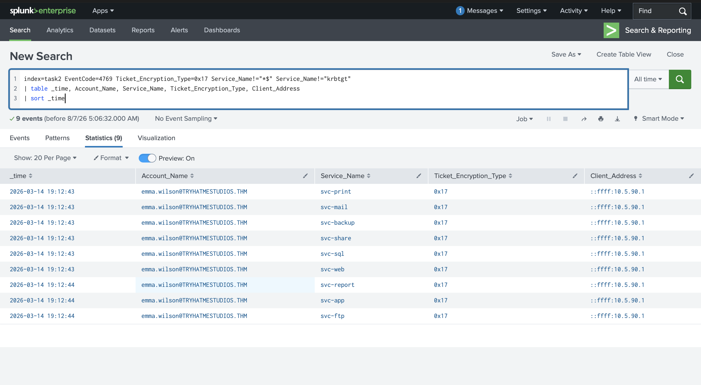

## Screenshot 2 - Kerberoasting: Triage Summary
To answer the key triage questions (how many service accounts were targeted, which account ran the attack, and where it came from), I aggregated the same filtered results:
```spl
index=task2 EventCode=4769 Ticket_Encryption_Type=0x17 Service_Name!="*$" Service_Name!="krbtgt"
| stats dc(Service_Name) as targeted_services count by Account_Name, Client_Address
```
This summary identifies the attacking account, its source IP, and the total number of distinct service accounts targeted - the next investigative priority being whether any targeted service account holds privileged (e.g., Domain Admin) group membership.

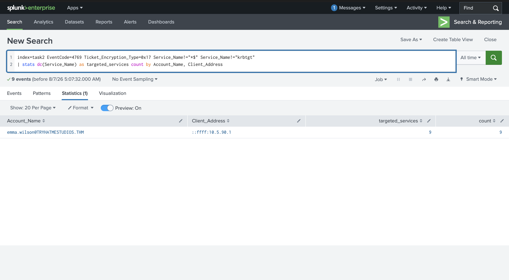

## Screenshot 3 - AS-REP Roasting: Baseline TGT Traffic
AS-REP Roasting targets a different weakness than Kerberoasting: user accounts with Kerberos pre-authentication disabled (`DONT_REQUIRE_PREAUTH`). Normally, a user must prove they know their password (by encrypting a timestamp) before the DC issues a TGT; with pre-auth disabled, the DC skips this check entirely, and an attacker can request a TGT for a known username and crack the returned material offline, without needing any valid credentials. To establish a baseline, I first reviewed all TGT request events:
```spl
index=task3 EventCode=4768
| table _time, Account_Name, Pre_Authentication_Type, Ticket_Encryption_Type, Client_Address
| sort _time
```
Most entries showed `Pre_Authentication_Type=2` (normal encrypted-timestamp pre-authentication) with AES-256 encryption, confirming expected Kerberos behavior for the environment.

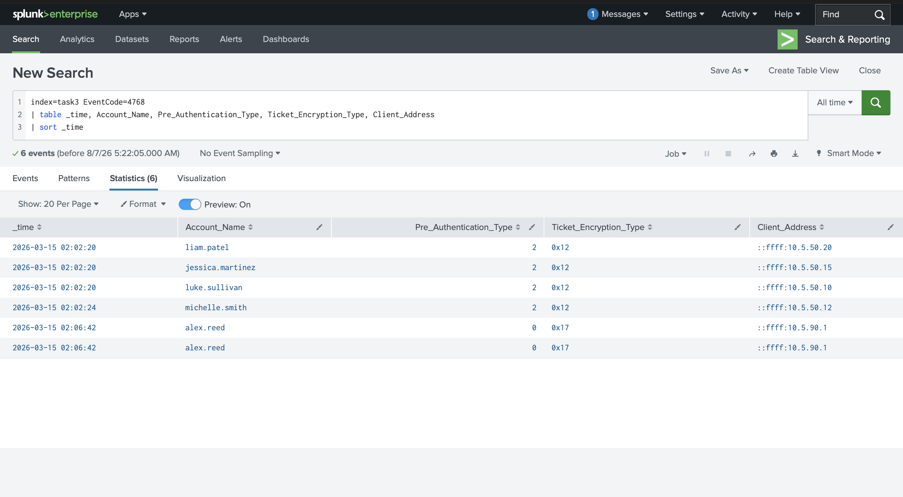

## Screenshot 4 - AS-REP Roasting: Isolating the Anomaly
Filtering specifically for `Pre_Authentication_Type=0` isolated the anomalous entry:
```spl
index=task3 EventCode=4768 Pre_Authentication_Type=0
| table _time, Account_Name, Pre_Authentication_Type, Ticket_Encryption_Type, Client_Address
```
This returned a single TGT request for an account with pre-authentication disabled, requested with RC4 encryption - confirming an AS-REP Roasting attempt against that account.

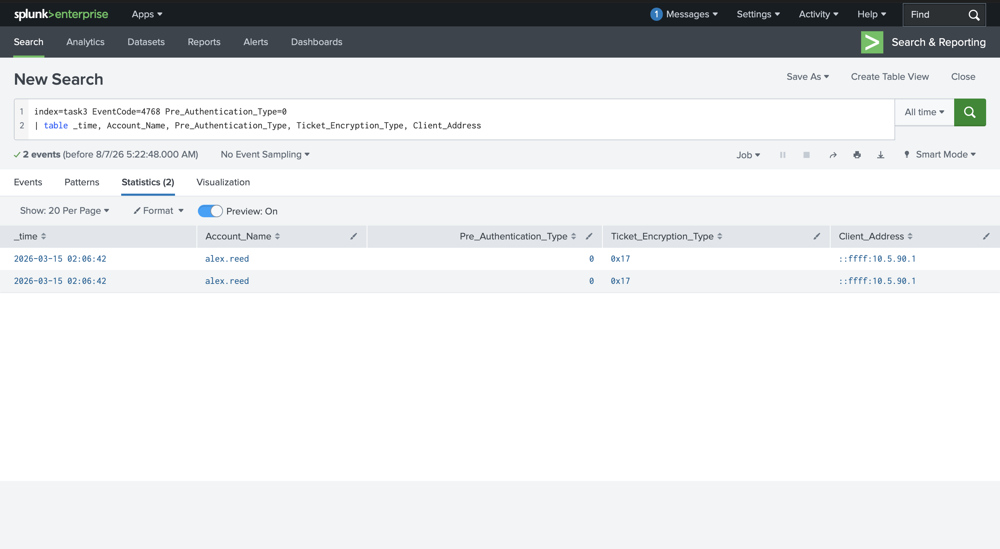

## Screenshot 5 - AS-REP Roasting: Confirming No Follow-Up Activity
To distinguish malicious intent from legitimate (if misconfigured) application behavior, I checked whether the targeted account generated any follow-up TGS request (4769) or logon (4624) events after the TGT request:
```spl
index=task3 (EventCode=4624 OR EventCode=4769)
| search Account_Name="{ACCOUNT_NAME}"
| table _time, EventCode, Account_Name, Client_Address
```
This query returned zero results, strongly suggesting the TGT was requested purely to harvest the crackable hash rather than for genuine service access - consistent with an AS-REP Roasting attack rather than a legitimate but misconfigured application.

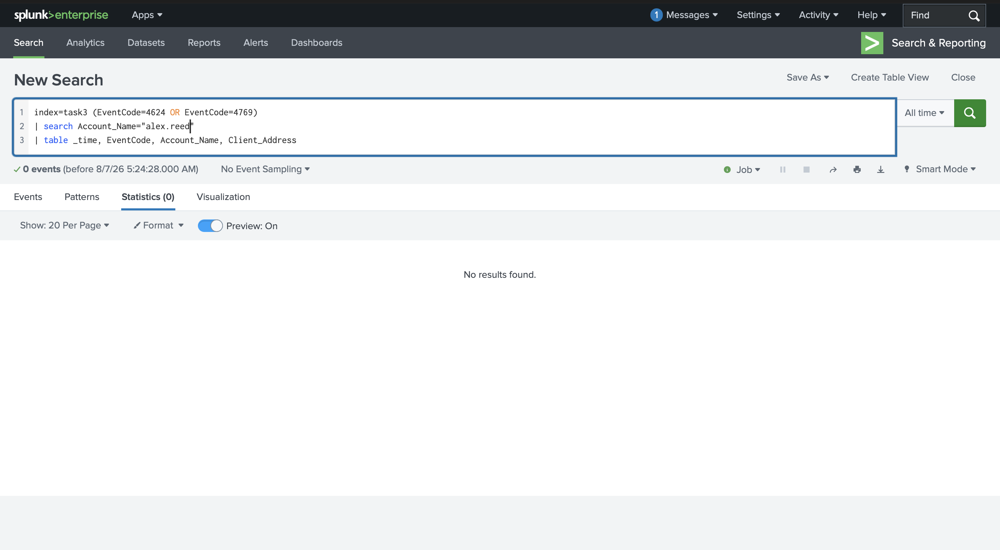

## Screenshot 6 - LSASS Dumping: Baseline Process Access
LSASS (Local Security Authority Subsystem Service) stores live credentials in memory for every authenticated user on a machine, making it a high-value target for attackers who want immediate, ready-to-use credentials without offline cracking. Detection relies on Sysmon Event 10 (ProcessAccess), which fires when one process opens a handle to another. Starting broad to avoid missing anything, I queried all processes that accessed LSASS:
```spl
index=task4 EventCode=10 TargetImage="*\\lsass.exe"
| stats count by SourceImage, GrantedAccess
```
Among expected legitimate access (svchost.exe, system processes), one entry stood out: **procdump64.exe** requesting `GrantedAccess=0x1FFFFF` (PROCESS_ALL_ACCESS) - a known signature of ProcDump-style LSASS memory dumps.

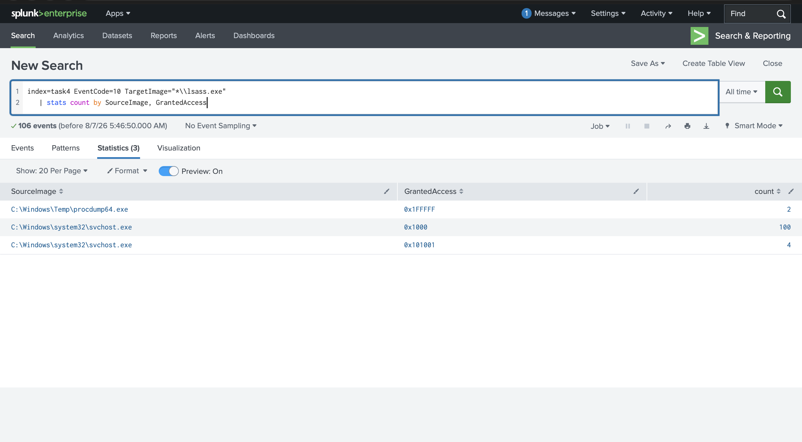

## Screenshot 7 - LSASS Dumping: CallTrace Analysis
Filtering specifically for the suspicious process and examining its `CallTrace` field revealed the method used:
```spl
index=task4 EventCode=10 TargetImage="*\\lsass.exe" SourceImage="*procdump64.exe"
| table _time, SourceImage, SourceUser, GrantedAccess, CallTrace
```
The `CallTrace` showed known DLLs (such as `dbgcore.dll`), confirming a MiniDump API-based dump consistent with ProcDump - a legitimate debugging tool used for malicious credential extraction, rather than a more sophisticated injection-based technique.

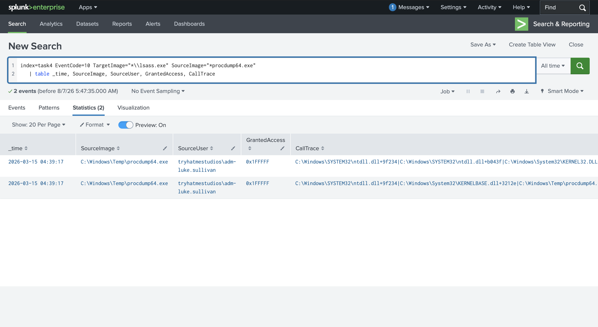

## Screenshot 8 - DCSync: Detection via Replication Rights
DCSync abuses the legitimate Active Directory replication protocol (DRSUAPI): an attacker's machine pretends to be a domain controller and requests password data directly, without ever touching the DC's disk. This requires the `DS-Replication-Get-Changes-All` extended right (GUID `1131f6ad`), held by default by Domain Admins, Enterprise Admins, and DC machine accounts. I filtered Event 4662 for this replication GUID performed by a non-machine account:
```spl
index=task5 EventCode=4662 "1131f6ad" user!="*$"
| table _time, user, Access_Mask, Properties
| sort _time
```
This returned a human user account exercising domain replication rights - a strong DCSync indicator, since legitimate replication in a single-DC lab environment (or DC-to-DC replication in production) would show a machine account (`$` suffix), not a human user.

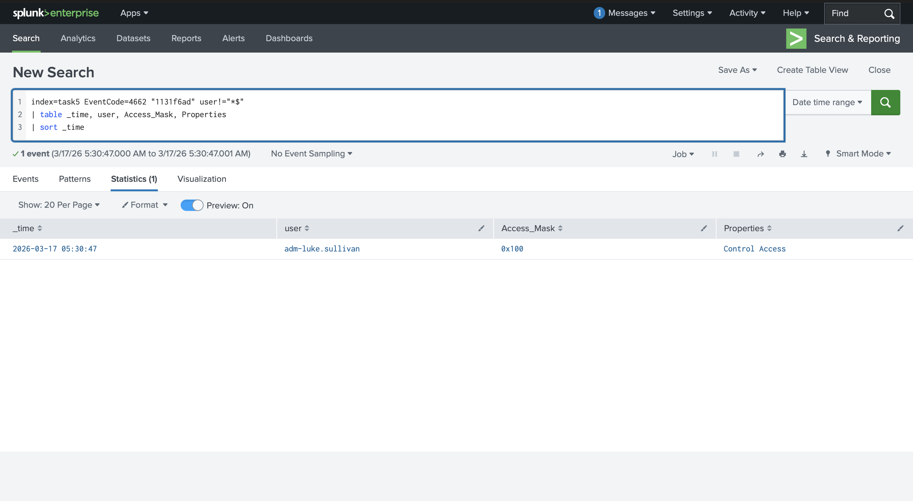

## Screenshot 9 - DCSync: Extracting the Logon_ID
Since Event 4662 does not contain a source IP field directly, I extracted the `Logon_ID` from the DCSync event to pivot toward a correlated logon event:
```spl
index=task5 EventCode=4662 Access_Mask=0x100 user={COMPROMISED_USER} "1131f6ad"
| table _time, host, user, Logon_ID
```

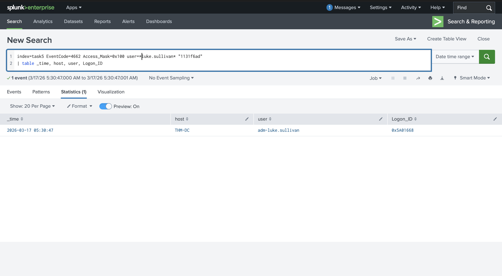

## Screenshot 10 - DCSync: Correlating the Source IP
Using the extracted `Logon_ID`, I queried the corresponding Event 4624 to recover the source IP and logon type of the session that performed the DCSync:
```spl
index=task5 EventCode=4624 Logon_ID={LOGON_ID}
| table _time, host, user, Source_Network_Address, Logon_Type
```
This confirmed the attacker's source IP, completing the DCSync investigation by linking the replication event to its originating session.

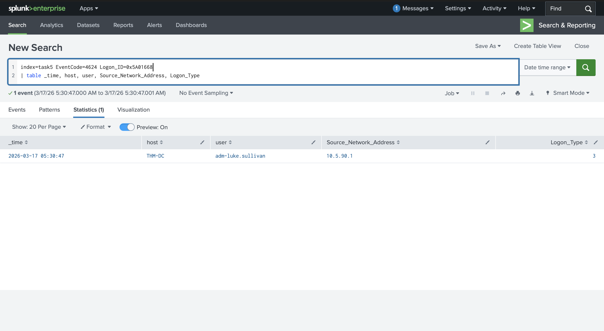

## Screenshot 11 - NTDS.dit Extraction: ntdsutil IFM Abuse
As an alternative, noisier path to full domain credential extraction, attackers can copy the NTDS.dit database directly from a domain controller's disk. One method abuses `ntdsutil`'s legitimate Install From Media (IFM) feature, normally used for DC promotion, to produce a clean offline copy of the database. I queried Sysmon Event 1 for `ntdsutil.exe` execution:
```spl
index=task6 EventCode=1 Image="*\ntdsutil.exe"
| table _time, host, User, ParentImage, Image, CommandLine
```
The full command line confirmed the `ifm`/`create` subcommands consistent with malicious database extraction rather than legitimate DC promotion activity.

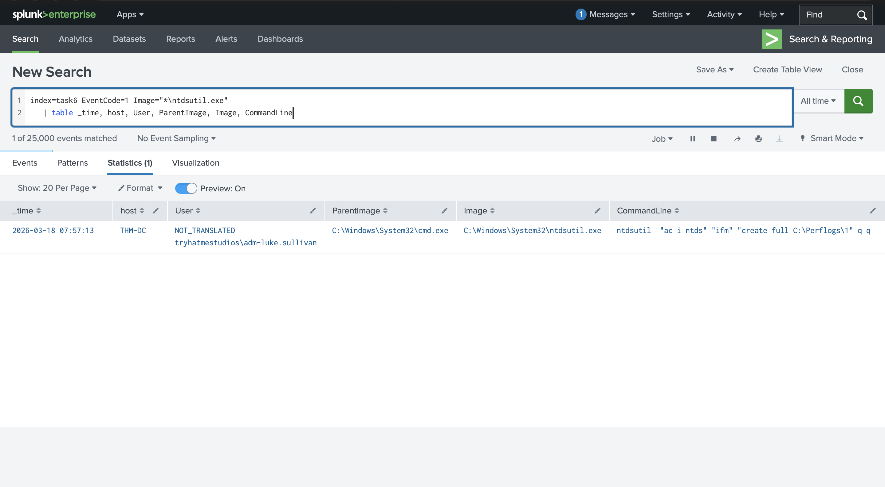

## Screenshot 12 - NTDS.dit Extraction: File Write Confirmation
To confirm the extraction actually succeeded, I checked for the resulting file write via Sysmon Event 11:
```spl
index=task6 EventCode=11 TargetFilename="*ntds.dit" Image="*\\ntdsutil.exe"
| table _time, Image, TargetFilename
```
This confirmed `ntds.dit` was written to disk, with `TargetFilename` revealing exactly where the attacker saved the extracted database.

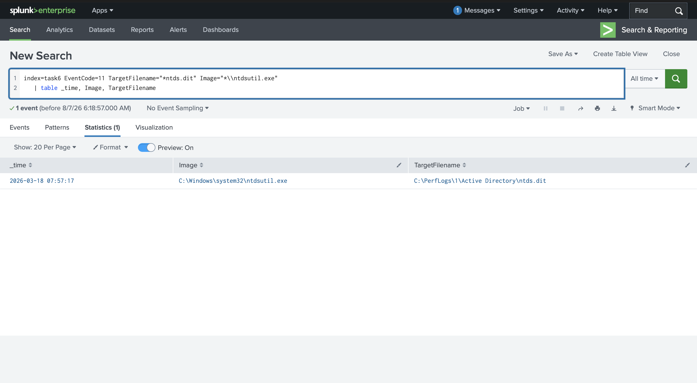

## Screenshot 13 - NTDS.dit Extraction: Volume Shadow Copy Method
The second extraction method uses `vssadmin` to create a Volume Shadow Copy, bypassing the file lock Windows places on `ntds.dit` while Active Directory is running. I queried for shadow copy creation:
```spl
index=task6 EventCode=1 Image="*\vssadmin.exe" CommandLine="*create shadow*"
| table _time, host, User, ParentImage, Image, CommandLine
```
Shadow copy creation alone has legitimate backup/restore uses, so this event alone doesn't confirm credential theft - what happens next in the command sequence is what matters.

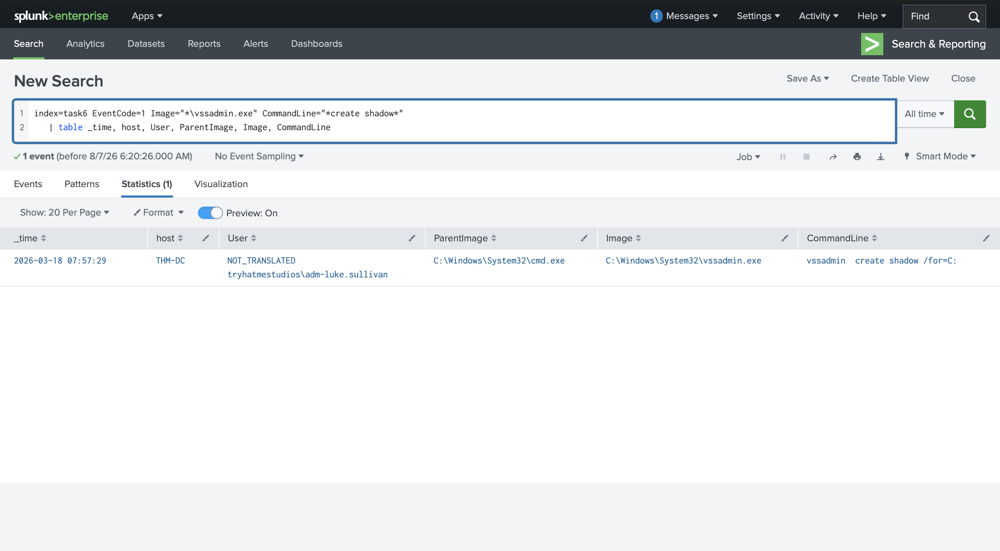

## Screenshot 14 - NTDS.dit Extraction: Copy Commands from Shadow Copy
Following the shadow copy creation, I searched for copy commands referencing the shadow copy path and targeting sensitive files:
```spl
index=task6 EventCode=1 CommandLine="*HarddiskVolumeShadowCopy*" (CommandLine="*ntds*" OR CommandLine="*SYSTEM*")
| table _time, host, User, ParentImage, Image, CommandLine
```
This revealed the full source and destination paths used to copy both `ntds.dit` and the SYSTEM registry hive (required to decrypt the password hashes) from the shadow copy - confirming successful, complete credential database extraction via this method.

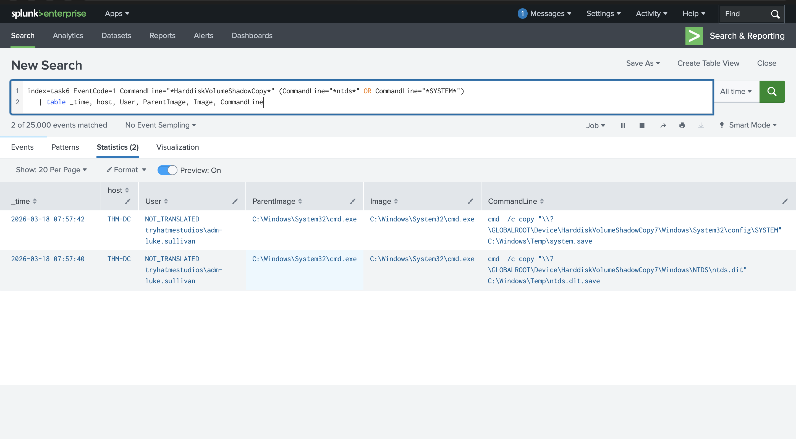

## Screenshot 15 - Investigation Challenge: Full Attack Chain
As a capstone exercise, a separate, previously unseen dataset (`index=task7`) presented a SIEM alert describing a burst of RC4-encrypted TGS requests from an unknown source IP against multiple service accounts. Applying the full methodology developed throughout this room, I traced the complete attack chain independently:

**AS-REP Roasting target:**
```spl
index=task7 EventCode=4768 Pre_Authentication_Type=0
| table _time, Account_Name, Pre_Authentication_Type, Ticket_Encryption_Type, Client_Address
```
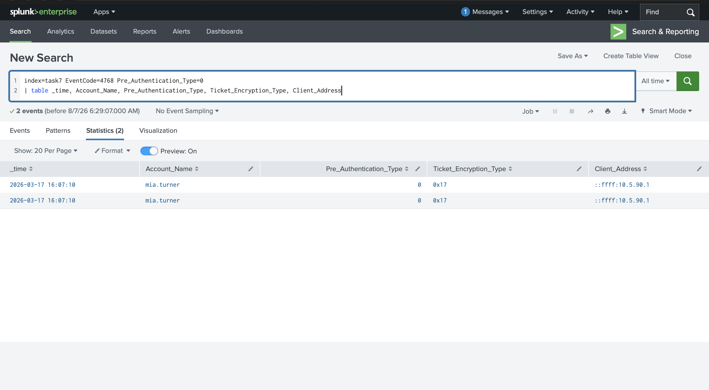

**Kerberoasting attacker account:**
```spl
index=task7 EventCode=4769 Ticket_Encryption_Type=0x17 Service_Name!="*$" Service_Name!="krbtgt"
| stats dc(Service_Name) as targeted_services count by Account_Name, Client_Address
| sort - targeted_services
```
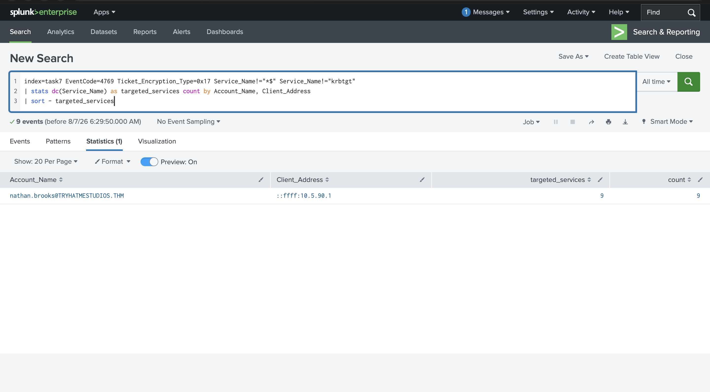

**LSASS access on the workstation:**
```spl
index=task7 EventCode=10 TargetImage="*\\lsass.exe"
| stats count by SourceImage, GrantedAccess
```
This identified `rundll32.exe` (executed from its legitimate `C:\Windows\system32\` path) accessing LSASS with `GrantedAccess=0x1FFFFF` - a Living-off-the-Land Binary (LOLBin) technique, using a trusted Windows utility to dump credentials while blending in with normal system activity.

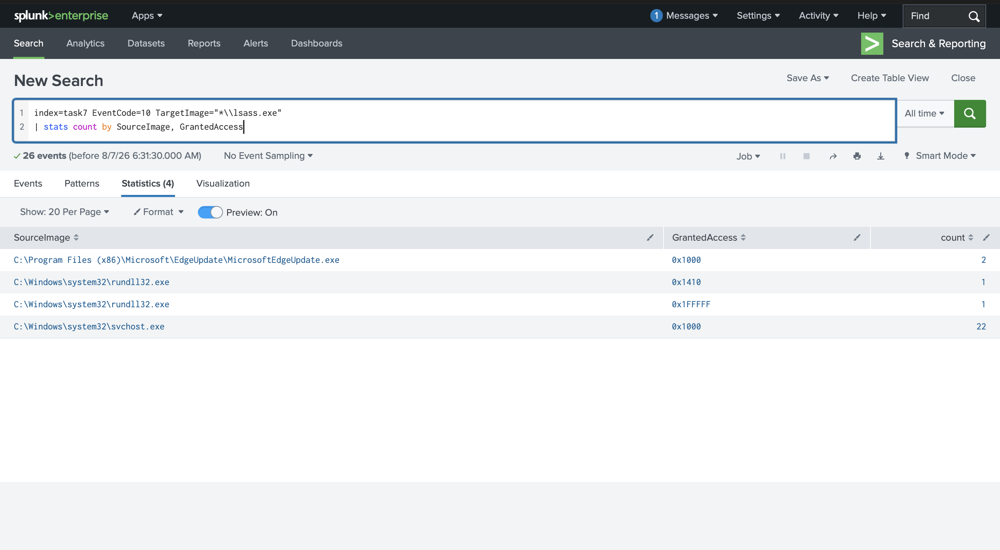

**DCSync attacker account:**
```spl
index=task7 EventCode=4662 "1131f6ad" user!="*$"
| table _time, user, Access_Mask, Properties
| sort _time
```
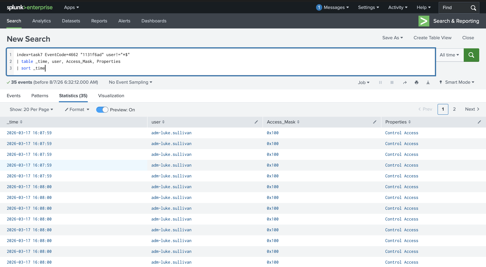

This confirmed the full escalation path: Kerberoasting provided initial service-account credentials, AS-REP Roasting harvested an additional crackable hash, LSASS dumping via a LOLBin extracted live credentials from a compromised workstation, and DCSync ultimately extracted domain-wide password hashes - representing complete domain compromise from a single initial alert.

## Findings
- **Kerberoasting**: Multiple RC4-encrypted TGS requests (Event 4769) were issued by a single compromised account against several service accounts within a short window, consistent with an automated Kerberoasting tool such as Rubeus or Impacket's GetUserSPNs.py.
- **AS-REP Roasting**: A single account configured with Kerberos pre-authentication disabled (`Pre_Authentication_Type=0`) had a TGT requested for it, with no follow-up TGS or logon activity - confirming the request was made purely to harvest a crackable password hash offline.
- **LSASS Dumping**: `procdump64.exe` (walkthrough) and `rundll32.exe` (challenge) were both observed accessing LSASS with `GrantedAccess=0x1FFFFF` (full process access), with `CallTrace` evidence pointing to MiniDump API usage - a hands-on-keyboard credential theft technique using legitimate Windows tooling (LOLBins) rather than custom malware.
- **DCSync**: A non-machine (human) user account was observed exercising the `DS-Replication-Get-Changes-All` extended right, confirmed via Event 4662, with the attacker's source IP recovered by correlating the event's `Logon_ID` to a matching Event 4624 logon session.
- **NTDS.dit Extraction**: Both covered extraction methods - `ntdsutil` IFM abuse and `vssadmin` Volume Shadow Copy creation followed by targeted file copies - were identified through Sysmon process creation (Event 1) and file creation (Event 11) telemetry on the domain controller.
- The independent investigation challenge confirmed a complete, multi-stage credential access campaign spanning all five techniques covered in this room, demonstrating a realistic escalation path from initial service-account compromise to full domain credential extraction.
- Real-world ransomware groups (BlackSuit, Akira, Scattered Spider) and nation-state actors (APT29/SolarWinds) have been documented using these exact techniques - Kerberoasting, AS-REP Roasting, LSASS dumping, and DCSync are not theoretical attack patterns but standard, actively used tradecraft in ongoing intrusions.

## Lessons Learned
- Learned that RC4 encryption (`0x17`) in Kerberos tickets is the most reliable single indicator of Kerberoasting in most current environments, but this signal is not future-proof: tools like Orpheus can perform Kerberoasting using AES-256 encryption, and Microsoft's ongoing RC4 deprecation (default-AES starting with Windows Server 2025) means volume-based detection (unusual numbers of unique SPNs requested per account per time window) is necessary for durable, encryption-agnostic coverage.
- Reinforced that the absence of expected follow-up activity (no 4769/4624 after a 4768) is itself a meaningful detection signal for AS-REP Roasting, not just the presence of an anomalous event - a reminder that SOC investigations often hinge as much on what didn't happen as on what did.
- Practiced interpreting Sysmon's `GrantedAccess` hex bitmasks and `CallTrace` field to distinguish between different LSASS dumping methods (MiniDump API vs. code injection) and to recognize Living-off-the-Land Binary abuse, where a legitimate, trusted Windows utility (rundll32.exe) is repurposed for credential theft - reinforcing that detection must rely on full file path and behavioral context rather than process name alone.
- Learned that DCSync detection has a critical, easy-to-miss prerequisite: "Audit Directory Service Access" and an appropriate SACL on the domain partition must both be explicitly configured, or DCSync activity is completely invisible in the logs regardless of how well-tuned a search query is - a strong argument for periodically auditing one's own detection coverage, not just writing queries against the assumption that the necessary logs exist.
- Recognized that the `user!="*$"` filter used for DCSync detection is a reasonable baseline but not foolproof, since an attacker who compromises a machine account's credentials (via ADCS abuse, unconstrained delegation, or similar) could perform DCSync from a machine account and evade this specific filter - a reminder that detection heuristics should be periodically re-evaluated against evolving attacker tradecraft.
- Compared DCSync and NTDS.dit extraction as two structurally different paths to the same objective, reinforcing that the same attacker goal (extracting every credential in the domain) can be pursued through very different techniques with very different noise profiles, log sources, and required privilege levels - meaning defenders need coverage across multiple detection strategies, not just one.
- Completing the independent investigation challenge - tracing a full five-technique attack chain in a previously unseen dataset without step-by-step guidance - confirmed that the underlying detection methodology and field-level reasoning had been internalized, not just the specific SPL syntax used throughout the guided walkthroughs.

## References
- [TryHackMe - Active Directory for SOC: Detecting AD Credential Attacks](https://tryhackme.com/module/active-directory-for-soc)
- [The DFIR Report - BlackSuit Ransomware (August 2024)](https://thedfirreport.com/2024/08/26/blacksuit-ransomware/)
- [ReliaQuest - BlackSuit Attack Analysis](https://reliaquest.com/blog/blacksuit-attack-analysis/)
- [CISA/FBI Advisory AA24-109A - Akira Ransomware](https://www.cisa.gov/news-events/cybersecurity-advisories/aa24-109a)
- [Splunk Threat Research Team - You Bet Your Lsass: Hunting LSASS Access](https://www.splunk.com/en_us/blog/security.html)
- [MITRE CAR-2019-08-002 - NTDS.dit File Access](https://car.mitre.org/analytics/CAR-2019-08-002/)
- [Microsoft - Kerberos RC4 Deprecation](https://learn.microsoft.com/en-us/windows-server/security/kerberos/kerberos-rc4-deprecation)
