# Detecting AD Initial Access

## Objective
Investigate how attackers gain initial access to an Active Directory environment through an AD-integrated web application (IIS), and learn to detect web shell deployment and exploitation using both IIS access logs and Windows/Sysmon endpoint telemetry. This room covers how AD-connected services expand the attack surface beyond a single standalone machine, and walks through a full investigation of a web shell attack from initial reconnaissance through command execution.

## Skills Demonstrated
- Understanding how AD-integrated services (IIS-hosted applications, Exchange, SharePoint, ADFS, VPN gateways) expand the blast radius of a compromise from a single server to the entire domain
- Identifying where IIS authentication activity is logged: Windows Security events (4624/4625) and IIS access logs on the web server, and Event 4776 (credential validation) on the Domain Controller
- Locating and interpreting raw IIS W3C log files (`C:\inetpub\logs\LogFiles\W3SVC1`), including awareness that IIS timestamps are recorded in UTC regardless of server local time
- Reading key IIS log fields (`c-ip`, `cs-uri-stem`, `cs-uri-query`, `cs-method`, `sc-status`, `cs(User-Agent)`) to reconstruct attacker activity from raw HTTP request logs
- Distinguishing normal vs. suspicious IIS traffic patterns: authentication volume, request timing, URI paths, query strings, HTTP methods, and status code distributions
- Recognizing web shell characteristics (`.aspx` scripts accepting commands via HTTP parameters) and understanding why they are a persistent, low-footprint attacker tool
- Identifying the core web shell detection pattern: `w3wp.exe` (the IIS worker process) spawning child processes such as `cmd.exe` or `powershell.exe`, which does not occur during normal IIS operation
- Conducting a full, staged SPL investigation of a web shell attack:
  1. Identifying a directory-scanning source IP via a burst of 404 responses
  2. Pivoting to that IP's successful (200) requests to discover the deployed web shell
  3. Filtering for the web shell's URI to extract attacker-issued reconnaissance commands from the query string
  4. Correlating IIS activity with Sysmon Event ID 1 (process creation) to confirm `w3wp.exe` executing the same commands on the endpoint
  5. Using Sysmon Event ID 11 (file creation) to determine the exact web shell deployment timestamp, with IIS POST-request logs as a fallback if Sysmon data is unavailable
- Recognizing real-world precedent for this attack pattern (HAFNIUM/ProxyLogon China Chopper web shells, 2023 Telerik UI exploitation) and understanding that the underlying detection signature remains consistent across different initial vulnerabilities

## Tools Used
- Splunk (Search & Reporting)
- IIS W3C access logs
- Sysmon (Event ID 1 - Process Creation, Event ID 11 - File Creation)
- Windows Security Event Log (4624, 4625, 4776)
- SPL (Search Processing Language)

## Screenshot 1 - Identifying the Scanning IP (404 Burst)
Before deploying a web shell, attackers typically scan an IIS server for writable paths, which appears in IIS logs as a burst of 404 (Not Found) responses from a single source IP. I queried the `iis` index for all 404 responses, grouped by client IP, and sorted by count:
```spl
index=iis sc_status=404
| stats count by c_ip
| sort - count
```
One IP address stood out with a dramatically higher 404 count than any other source, identifying it as the directory-scanning attacker IP used throughout the rest of the investigation.

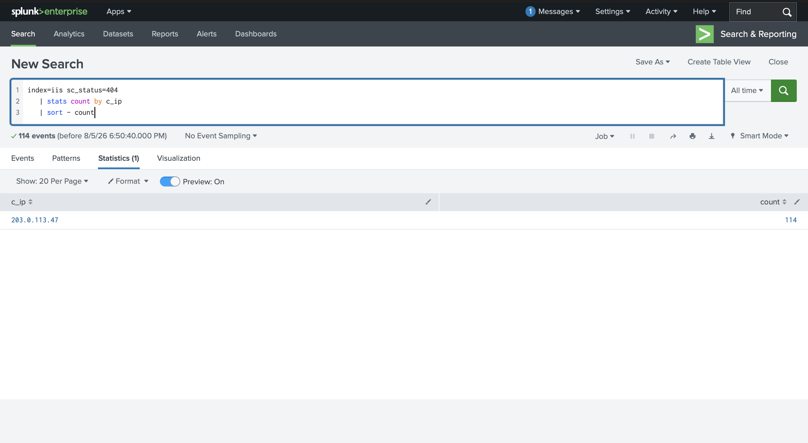

## Screenshot 2 - Discovering the Web Shell
Pivoting to the identified IP's successful (200) requests revealed what resources the attacker found and accessed:
```spl
index=iis c_ip={SUSPICIOUS_IP} sc_status=200
| stats count by cs_uri_stem
| sort - count
```
Among the URIs returned, one stood out as a suspicious `.aspx` file located in `/aspnet_client/` - a default IIS directory intended only for ASP.NET client-side scripts, which should never contain executable application code. This directory is writable by the IIS worker process (`w3wp.exe`), making it a common web shell drop location, consistent with real-world China Chopper deployments observed during the 2021 HAFNIUM/ProxyLogon campaign.

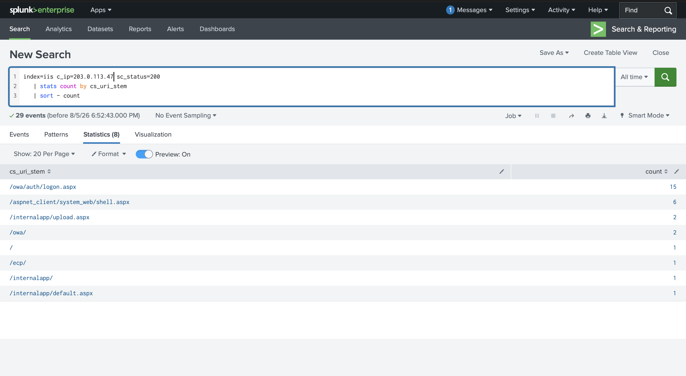

## Screenshot 3 - Extracting Reconnaissance Commands
Filtering IIS logs specifically for requests to the identified web shell file exposed the attacker's activity through the `cs_uri_query` field, since this particular web shell accepts OS commands as a URL parameter:
```spl
index=iis cs_uri_stem="*/{WEBSHELL_FILENAME}"
| table _time, c_ip, cs_method, cs_uri_query, sc_status
| sort _time
```
The `cs_uri_query` field revealed the reconnaissance commands the attacker executed through the web shell over HTTP.

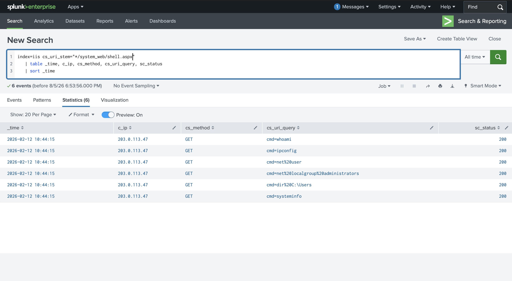

## Screenshot 4 - Confirming Execution via Sysmon Process Chain
To confirm these commands were actually executed on the host (rather than just requested over HTTP), I pivoted to Sysmon Event ID 1 (process creation), filtering for any process spawned by `w3wp.exe` - something that should essentially never happen during normal IIS operation:
```spl
index=win EventCode=1 ParentImage="*\\w3wp.exe"
| table _time, ParentImage, CommandLine
| sort _time
```
This confirmed `w3wp.exe` spawning command-line processes executing the same reconnaissance commands observed in the IIS query string, validating that the web shell successfully achieved code execution on the host.

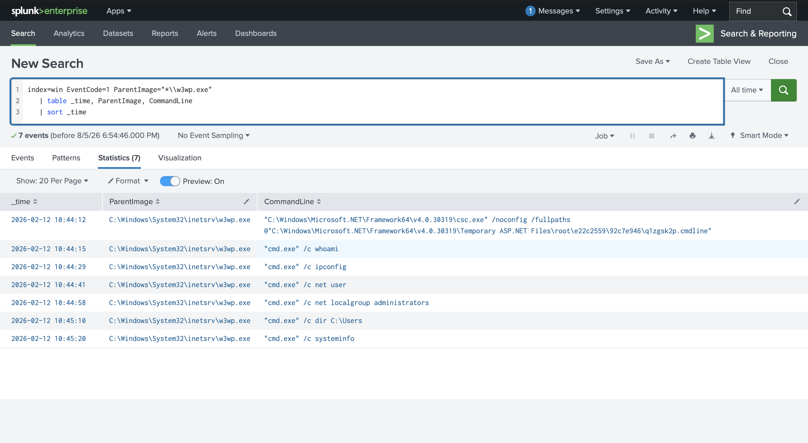

## Screenshot 5 - Determining Web Shell Deployment Time
Finally, to establish exactly when the web shell was written to disk, I queried Sysmon Event ID 11 (File Create) for the web shell's filename:
```spl
index=win EventCode=11 TargetFilename="*{WEBSHELL_FILENAME}"
| table _time, Image, TargetFilename
```
This returned the precise timestamp the web shell file was created on the target server, anchoring the start of the intrusion timeline. (Note: if Sysmon Event ID 11 data isn't available in a given environment, the same deployment timestamp can typically be recovered from the IIS logs by filtering for the POST request that uploaded the web shell.)

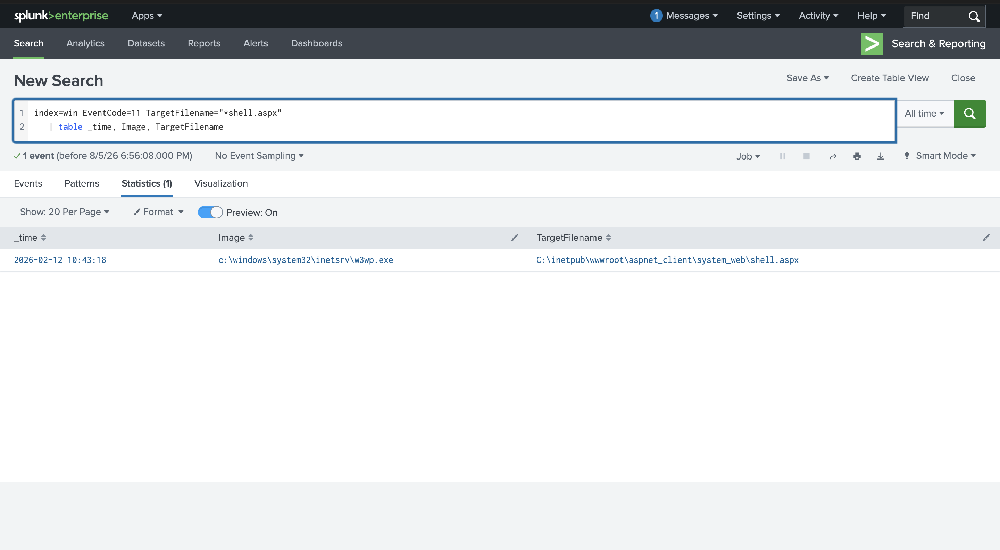

## Screenshot 6 - OWA Brute-Force Burst Detection
Exchange Outlook Web Access (OWA) is one of the most commonly targeted login pages in enterprise environments, since it is internet-facing by design and serves as the gateway to corporate email. A real-world precedent for this attack pattern is the January 2024 Midnight Blizzard campaign against Microsoft's own corporate Exchange environment, where a legacy test tenant account without MFA was compromised via password spraying.

To detect a brute-force attempt against OWA, I queried IIS logs for a burst of POST requests to the OWA authentication endpoint, grouped into 5-minute windows per source IP:
```spl
index=iis cs_uri_stem="/owa/auth.owa" cs_method=POST
| bin _time span=5m
| stats count by _time, c_ip
| where count > 10
| sort - count
```
This surfaced a single IP address sending a high volume of authentication POST requests within a short window - a clear brute-force (or password spray) signal. At the IIS level alone, brute force and password spraying look identical, since IIS logs do not capture which specific account was targeted.

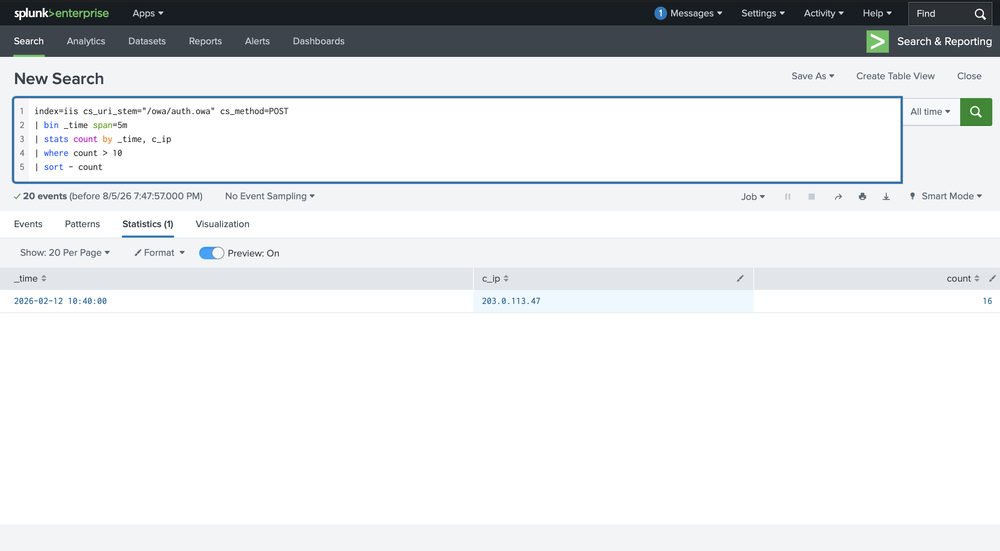

## Screenshot 7 - Identifying the Targeted Account
Since IIS logs don't capture the targeted username for OWA requests, I pivoted to Windows Security logs (Event 4625 - failed logon) to determine whether the failed attempts clustered around one account (brute force) or were spread across many accounts (password spraying):
```spl
index=win EventCode=4625
| stats count by user, Logon_Type
| sort - count
```
The account with the highest failure count was identified as the brute-force target, logged under **Logon_Type 8 (NetworkCleartext)** - the logon type IIS-hosted applications use when authenticating against Active Directory on behalf of a web-based login.

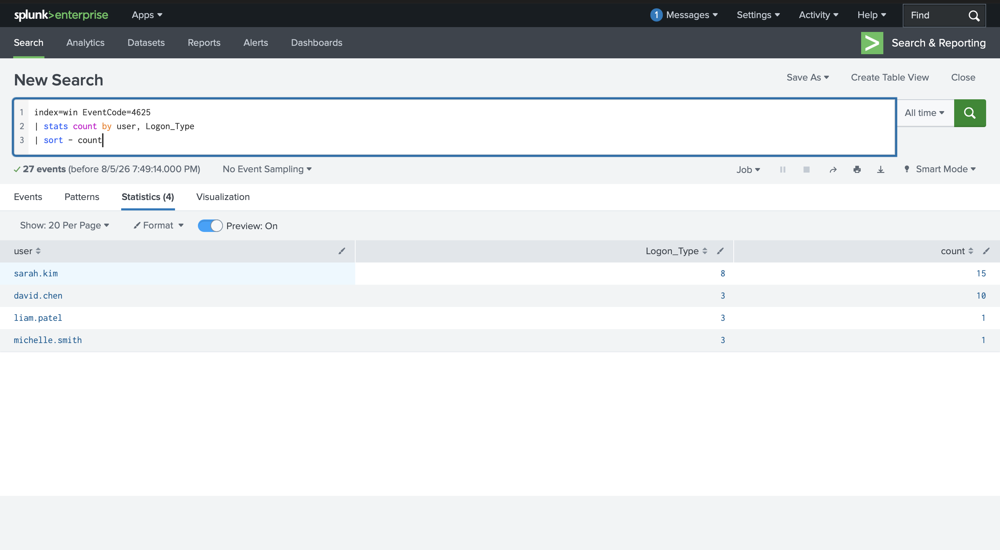

## Screenshot 8 - Correlating the Login Timeline
To determine whether the brute-force attempt ultimately succeeded, I queried both successful (4624) and failed (4625) logon events for the targeted account, sorted chronologically:
```spl
index=win EventCode IN (4624, 4625) user="{TARGETED_USER}" Logon_Type=8
| table _time, EventCode, user, Process_Name, Logon_Type
| sort _time
```
This revealed a cluster of 4625 (failure) events followed by a 4624 (success) event, confirming the attacker eventually authenticated successfully. These events appear on the web server itself rather than the Domain Controller, since IIS handles the authentication locally. Notably, the `Source_Network_Address` field on these events was empty/local rather than showing the attacker's real IP - the true source IP is only visible in the IIS logs, reinforcing why both log sources are needed together for a complete picture.

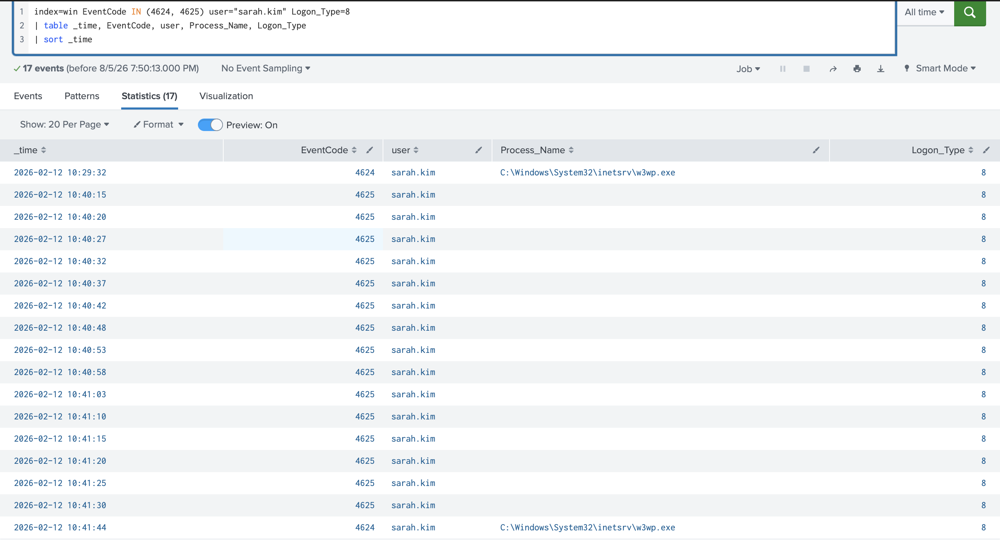

## Screenshot 9 - Post-Authentication Activity Check
With confirmed successful authentication, the final step was checking whether the attacker accessed any sensitive Exchange paths after logging in, which would indicate escalation beyond simple mailbox access:
```spl
index=iis c_ip="{ATTACKER_IP}"
| stats count by cs_uri_stem
| sort - count
```
This query checks specifically for requests to `/ecp` (the Exchange Control Panel, the administrative interface) or `/powershell` (Exchange Remote PowerShell) - either of which would indicate the attacker moved beyond email access toward administrative control, such as creating mail forwarding rules or exporting mailboxes.

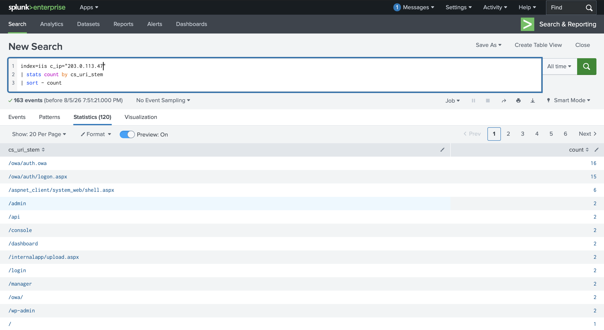

## Screenshot 10 - VPN Attack Scope (NPS Denial Events)
The final investigation scenario in this room shifts the log source from IIS to NPS (Network Policy Server), since VPN gateways are typically non-Windows appliances that authenticate against AD via RADIUS rather than directly. To scope a potential VPN credential attack, I queried NPS denial events (Event 6273), grouped by targeted username and the RADIUS client IP that forwarded the request:
```spl
index=win EventCode=6273
| stats count by User_Account_Name, Client_IP_Address
| sort - count
```
This identified which usernames were targeted by failed VPN authentication attempts. Note that `Client_IP_Address` in NPS events reflects the VPN gateway's IP (the RADIUS client forwarding the request), not the original source IP of whoever is actually attempting to authenticate to the VPN.

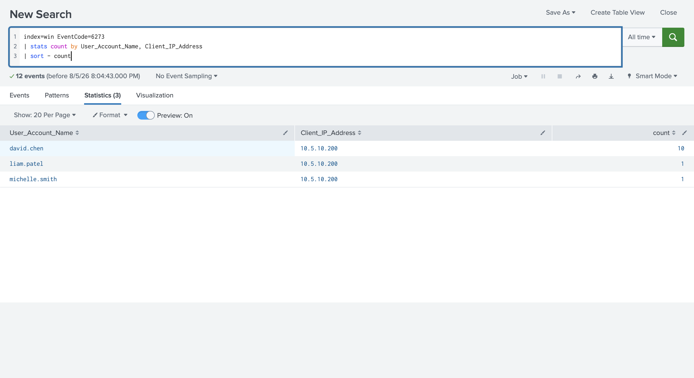

## Screenshot 11 - Confirming the Compromised Account
To determine whether the targeted account was ultimately compromised, I filtered NPS events for both denials and grants against that specific account:
```spl
index=win EventCode IN (6273,6272) User_Account_Name={COMPROMISED_USER}
| table _time, EventCode, User_Account_Name, Client_IP_Address
```
This revealed a cluster of 6273 (denied) events followed by a 6272 (granted) event for the same account - the classic brute-force success pattern, mirroring what was observed in the OWA investigation but at the VPN/RADIUS layer instead of the web layer.

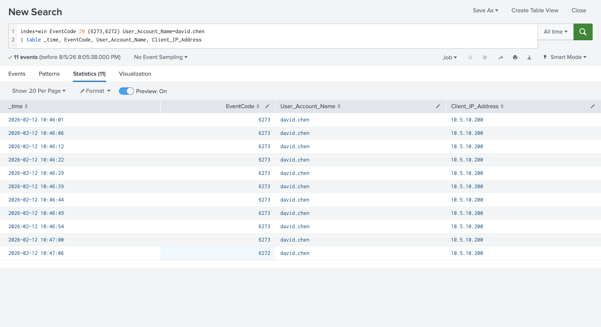

## Screenshot 12 - Correlating with Windows Security Logon Events
Finally, I cross-referenced the NPS authentication result with Windows Security logon events for the same account:
```spl
index=win EventCode IN (4624, 4625) user={COMPROMISED_USER}
| table _time, host, user, EventCode, Logon_Type
| sort _time
```
Since NPS runs on the Domain Controller (`THM-DC`) in this lab environment, the logon session events appear directly on the DC: a cluster of 4625 (failed logon) entries followed by a 4624 (successful logon), with a timestamp closely matching the NPS 6272 grant event from Step 2. These Security events also include the `LogonId` field, which enables tracing the compromised account's session activity after authentication - a natural next step for extending this investigation into post-compromise behavior.

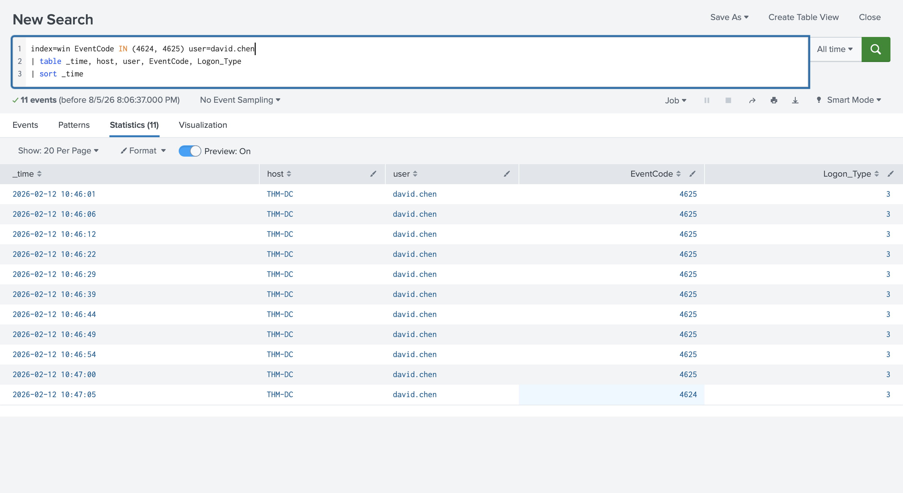

## Screenshot 13 - Investigation Challenge: Independent Web Shell Investigation
As a final, independent exercise, the room provided a separate investigation environment with its own Splunk instance, presenting the same class of alert (an unusual volume of HTTP 404 responses from a single external IP against an IIS web server) without step-by-step guidance. I applied the same methodology developed earlier in this room to reconstruct the attack independently:

**Identifying the web shell filename** - starting from the same 404-burst-to-successful-request pivot used in the walkthrough:
```spl
index=iis sc_status=404
| stats count by c_ip
| sort - count
```
followed by:
```spl
index=iis c_ip="{SCANNING_IP}" sc_status=200
| stats count by cs_uri_stem
| sort - count
```

**Extracting the first reconnaissance command** - filtering for the identified web shell and sorting chronologically to isolate the earliest interaction:
```spl
index=iis cs_uri_stem="*/{WEBSHELL_FILENAME}"
| table _time, c_ip, cs_method, cs_uri_query, sc_status
| sort _time
```

**Identifying the upload path** - locating the POST request responsible for writing the web shell to disk:
```spl
index=iis cs_method=POST cs_uri_query="*{WEBSHELL_FILENAME}*"
| table _time, c_ip, cs_uri_stem, cs_uri_query, sc_status
| sort _time
```

**Determining the exact deployment time** - pivoting to Sysmon file creation telemetry:
```spl
index=win EventCode=11 TargetFilename="*{WEBSHELL_FILENAME}"
| table _time, Image, TargetFilename
```

This exercise confirmed that the three-stage methodology built throughout this room (scope the scanning activity, identify the deployed artifact, correlate endpoint telemetry for execution and deployment timing) applies consistently to a fresh, previously unseen environment, without relying on prior knowledge of specific IPs, filenames, or timestamps.

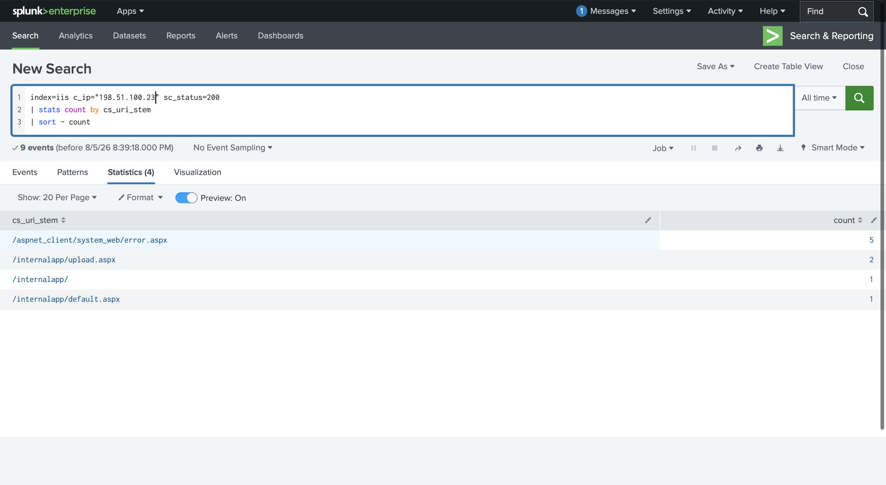
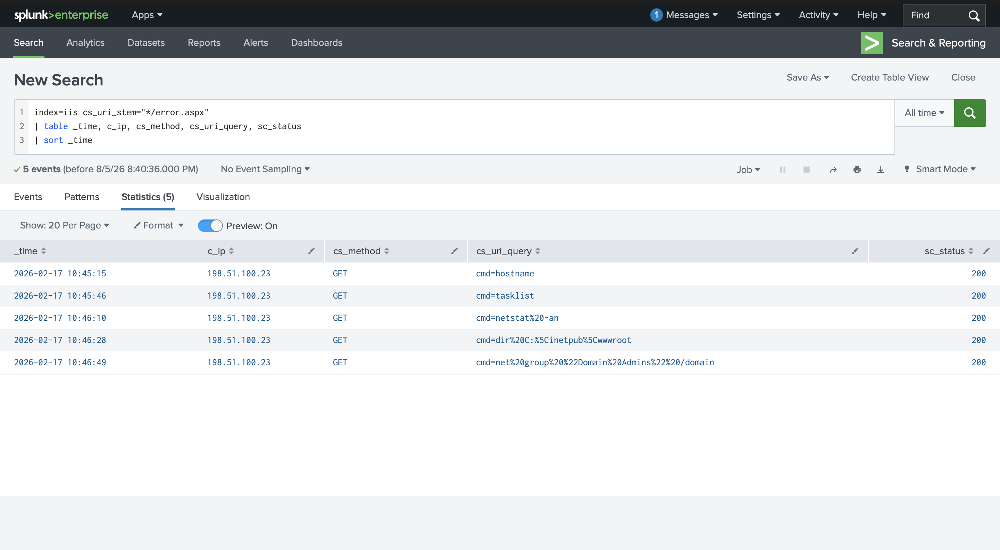
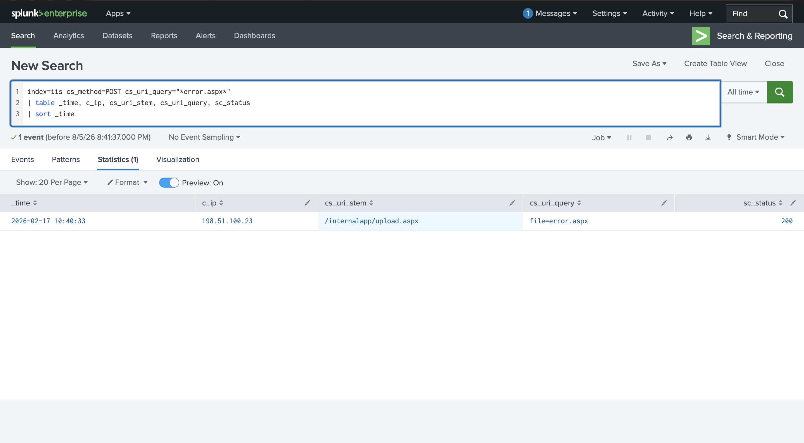
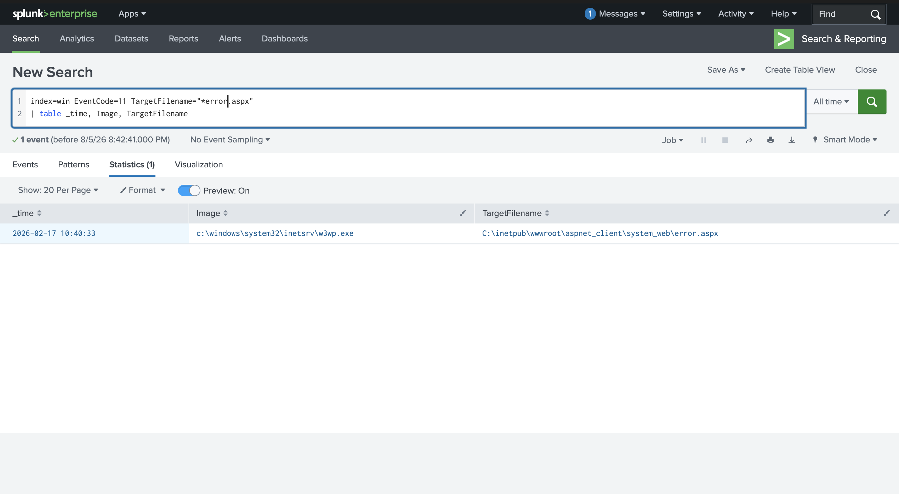

## Findings
- Initial access was achieved through directory scanning of an IIS-hosted application, followed by discovery and exploitation of a writable default directory (`/aspnet_client/`) to host a malicious `.aspx` web shell.
- The web shell accepted attacker commands via an HTTP query string parameter, allowing remote command execution without any additional attacker tooling beyond a web browser or HTTP client.
- The core detection signature for this attack - `w3wp.exe` spawning `cmd.exe`/`powershell.exe` - was confirmed directly in Sysmon process creation telemetry, corroborating the activity observed in the IIS access logs.
- IIS logs and endpoint (Sysmon/Security) logs are timestamped differently by default (UTC vs. local server time) and can show minor discrepancies due to buffered logging and network latency; both should be normalized before building a combined timeline during an investigation.
- This attack chain (web-facing application compromise -> web shell -> local code execution) represents the first stage of a broader AD compromise: once code execution is achieved on a domain-joined IIS server, an attacker is positioned to pivot toward credential theft and lateral movement using the techniques covered in later rooms of this module.
- A separate OWA brute-force investigation identified a burst of authentication POST requests from a single source IP against `/owa/auth.owa`, targeting one specific account (confirmed via Windows Security Event 4625, Logon_Type 8) rather than spreading attempts across many accounts, indicating a targeted brute-force rather than a password-spraying campaign.
- The brute-force attempt ultimately succeeded, evidenced by a cluster of 4625 failures followed by a 4624 success for the targeted account, both logged locally on the IIS/Exchange server rather than the Domain Controller.
- Post-authentication IIS activity from the attacker's IP was reviewed for access to `/ecp` or `/powershell`, which would indicate escalation from simple mailbox access toward administrative control of the Exchange environment.
- A third investigation targeting the VPN/RADIUS authentication layer identified a cluster of NPS 6273 (denied) events against a specific account, followed by a 6272 (granted) event, confirming a successful credential attack against the VPN gateway - mirroring the OWA brute-force pattern but at a different layer of the authentication stack.
- This VPN compromise was corroborated on the Domain Controller via a matching cluster of Windows Security 4625/4624 events for the same account, since NPS in this lab environment runs directly on the DC.
- VPN-based initial access is a well-documented technique for real-world ransomware groups such as Akira, which per CISA advisories has used VPN brute-forcing, password spraying, and purchased credentials from initial access brokers to gain footholds, in some cases exfiltrating data within two hours of initial access.
- An independent investigation challenge, using a separate environment with no prior context, was successfully worked through using the same methodology: identifying the web shell filename, its first reconnaissance command, its upload URI path, and its exact deployment timestamp - confirming the underlying detection and investigation approach generalizes beyond the specific walkthrough environment.

## Lessons Learned
- Reinforced that AD-integrated services dramatically increase the impact of what would otherwise be a contained, single-server compromise - a vulnerability in one web application can become a foothold into the entire domain.
- Learned to recognize `w3wp.exe` spawning child processes as a high-confidence detection pattern, since legitimate IIS operation essentially never requires the worker process to launch a command shell (with the narrow exception of legitimate .NET applications invoking the C# compiler, `csc.exe`, which is distinguishable by the commands being executed rather than the parent-child relationship alone).
- Practiced correlating two independent log sources (IIS access logs and Sysmon endpoint telemetry) to validate a single finding from two angles - confirming that a web request wasn't just attempted, but actually resulted in code execution on the host.
- Reinforced the importance of timestamp normalization (UTC vs. local time) when building a cross-source investigation timeline, a detail that's easy to overlook and can lead to incorrect sequencing of events if missed.
- Built a repeatable, staged investigation methodology (scan detection -> artifact discovery -> command extraction -> execution confirmation -> deployment timing) that generalizes well beyond this specific web shell scenario to other web-based initial access investigations.
- Learned that HTTP status codes alone are insufficient to determine authentication outcome in OWA logs, since both successful and failed logins return a 302 redirect; the query string (`reason=2` for failures) or a pivot to Windows Security logs is required to disambiguate.
- Reinforced that IIS-hosted authentication events (4624/4625) logged locally on a web server often lack the true attacker source IP in the `Source_Network_Address` field, since the logon is processed locally by IIS - meaning IIS access logs and Windows Security logs must be used together, not interchangeably, to fully attribute an attack.
- Practiced distinguishing brute-force (many attempts against one account) from password spraying (few attempts spread across many accounts) using the same underlying IIS signal, disambiguated only by pivoting to Windows Security logs - a reminder that identical network-layer patterns can represent different attacker techniques and require endpoint/directory-level context to correctly classify.
- Learned that VPN gateway detection depends entirely on whether RADIUS/NPS is configured in the environment; without it, VPN authentication events may only exist as 4624/4625 on the gateway itself and 4776 on the DC, meaning the availability of NPS event data is itself an environment-specific detail worth verifying before an investigation.
- Reinforced that not every authentication failure event indicates an attack: NPS Event 6273's Reason Code field distinguishes genuine credential attacks (code 16) from unrelated authorization or configuration issues (codes 48 and 65) - misreading this field could lead to chasing false positives or, worse, dismissing a real credential attack as a config problem.
- Recognized that a sufficiently patient or well-resourced attacker (one who already possesses valid credentials, whether purchased, phished, or reused) can authenticate with a single clean success event and no preceding failures, making pure authentication-log analysis insufficient on its own - detection in that scenario shifts entirely to post-authentication behavioral analysis, reinforcing why account activity monitoring after successful login matters as much as monitoring the login attempt itself.
- Observed the same investigative methodology (scope the attack -> identify the targeted/compromised account -> correlate across log sources) applied consistently across three different attack surfaces in this room (web shell/IIS, OWA/Exchange, and VPN/NPS), reinforcing that the underlying SOC investigation process generalizes well even as the specific log sources and event IDs change.
- Completing the independent investigation challenge without step-by-step instructions was the clearest confirmation that the methodology, not just the specific queries, had been internalized - being able to reconstruct the correct search logic from first principles (what event type would capture this activity, what field would contain this value) is a more durable skill than memorizing exact SPL syntax.

## References
- [TryHackMe - Active Directory for SOC: Detecting AD Initial Access](https://tryhackme.com/module/active-directory-for-soc)
- [CISA Advisory AA21-062A - Mitigate Microsoft Exchange Server Vulnerabilities](https://www.cisa.gov/news-events/cybersecurity-advisories/aa21-062a)
- [Microsoft - China Chopper Web Shell Analysis](https://www.microsoft.com/en-us/security/blog/2021/03/02/hafnium-targeting-exchange-servers/)
