# Detecting AD Lateral Movement

## Objective
Investigate how attackers move from an initial compromised foothold to high-value targets within an Active Directory environment using SMB, PsExec, and RDP, and learn to detect each technique using Windows Security logs, Sysmon, and Splunk. This room covers the authenticate-then-execute pattern common to all lateral movement, the source/destination artifact model, and walks through full investigations of admin share abuse, PsExec-based remote execution, and RDP session chaining, culminating in an independent investigation challenge against a renamed service.

## Skills Demonstrated
- Understanding the authenticate-then-execute pattern common to all lateral movement techniques, and the source/destination artifact model (Event 4648 and Sysmon Event 1 on the source vs. Event 4624 and share-access events on the destination)
- Detecting AD discovery activity through Sysmon Event 1 (process creation) and PowerShell Event 4104 (Script Block Logging), and recognizing living-off-the-land discovery commands (`nltest`, `net user`, `net group`, `Get-ADUser`) as precursors to lateral movement
- Identifying SMB admin share abuse (`ADMIN$`, `C$`) through Windows Security Event 5140, and distinguishing normal administrative access from lateral movement by baselining a user's typical share-access pattern before flagging a deviation as suspicious
- Mapping a source IP to its hostname using the Active Directory machine account naming convention (`HOSTNAME$` in Event 4624), a technique reused across every stage of this investigation
- Pivoting to source-host Sysmon logs to recover the actual logged-in user behind a stolen credential, distinguishing "who was at the keyboard" from "whose credentials were used"
- Detecting PsExec lateral movement through its full artifact chain: Event 7045 (service installation on the destination), Sysmon Event 17 (named pipe creation for stdin/stdout/stderr relay), Event 5145 (detailed file share access revealing the source hostname embedded in the pipe name), and Sysmon Event 1 on the source host confirming the PsExec.exe process launch
- Recognizing that PsExec's underlying behavioral signature (a demand-start, user-mode service installed via `ADMIN$`) persists even when the operator renames the binary and service name, defeating naive detection rules built only around the literal string `PSEXESVC`
- Detecting RDP-based lateral movement using Logon Type 10 (RemoteInteractive) on Event 4624, and understanding why RDP investigations typically begin from a downstream indicator (such as discovery commands on a sensitive host) rather than by hunting RDP logs directly, since RDP traffic is otherwise indistinguishable from legitimate administrative sessions
- Tracing multi-hop RDP chains by correlating `Logon_ID` between a process creation event and its parent logon session, then pivoting outward hop by hop using `mstsc.exe` process creation artifacts on each intermediate host
- Correlating source-side and destination-side artifacts across three independent techniques to reconstruct a single, coherent attacker path from the true point of origin to the Domain Controller
- Independently replaying the full investigative methodology (service installation -> command execution -> share access -> source attribution) against a fresh, unguided environment using a renamed service

## Tools Used
- Splunk (Search & Reporting)
- Windows Security Event Log (Event ID 4624, 4648, 5140, 5145, 7045)
- Sysmon (Event ID 1 - Process Creation, Event ID 17 - Pipe Created)
- PowerShell Script Block Logging (Event ID 4104)
- SPL (Search Processing Language)

## Screenshot 1 - AD Discovery Commands
Before moving laterally, an attacker first needs to map out the environment: which servers exist, which accounts hold elevated privileges, and how the domain is organized. This discovery phase relies almost entirely on built-in, "living off the land" Windows commands that don't require elevated privileges, since Active Directory grants read access to most domain data to any authenticated user by default. I queried Sysmon Event 1 (process creation) across the environment, filtering for the most common discovery commands:
```spl
index=win EventCode=1
| search CommandLine IN ("*nltest*", "*net * user*", "*net * group*", "*net * view*", "*net * localgroup*")
| table _time, host, User, Image, CommandLine, ParentImage
| sort _time
```
Sorting chronologically surfaced the earliest discovery command executed in the environment: `[paste exact CommandLine from your screenshot here]`.

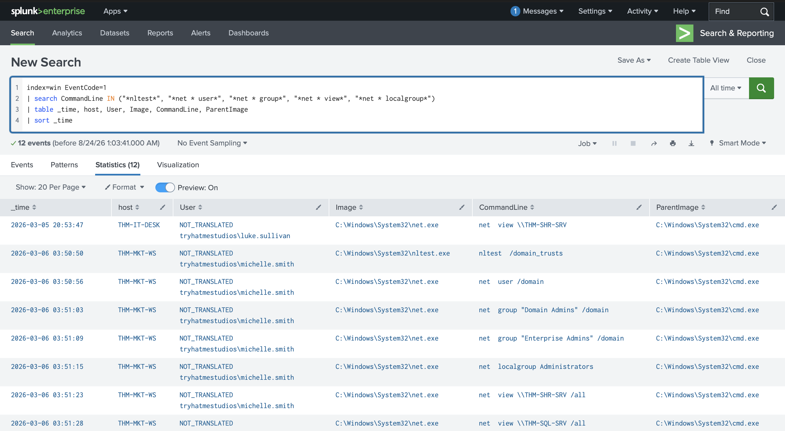

## Screenshot 2 - PowerShell AD Enumeration
Not all discovery activity shows up as a distinct process launch. If Script Block Logging is enabled, PowerShell cmdlets executed within an interactive session are captured individually via Event 4104, even when no new process is spawned for each command. I queried Event 4104 for common AD enumeration cmdlets:
```spl
index=win EventCode=4104
| search Message IN ("*Get-ADUser*", "*Get-ADGroupMember*", "*Get-ADComputer*")
| table _time, Message
| sort _time
```
The full `Message` field captured the complete script block, including the `Get-ADUser` command used to enumerate every domain user account: `[paste exact command from your screenshot here]`.

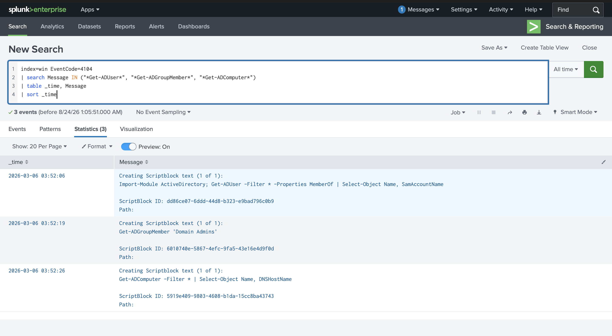

## Screenshot 3 - ADMIN$ Share Access
SMB is the noisiest and most commonly abused lateral movement protocol, since every drive mapping, Group Policy update, and file share access already relies on it. Default administrative shares (`C$`, `ADMIN$`, `IPC$`) exist on every Windows system for remote management, and regular users never touch them during normal work. I queried Event 5140 for any access to these shares:
```spl
index=win EventCode=5140 Share_Name IN ("*\\ADMIN$\*", "*\\C$\*")
| table _time, host, Source_Address, user, Share_Name
| sort _time
```
The results showed **luke.sullivan** accessing `ADMIN$` across three separate hosts - **THM-DEV-WS**, **THM-SHR-SRV**, and **THM-SQL-SRV** - all from a single source IP, **10.5.50.12**, within a tight six-minute window. A single account hitting admin shares on multiple machines in quick succession from one IP is a strong lateral movement indicator on its own, but confirming it required checking this against the account's normal behavior.

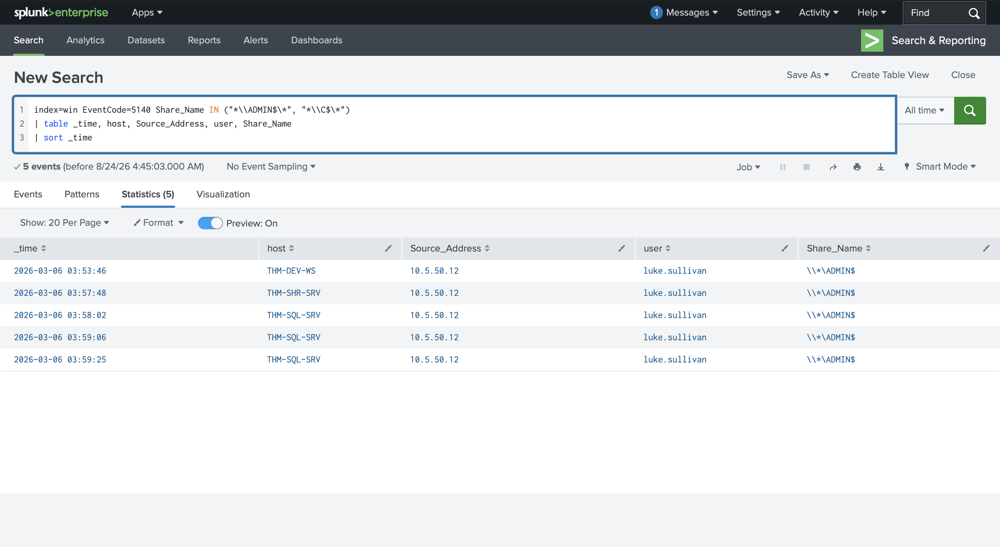

## Screenshot 4 - Baseline User Activity
To determine whether the ADMIN$ access above was actually suspicious, I pulled every share-access event for luke.sullivan and reviewed his historical pattern:
```spl
index=win EventCode=5140 user=luke.sullivan
| table _time, Source_Address, Share_Name, host
| sort _time
```
Luke.sullivan's baseline activity, recorded the day before and again later the same night, showed him accessing only the `\IT` and `\IPC$` shares on **THM-SHR-SRV**, consistently from **10.5.50.10** - his usual IT admin workstation. The `ADMIN$` access from **10.5.50.12** across three unrelated hosts stood out immediately against this baseline: different IP, different shares, and a workstation he had never used before.

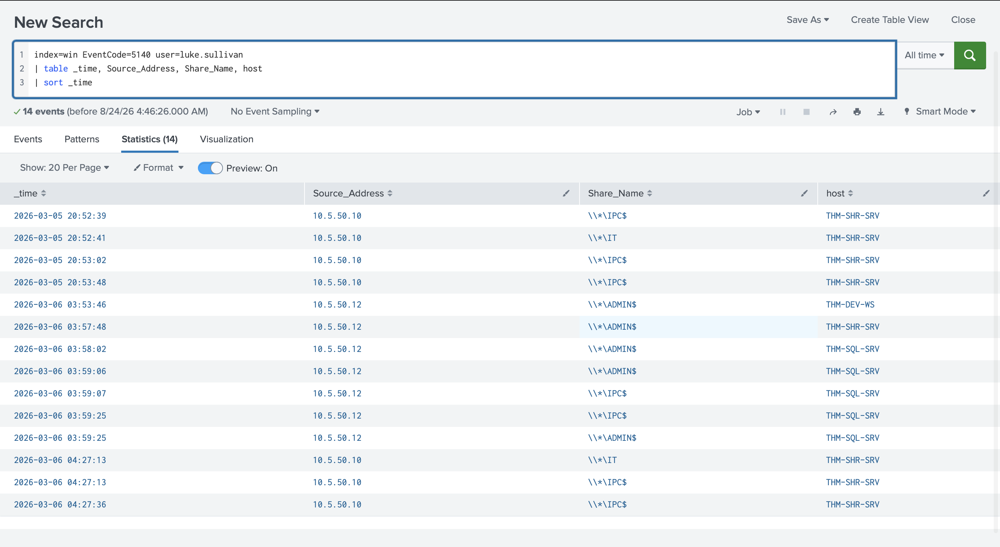

## Screenshot 5 - Source Hostname Mapping
With a confirmed anomaly and a source IP in hand, the next step was identifying which physical machine that IP belonged to. Since every domain-joined computer authenticates with a machine account matching its hostname (suffixed with `$`), I queried Event 4624 for any machine account logon from that IP:
```spl
index=win EventCode=4624 Source_Network_Address=10.5.50.12 user=*$
| stats count by user, Source_Network_Address
| sort -count
```
This resolved **10.5.50.12** to **THM-MKT-WS$**, meaning the source machine was **THM-MKT-WS** - a marketing workstation. An IT admin account authenticating from a marketing machine is exactly the kind of mismatch that indicates stolen credentials rather than legitimate administrative work.

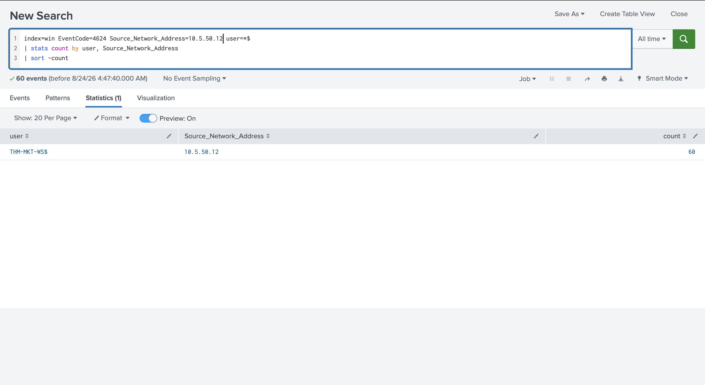

## Screenshot 6 - Source Commands (ADMIN$)
To find out who was actually at the keyboard on THM-MKT-WS, I pivoted to that host's Sysmon process creation logs and filtered for any command referencing `ADMIN$`:
```spl
index=win EventCode=1 host=THM-MKT-WS CommandLine="*ADMIN$*"
| table _time, User, Image, CommandLine
| sort _time
```
The results revealed that the logged-in user was actually **michelle.smith**, a marketing employee, running a series of `net use` commands with explicit credentials against all three target hosts:
```
net use \\THM-SHR-SRV\ADMIN$ /user:TRYHATMESTUDIOS\luke.sullivan P@ssw0rd!123
net use \\THM-SQL-SRV\ADMIN$ /user:TRYHATMESTUDIOS\luke.sullivan P@ssw0rd!123
net use \\THM-DEV-WS\ADMIN$ /user:TRYHATMESTUDIOS\luke.sullivan P@ssw0rd!123
```
This confirmed credential misuse: the `User` field showed michelle.smith at the keyboard, while the `CommandLine` field exposed luke.sullivan's stolen credentials - including his plaintext password - being used to authenticate against every target. This is precisely the two-different-accounts pattern that separates legitimate admin activity from an attacker operating with someone else's identity.

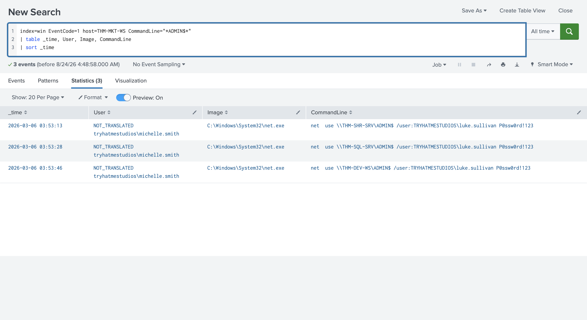

## Screenshot 7 - PsExec Service Installation
Raw SMB access alone only allows browsing and file copying; it doesn't execute anything remotely. PsExec closes that gap by combining an SMB admin share session with Windows service installation to run arbitrary commands on a target. Its signature artifact is Event 7045 (service installation) on the destination host, logged in the System log:
```spl
index=win EventCode=7045
| table _time, host, Service_Name, Service_File_Name, Service_Type, Service_Start_Type, Service_Account
| sort _time
```
Two `PSEXESVC` service installations appeared on **THM-SQL-SRV**, with the binary written to `%SystemRoot%\PSEXESVC.exe`, running under **LocalSystem** - meaning the remote commands executed with full SYSTEM-level privileges. Both installs matched the classic `demand start` / `user mode service` combination that defines PsExec's default configuration.

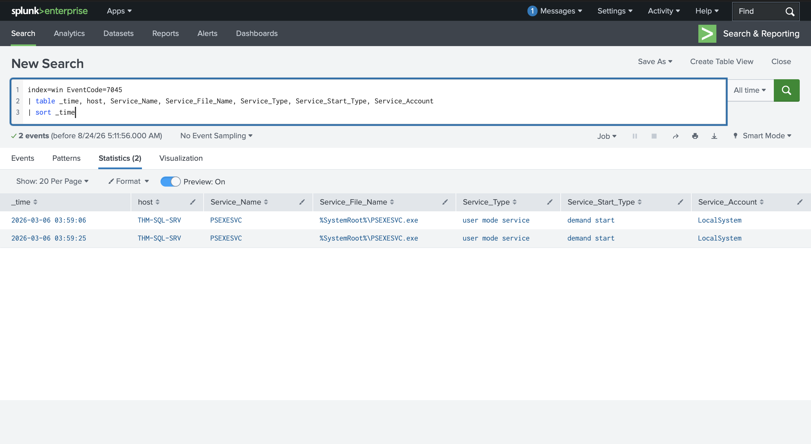

## Screenshot 8 - PsExec Commands Executed
Once the service is created, `PSEXESVC.exe` becomes the parent process for every command the attacker runs remotely. I filtered Sysmon Event 1 by `ParentImage` to isolate only processes spawned through the service:
```spl
index=win EventCode=1 host=THM-SQL-SRV ParentImage="*PSEXESVC*"
| table _time, host, User, ParentImage, Image, CommandLine
| sort _time
```
Two commands were executed, both under `tryhatmestudios\luke.sullivan`:
```
cmd /c "hostname & whoami & ipconfig"
cmd /c "net localgroup administrators"
```
This is the same discovery-then-enumerate pattern seen throughout the earlier initial access investigation: quick situational awareness (`hostname`/`whoami`/`ipconfig`) followed immediately by a privilege check (`net localgroup administrators`) on the newly reached host.

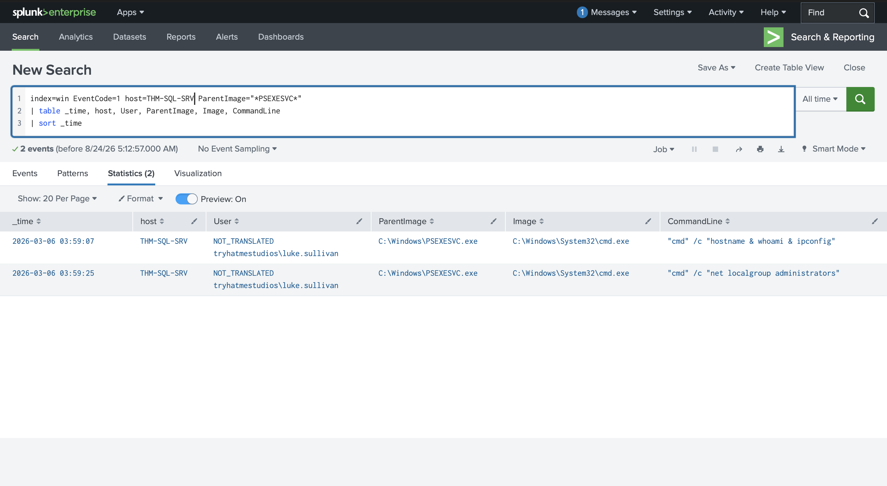

## Screenshot 9 - PsExec Named Pipes
PsExec relays stdin, stdout, and stderr between the source and destination over named pipes, which Sysmon captures via Event 17 (Pipe Created). Even when the service binary is renamed, these pipe names often retain PsExec's default naming convention:
```spl
index=win EventCode=17 Image="*PSEXESVC*"
| table _time, host, Image, PipeName
| sort _time
```
The pipes were named `\PSEXESVC-THM-MKT-WS-4544-{stdin,stdout,stderr}` and `\PSEXESVC-THM-MKT-WS-8536-{stdin,stdout,stderr}`. Notably, the pipe names themselves embed the source hostname - **THM-MKT-WS** - meaning this single artifact alone was enough to identify the true origin of the PsExec session, even before checking Event 5145.

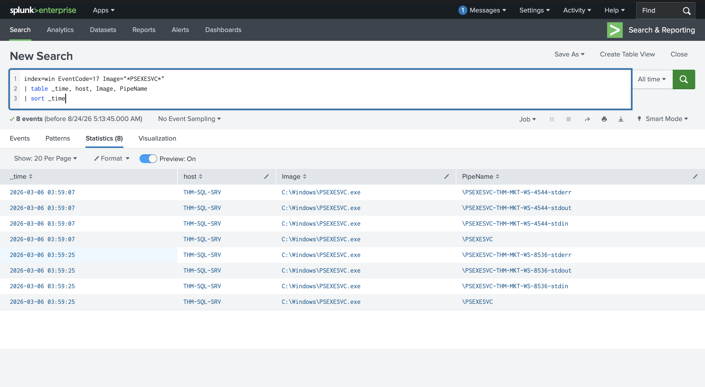

## Screenshot 10 - PsExec File Share Access
Event 5145 (Detailed File Share) logs the specific files and named pipe objects accessed through a share, making it a particularly rich artifact for PsExec investigations:
```spl
index=win EventCode=5145 host=THM-SQL-SRV Relative_Target_Name="*PSEXE*"
| table _time, user, Source_Address, Share_Name, Relative_Target_Name
| sort _time
```
This confirmed luke.sullivan's credentials connecting from **10.5.50.12**, first touching `PSEXESVC.exe` via the `ADMIN$` share, then the named pipes via `IPC$` - the complete file-and-pipe trail of a PsExec session, corroborating the hostname already recovered from the pipe names.

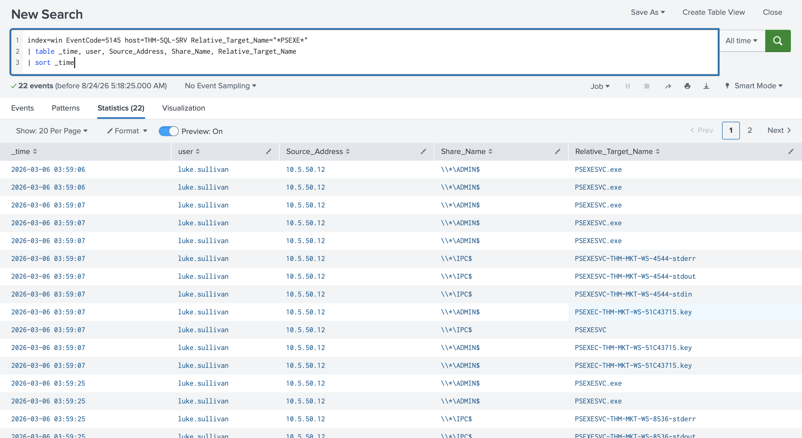

## Screenshot 11 - PsExec Source Host
The final step was confirming the PsExec launch itself on the source machine. I queried Sysmon Event 1 on THM-MKT-WS for any process referencing PsExec:
```spl
index=win EventCode=1 host=THM-MKT-WS
| search Image="*PsExec*"
| table _time, host, User, Image, CommandLine
| sort _time
```
This confirmed `michelle.smith` - again the actual logged-in user on THM-MKT-WS - launching:
```
C:\Tools\PsExec.exe -accepteula \\THM-SQL-SRV cmd /c "hostname & whoami & ipconfig"
C:\Tools\PsExec.exe \\THM-SQL-SRV cmd /c "net localgroup administrators"
```
This closed the loop on the PsExec investigation: THM-MKT-WS was confirmed as the true source, using the same stolen luke.sullivan credential set already identified during the SMB investigation, now demonstrated to have escalated from simple share browsing to full remote command execution.

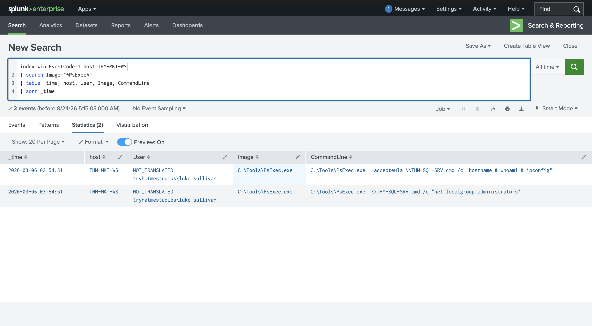

## Screenshot 12 - DC Discovery Commands
RDP doesn't leave a distinct signature artifact the way PsExec does - no service installation, no named pipes, nothing that says "this session was RDP" on its own. As a result, RDP investigations typically start from a downstream indicator rather than by hunting RDP logs directly. In this case, the trigger was discovery commands appearing directly on the Domain Controller itself:
```spl
index=win EventCode=1 host=THM-DC
| search CommandLine IN ("*nltest*", "*net * user*", "*net * group*", "*net * view*")
| table _time, host, User, Image, CommandLine, LogonId
| sort _time
```
This surfaced `adm-luke.sullivan` running `net  user /domain` directly on **THM-DC**, under `LogonId=0x508C55A` - a highly privileged admin account running enumeration commands on the most sensitive server in the domain.

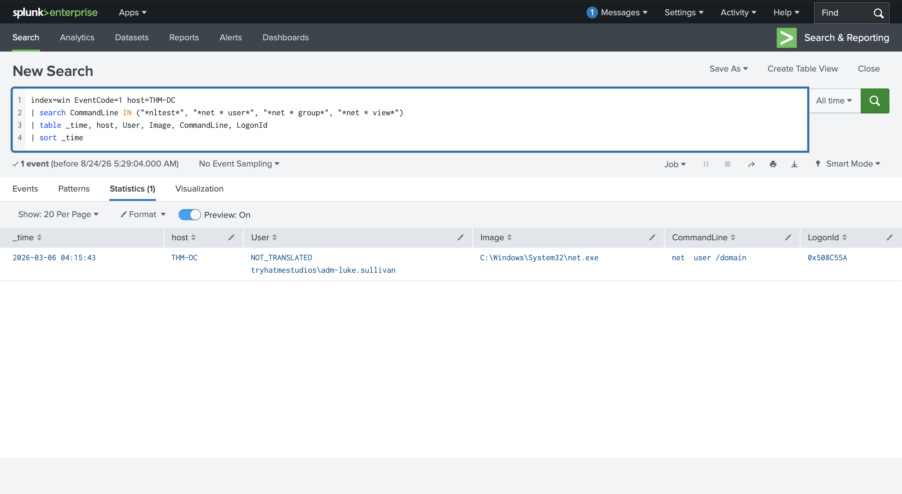

## Screenshot 13 - DC RDP Logon
Using the `LogonId` captured above, I correlated it against Event 4624 on the same host to determine how that session was established:
```spl
index=win EventCode=4624 host=THM-DC Logon_ID=0x508C55A
| table _time, user, Logon_Type, Source_Network_Address, Logon_ID
```
The `Logon_Type` field showed **10 (RemoteInteractive)**, confirming the attacker reached the Domain Controller over a full RDP session, sourced from **10.5.30.120**.


## Screenshot 14 - Intermediate Host Mapping
Using the same machine-account resolution technique applied earlier in the SMB investigation, I mapped the RDP source IP to a hostname:
```spl
index=win EventCode=4624 Source_Network_Address=10.5.30.120 user=*$
| stats count by user, Source_Network_Address
| sort -count
```
This resolved **10.5.30.120** to **THM-SQL-SRV** - the same server already compromised via PsExec earlier in this investigation, now revealed as an intermediate pivot point on the way to the DC rather than a final destination.

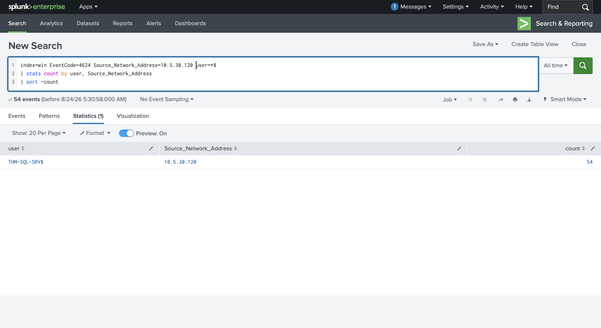

## Screenshot 15 - Outbound RDP (mstsc)
To confirm an outbound RDP connection actually originated from THM-SQL-SRV, I searched for `mstsc.exe` (the Windows RDP client) in that host's process creation logs:
```spl
index=win EventCode=1 host=THM-SQL-SRV Image="*mstsc.exe*"
| table _time, User, Image, CommandLine, LogonId
| sort _time
```
This confirmed `tryhatmestudios\luke.sullivan` launching `mstsc.exe /v:THM-DC` from THM-SQL-SRV, under `LogonId=0x3C572BD` - direct evidence that someone inside an active session on THM-SQL-SRV deliberately opened a second RDP connection targeting the Domain Controller.

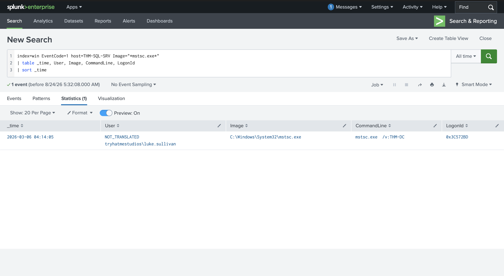

## Screenshot 16 - Intermediate Host RDP Chain
Finally, using the same LogonId-correlation technique applied to the DC, I traced how the attacker reached THM-SQL-SRV in the first place:
```spl
index=win EventCode=4624 host=THM-SQL-SRV Logon_ID=0x3C572BD
| table _time, user, Logon_Type, Source_Network_Address, Logon_ID
```
This revealed a separate RDP logon - this time as **luke.sullivan** (not the privileged `adm-luke.sullivan` account used against the DC), **Logon_Type 10**, sourced from **10.5.50.12**. That IP resolves to **THM-MKT-WS** - the same workstation identified as the true origin in both the SMB and PsExec investigations.

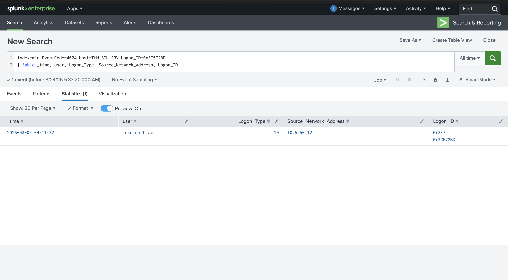

This completed a full two-hop RDP chain:
```
THM-MKT-WS (10.5.50.12, michelle.smith at keyboard)
   |  RDP as luke.sullivan
   v
THM-SQL-SRV (10.5.30.120)
   |  RDP as adm-luke.sullivan (escalation to a more privileged account)
   v
THM-DC -- discovery commands executed directly on the Domain Controller
```
The account switch between hops - from the standard `luke.sullivan` account to the more privileged `adm-luke.sullivan` account - shows the attacker escalating privileges mid-chain, using a second stolen credential set once inside THM-SQL-SRV, rather than relying on a single compromised account for the entire path to the DC.

## Screenshot 17 - Investigation Challenge: svcupdate Service
As an independent exercise, the SOC team received an EDR alert for a suspicious service installation (`svcupdate`) on **THM-SHR-SRV**, with no scheduled change request to account for it. I applied the same methodology built throughout this room, working entirely against `index=challenge`, without step-by-step guidance.

**Confirming the service installation and binary path:**
```spl
index=challenge EventCode=7045
| table _time, host, Service_Name, Service_File_Name, Service_Type, Service_Start_Type, Service_Account
| sort _time
```
This confirmed `svcupdate` installed twice on THM-SHR-SRV, binary at `%SystemRoot%\svcupdate.exe`, running as `LocalSystem` under the same `demand start` / `user mode service` combination seen in the walkthrough's PsExec investigation - the renamed binary didn't change the underlying signature at all.

**Identifying the account and source IP behind the ADMIN$ access:**
```spl
index=challenge EventCode=5140 host=THM-SHR-SRV Share_Name="*ADMIN$*"
| table _time, host, Source_Address, user, Share_Name
| sort _time
```
This returned **ryan.chen** accessing `ADMIN$` on THM-SHR-SRV from **10.5.50.15**, in a single query giving both the compromised account and the source IP needed to continue the investigation.

**Extracting the first remote command executed through the service:**
```spl
index=challenge EventCode=1 host=THM-SHR-SRV ParentImage="*svcupdate*"
| table _time, host, User, ParentImage, Image, CommandLine
| sort _time
```
Sorted chronologically, the earliest command was `"cmd" /c "hostname & whoami & ipconfig"`, followed immediately by `"cmd" /c "net localgroup administrators"` - the identical discovery-then-enumerate sequence observed against THM-SQL-SRV during the walkthrough, confirming this was the same attacker methodology applied to a different target.

**Resolving the origin host:**
```spl
index=challenge EventCode=4624 Source_Network_Address=10.5.50.15 user=*$
| stats count by user, Source_Network_Address
| sort -count
```
This resolved **10.5.50.15** to **THM-HR-WS$**, identifying **THM-HR-WS** - an HR workstation - as the true origin of the attack, mirroring the walkthrough's pattern of a non-administrative business workstation being the actual source of stolen-credential lateral movement.

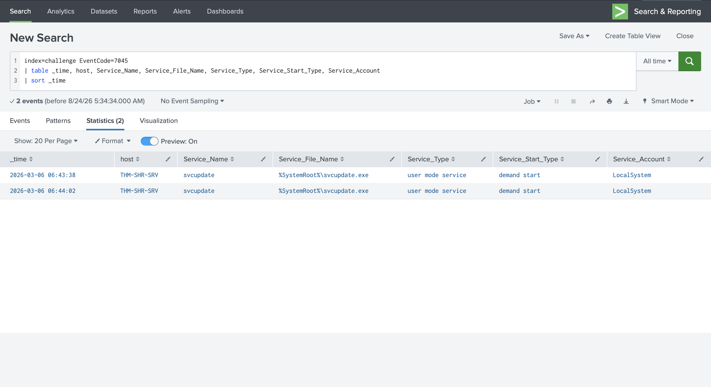
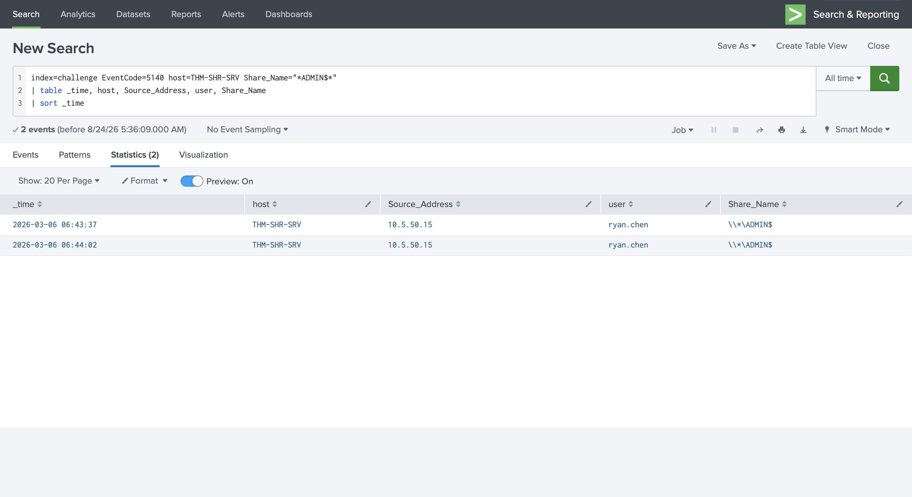
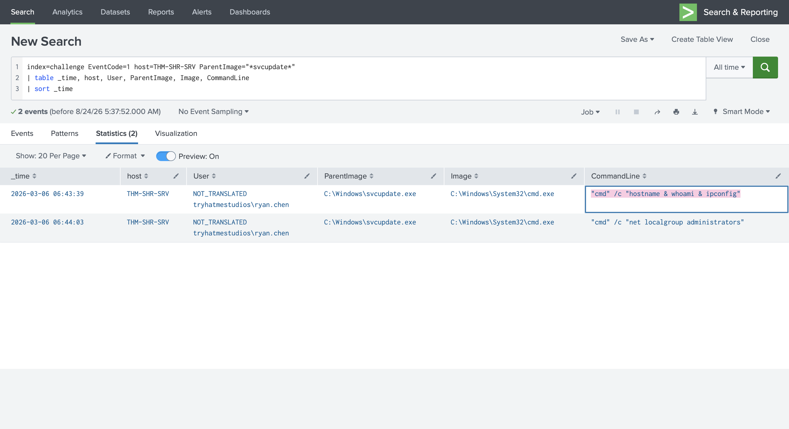
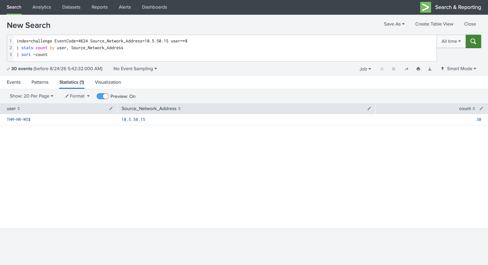

## Findings
- Three distinct lateral movement chains were identified in this environment, all tracing back to a single common origin: **SMB** access via stolen credentials from THM-MKT-WS to THM-SHR-SRV, THM-SQL-SRV, and THM-DEV-WS; **PsExec** remote execution from THM-MKT-WS to THM-SQL-SRV using the same stolen credentials; and a **two-hop RDP chain** from THM-MKT-WS through THM-SQL-SRV to THM-DC, escalating from a standard account to a privileged admin account at the second hop.
- The true source of all three techniques was **THM-MKT-WS**, operated by **michelle.smith** - a marketing user with no legitimate business reason to hold or use IT admin credentials. This points to prior credential theft, consistent with the initial-access techniques (web shell, OWA brute force, VPN credential attack) documented in the earlier Detecting AD Initial Access room in this module.
- The attacker's credentials for luke.sullivan were recovered in plaintext directly from Sysmon command-line logging (`net use ... P@ssw0rd!123`), demonstrating why command-line auditing is a double-edged sword - operationally valuable for detection, but also a reminder that credentials passed on the command line are trivially exposed to anyone with read access to process creation logs.
- PsExec's named pipe naming convention (`PSEXESVC-{hostname}-{pid}-{stdin/stdout/stderr}`) directly embedded the source hostname, making Sysmon Event 17 alone sufficient to identify the attacker's origin machine without needing to cross-reference Event 5145.
- The RDP chain showed clear privilege escalation mid-path: the attacker used the standard `luke.sullivan` account to reach the intermediate server, then switched to the more privileged `adm-luke.sullivan` account for the final hop into the Domain Controller - indicating either a second stolen credential set or credentials harvested from the intermediate host itself.
- The independent investigation challenge (`svcupdate` on THM-SHR-SRV, sourced from THM-HR-WS via ryan.chen's credentials) followed an identical playbook to the PsExec walkthrough, confirming this is a repeatable attacker methodology rather than a one-off technique, and that renaming the service binary provided no meaningful evasion against the Event 7045 signature.

## Lessons Learned
- Discovery commands in process creation logs are often the first indicator that triggers a lateral movement investigation. Spotting enumeration early can lead to catching lateral movement before it reaches sensitive targets.
- The same Event 4624 fires for a legitimate admin and an attacker. Source workstation, account, timing, and target pattern are what distinguish them - context, not the event itself, carries the signal.
- Type 10 means RDP. Type 3 covers both SMB and PsExec, where additional artifacts (Event 5140, Event 7045, Sysmon Event 17) are needed to tell the two apart.
- Event 4648 ties the initiating user to the target connection by recording alternate credential use on the source, but only for explicit credentials such as `net use /user:` - it doesn't fire for Pass-the-Hash, Pass-the-Ticket, or Kerberos single sign-on, since those techniques reuse cached credentials without explicitly providing them.
- Admin share access (`ADMIN$`, `C$`) from unexpected sources is a strong lateral movement indicator on its own, but baselining a user's normal share-access pattern first is what actually confirms the deviation is malicious rather than assuming based on the share name alone.
- Sysmon Event 17 detects characteristic PsExec pipe patterns that persist even when the binary is renamed, since the pipe naming convention is often left unchanged in the underlying source code. Event 7045 (service installation) remains PsExec's signature artifact regardless of what the service or binary is called - the giveaway is the demand-start, user-mode-service combination, not the literal name.
- RDP is deliberately investigated last-in-chain rather than hunted directly, because Type 10 logons are otherwise indistinguishable from completely legitimate administrative sessions at the network level; a downstream trigger (like discovery commands on a sensitive host) is usually what kicks off the RDP-specific pivot.
- Linking RDP sessions with `Logon_ID` and looking for `mstsc.exe` on intermediate hosts is what makes chained hops traceable at all. Each hop changes the source IP, so tracing the full chain requires checking both source and destination logs at every stage, not just the final destination.
- Renaming a malicious service (`svcupdate` vs. `PSEXESVC`) does not defeat detection on its own - the demand-start, user-mode-service signature on Event 7045 remains constant regardless of naming, which is precisely why hunting on behavioral patterns rather than literal string matches matters.
- Completing the investigation challenge without step-by-step instructions reinforced that the value of this room wasn't memorizing specific SPL queries, but internalizing a repeatable investigative sequence: confirm the artifact, extract the account and source IP, pivot to command execution, and resolve the true origin host - a sequence that held up identically across three genuinely different protocols.

## References
- [TryHackMe - Active Directory for SOC: Detecting AD Lateral Movement](https://tryhackme.com/module/active-directory-for-soc)
- CISA Advisory AA24-038A - Volt Typhoon Living off the Land Techniques
- CISA Advisory AA23-061A - BlackSuit/Royal Ransomware RDP/PsExec/SMB Lateral Movement
- Red Canary - Wizard Spider PsExec Deployment Analysis
- Trend Micro (2025) - Earth Kurma APT Admin Share Abuse in Southeast Asian Government Networks
