# Detecting AD Post-Exploitation

## Objective
This room focuses on detecting adversary activity during the post-exploitation phase of an Active Directory compromise — the actions attackers take *after* they've already gained a foothold and escalated privileges. The room walks through the full lifecycle of a real-world-style intrusion in the `TrySaveMe` domain: establishing persistence, escalating to Domain Admin, covering tracks (log/backup/shadow copy destruction), staging and attempting to deploy ransomware across multiple hosts, and researching destructive "wiper" malware as an alternative endgame to ransom-driven attacks.

The goal was to investigate a live SOC alert — a suspicious process (`updater.exe`) executing under a Domain Admin account on the domain controller — and trace it through Splunk to reconstruct the attacker's full chain of activity, using Sysmon and Windows Security event logs.

## Skills Demonstrated
- Log analysis and event correlation in Splunk (SPL query construction, field extraction, `rex` and `stats` commands)
- Windows/Sysmon event log interpretation (Process Create, File Create, Process Access, Security Auditing events)
- Distinguishing parent/child process relationships to trace an attack chain
- Identifying AD persistence techniques (account creation, group membership abuse)
- Detecting anti-forensics activity (VSS deletion, log clearing)
- Recognizing ransomware pre-deployment and deployment techniques (WMI-based remote execution)
- Mapping observed behavior to MITRE ATT&CK techniques
- Open-source threat intelligence research (real-world wiper malware case studies)

## Tools Used
- Splunk (Search & Reporting)
- Sysmon (Microsoft-Windows-Sysmon/Operational log)
- Windows Security Event Log
- MITRE ATT&CK framework
- TryHackMe OpenVPN + Windows App (RDP) for lab access

## Investigation Walkthrough

### Establishing the Attack Chain (Persistence)

**Screenshot 1 – Malicious process executed from a non-standard directory**
The alert centered on `updater.exe` running under the `maria.garcia` Domain Admin account on `DC-01`. Filtering Splunk for this process revealed multiple hits — most were legitimate Google Updater traffic (`C:\Program Files (x86)\Google\GoogleUpdater\...`). Excluding those surfaced the actual malicious file, running from `C:\Users\maria.garcia\AppData\Roaming\` — a user-writable, non-standard location typical of attacker staging.
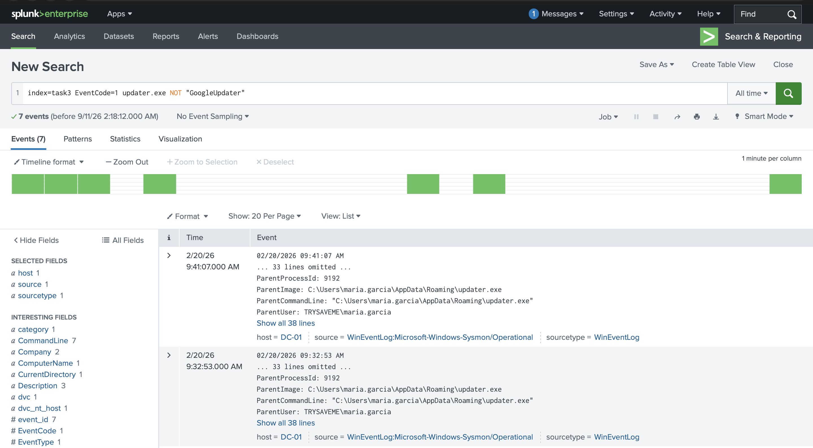

**Screenshot 2 – Persistence account created**
The malicious `updater.exe` spawned `net.exe`, which ran:
```
net user hans.schmidt P@ssw0rd123! /add /domain
```
This created a new domain account, `hans.schmidt`, as a persistence mechanism.
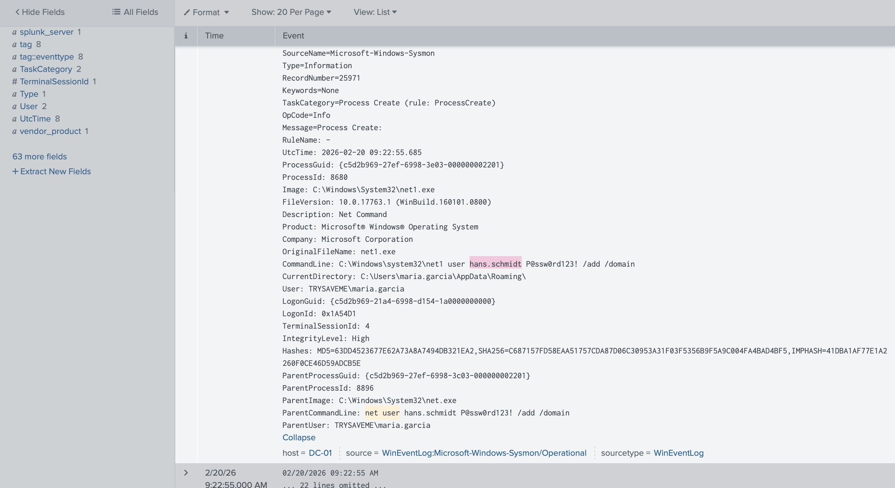

**Screenshot 3 – Account added to Remote Desktop Users**
Shortly after, the attacker added `hans.schmidt` to the **Remote Desktop Users** group to enable future remote access:
```
net localgroup "Remote Desktop Users" hans.schmidt /add
```
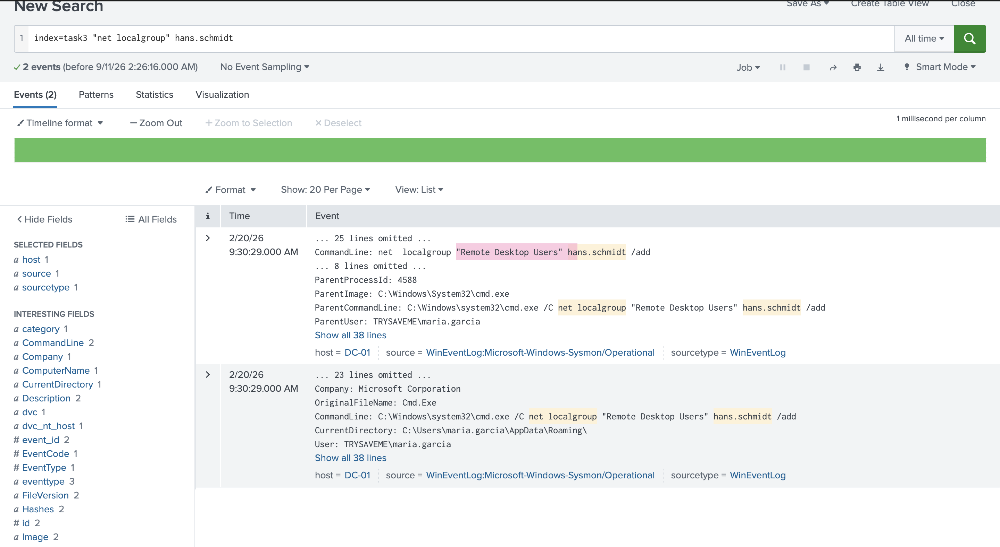

**Screenshot 4 – Privilege escalation to Domain Admins**
Roughly 11 minutes later, `hans.schmidt` was escalated to full Domain Admin privileges:
```
net group "Domain Admins" hans.schmidt /add /domain
```
Confirmed both via the command execution and the corresponding Windows Security log (Event ID 4728), which independently verified the group change.
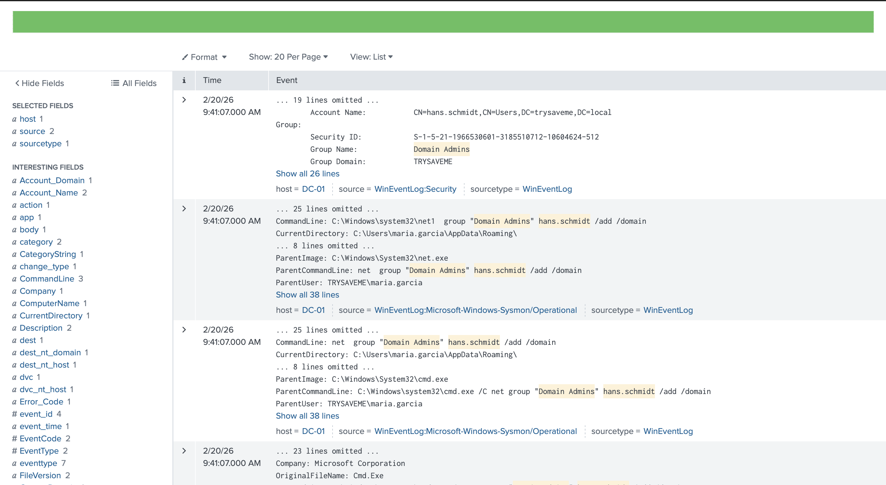

**Screenshot 5 – No confirmed logon with the persistence account**
Despite building out full Domain Admin access for `hans.schmidt`, no legitimate logon event (Event ID 4624) was found for the account. The only related activity was an account-property change made under an **ANONYMOUS LOGON** session — suspicious, but not evidence the attacker ever authenticated as `hans.schmidt`.
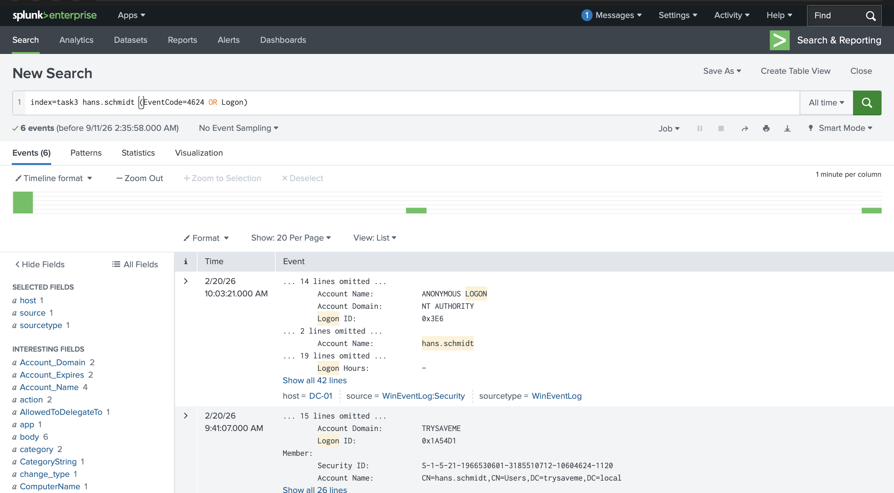

### Pre-Encryption / Anti-Forensics Activity

**Screenshot 6 – Volume Shadow Copies enumerated**
The attacker first listed existing shadow copies to assess recovery options available to the victim:
```
vssadmin list shadows
```
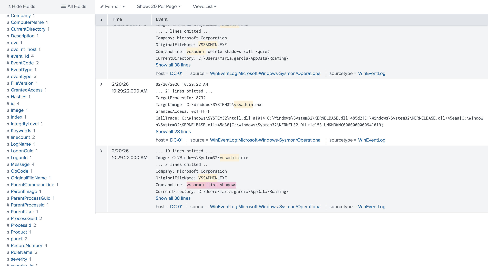

**Screenshot 7 – Shadow copies deleted**
Shadow copies were then destroyed to prevent file recovery:
```
vssadmin delete shadows /all /quiet
```
Process ID **5520** (`vssadmin.exe`) executed this command, spawned as a child of the malicious `updater.exe` (PID 9192) — confirming the entire chain traces back to the same initial malicious process.
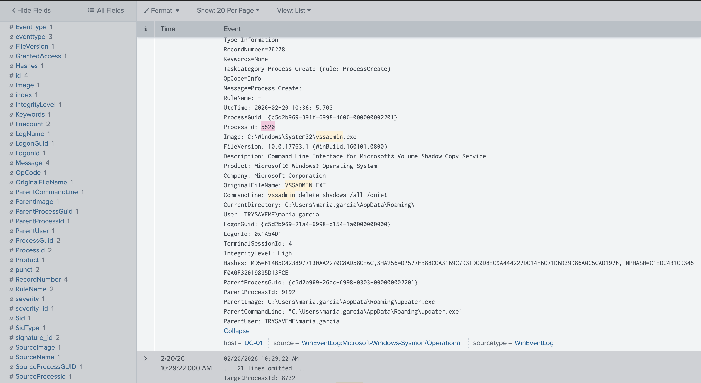

**Screenshot 8 – Security event log cleared**
The Windows **Security** event log was cleared to hinder investigation, confirmed via Event ID 1102 ("The audit log was cleared"), performed under the `maria.garcia` account.
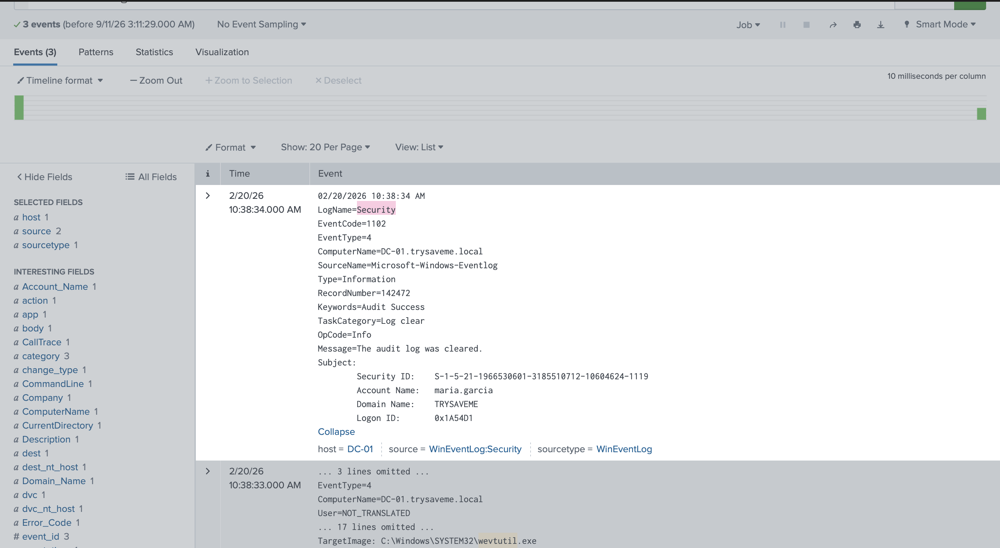

### Ransomware Staging and Deployment Attempt

**Screenshot 9 – Ransomware payload written to disk**
A file named `fixer.exe` was created at `C:\Windows\fixer.exe` on `TSM-PROD-01`, dropped by PowerShell under the `maria.garcia` account.
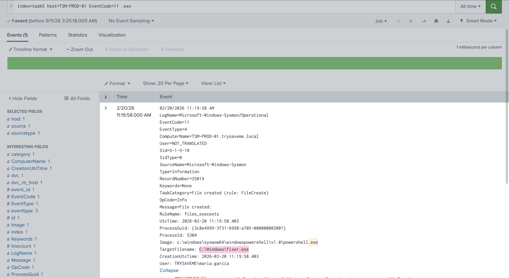

**Screenshot 10 – Remote execution attempted via WMI (T1047)**
The attacker attempted to remotely trigger the ransomware payload using WMI:
```
wmic /node:tsm-prod-06.trysaveme.local /user:maria.garcia /password:P@ssw0rd123! process call create C:\Windows\fixer.exe
```
This maps to MITRE ATT&CK technique **T1047 – Windows Management Instrumentation**.
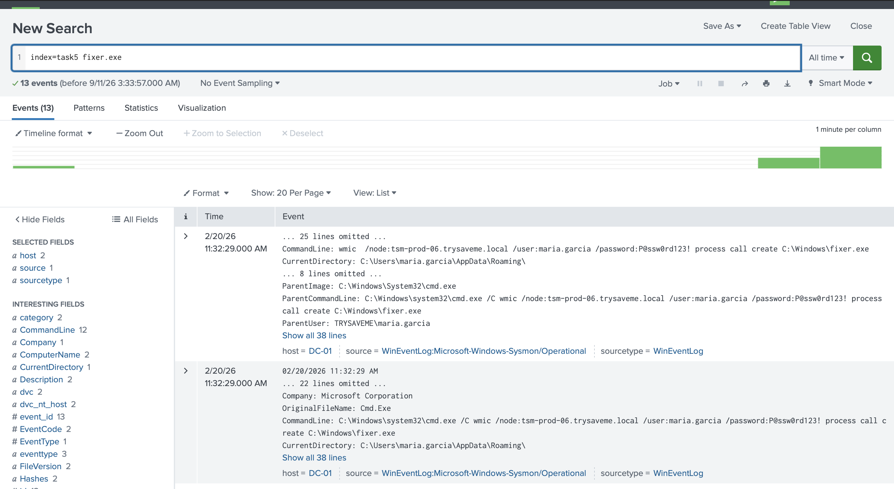

**Screenshot 11 – Six systems targeted**
Extracting every unique `/node:` value from the WMI commands showed the attacker targeted **six production systems**: `tsm-prod-01` through `tsm-prod-06.trysaveme.local`.
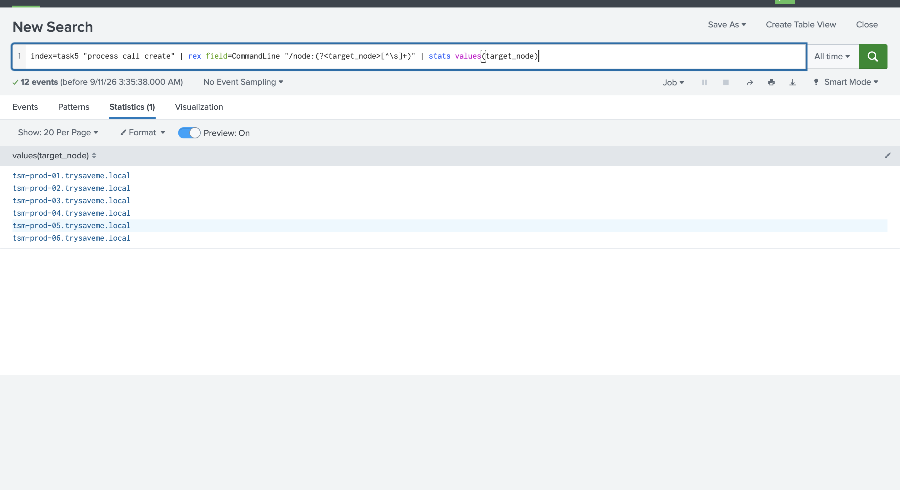

**Screenshot 12 – No successful execution confirmed**
Despite the coordinated attempt across six hosts, searching for `fixer.exe` process-creation events on any of the targeted systems returned only the original file-creation event on TSM-PROD-01 — no evidence the ransomware ever actually executed anywhere.
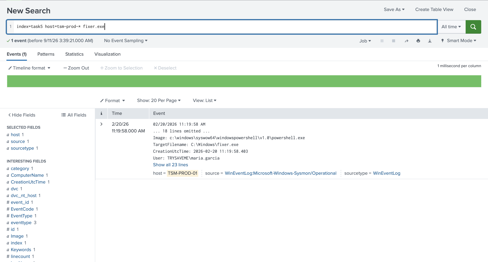

### Data Destruction Research (Wiper Malware)

This portion of the room focused on researching real-world destructive malware ("wipers") as an alternative attacker objective to ransomware — since wiper activity is notoriously difficult to catch in logs before damage is done. Key findings:

- **MITRE ATT&CK ID:** Data Destruction falls under the **Impact** tactic as **T1485**.
- **HermeticWiper (2022, targeting Ukraine):** Deployed alongside a decoy ransomware (PartyTicket/HermeticRansom) to distract from the wiper's true purpose. The attack chain delivered an additional payload via **Discord's CDN** (`cdn.discordapp.com`) — a legitimate service abused as free, hard-to-block infrastructure.
- **Apostle Wiper (Agrius threat group, Iran-linked):** Used compromised web shells (ASPXSpy variants) to tunnel **RDP** traffic, allowing lateral movement using stolen credentials.

## Findings
- The entire intrusion traced back to a single malicious process (`updater.exe`, PID 9192) running from `maria.garcia`'s AppData\Roaming directory — every subsequent action (account creation, privilege escalation, VSS deletion, log clearing, ransomware staging) was a direct or indirect child of this process.
- The attacker built a complete persistence and privilege-escalation chain (new account → Remote Desktop access → Domain Admin) in under 20 minutes, but never appeared to actually use the `hans.schmidt` account to log in.
- Classic pre-encryption anti-forensics steps were all present: shadow copy deletion and Security log clearing, both textbook indicators that ransomware deployment was imminent.
- The ransomware deployment attempt, while methodical (targeting 6 systems via WMI with valid stolen credentials), does not appear to have succeeded — no process execution evidence was found on any targeted host, suggesting the attack was interrupted, blocked, or failed before detonation.
- This intrusion illustrates a nearly complete attacker post-exploitation lifecycle that was likely disrupted before achieving full impact — a good outcome from a defensive standpoint, but one that still required a full incident investigation to confirm.

## Lessons Learned
- **Parent/child process fields are essential for chain-of-custody analysis.** Distinguishing `ProcessId` from `ParentProcessId` (and Process Create vs. Process Access events) was critical to correctly attributing actions to the right process at each step.
- **A single suspicious process can be the thread that ties together an entire investigation.** Pivoting repeatedly on `ParentImage: updater.exe` was the key technique that connected persistence, defense evasion, and ransomware staging into one coherent timeline.
- **Absence of evidence is itself a finding.** The lack of any successful logon for the persistence account, and the lack of any ransomware execution across 6 targeted hosts, were just as important to document as the successful attacker actions — they shape the actual impact assessment of the incident.
- **Detecting pre-encryption behavior (VSS deletion, log clearing) is a critical, time-sensitive opportunity.** These are the last observable signals before an attacker moves to actual encryption/destruction — catching them is often the final chance to intervene.
- **Wiper malware is largely undetectable via logs alone**, reinforcing that layered defenses (XDR, driver allowlisting, backup immutability) matter more than log-based detection for this specific threat category.

## References
- TryHackMe — [Detecting AD Post-Exploitation](https://tryhackme.com/room/detectingadpostexploitation)
- CISA Advisory AA24-038A — [PRC State-Sponsored Actors Compromise U.S. Critical Infrastructure (Volt Typhoon)](https://www.cisa.gov/news-events/cybersecurity-advisories/aa24-038a)
- Aviatrix Threat Research — [Synnovis 2024 Ransomware Data Breach, UK Healthcare](https://aviatrix.ai/threat-research-center/synnovis-2024-ransomware-data-breach-uk-healthcare/)
- SentinelOne — [HermeticWiper: New Destructive Malware Used in Cyber Attacks on Ukraine](https://www.sentinelone.com/labs/hermetic-wiper-ukraine-under-attack/)
- SentinelLabs — [From Wiper to Ransomware: The Evolution of Agrius](https://www.sentinelone.com/labs/from-wiper-to-ransomware-the-evolution-of-agrius/)
- MITRE ATT&CK — [T1485: Data Destruction](https://attack.mitre.org/techniques/T1485/)
- MITRE ATT&CK — [T1047: Windows Management Instrumentation](https://attack.mitre.org/techniques/T1047/)
