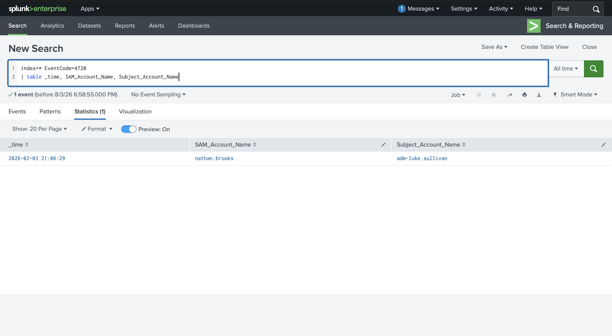
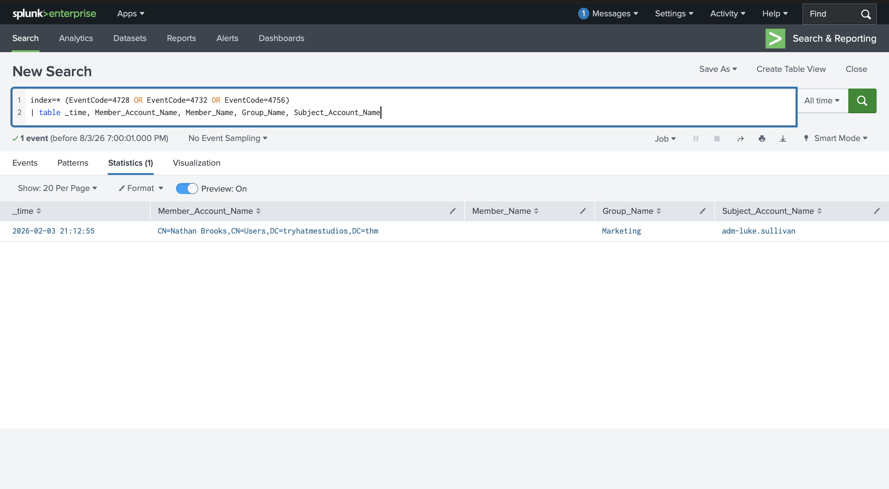
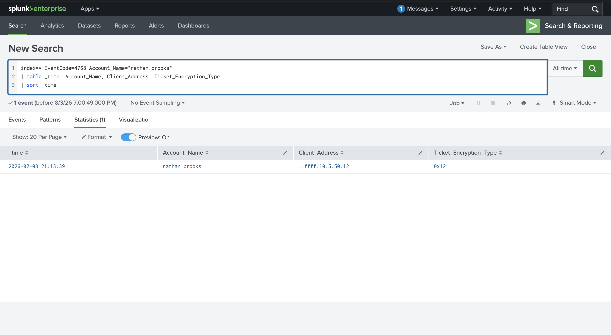

# Monitoring Active Directory

## Objective
Learn how Active Directory authentication, account lifecycle, and directory service events are logged in Windows, and how to use Splunk to establish a baseline of normal AD activity, detect anomalies, and investigate user account activity. This room covers Kerberos and NTLM authentication logging, account/group management events, Advanced Audit Policy configuration, and closes with a hands-on investigation of a new employee's account creation and first-day activity.

## Skills Demonstrated
- Understanding the core Active Directory authentication protocols (Kerberos, LDAP, SMB, RDP, legacy NetBIOS/LLMNR) and the ports/purposes of each
- Distinguishing domain account authentication (logged centrally on the Domain Controller) from local account authentication (logged only on the local machine), and understanding the implications for lateral movement investigations
- Mapping the Kerberos authentication flow (TGT request → TGS request → session creation) to their corresponding Windows Event IDs (4768, 4769, 4624) and recognizing pre-authentication failures (4771)
- Mapping the legacy NTLM authentication flow (credential validation → session creation) to Event IDs 4776 and 4624
- Interpreting Kerberos ticket encryption types (AES-256 vs RC4-HMAC) as an indicator of legacy systems or potential downgrade activity
- Recognizing account lifecycle events (creation, enablement, password reset, disablement, lockout) and security group membership change events (global, local, and universal scope) as key indicators of privilege escalation
- Understanding Event 5136 (Directory Service Changes) for attribute-level AD object modifications, including Group Policy Object (GPO) metadata changes
- Interpreting Windows logon event types (Interactive, Network, Batch, Service, Unlock, RemoteInteractive) to assess whether observed activity is consistent with an account's expected behavior
- Applying stack counting (long-tail analysis) as an anomaly-detection technique to surface rare, potentially malicious activity hidden within high-volume, normal AD traffic
- Filtering out computer/machine accounts (`$` suffix) to isolate human user activity during investigations
- Verifying Advanced Audit Policy configuration (via Group Policy and `auditpol`) to confirm the logging required for AD visibility is actually enabled
- Conducting an end-to-end SPL-based investigation of a new user account: identifying account creation, the creating administrator, group membership assignment, and first authentication activity

## Tools Used
- Splunk (Search & Reporting)
- Windows Event Viewer / Security Event Log concepts
- SPL (Search Processing Language)
- Group Policy Management Editor (Advanced Audit Policy Configuration)
- `auditpol` (Windows command-line audit policy verification)

## Screenshot 1 – Account Creation Investigation (Event 4720)
To identify the newly created account referenced in the onboarding verification scenario, I queried the `win` index for Event 4720 (account creation):
```spl
index=* EventCode=4720
| table _time, SAM_Account_Name, Subject_Account_Name
```
This returned a single result, identifying the new account as **nathan.brooks**, created by the administrative account **adm-luke.sullivan** on 2026-02-03 at 21:06:29. The `adm-` prefix on the creating account is a common naming convention for privileged/administrative accounts, distinct from an admin's standard user account.



## Screenshot 2 – Group Membership Assignment (Events 4728/4732/4756)
To determine what security group nathan.brooks was added to, I queried all three group-membership Event IDs together, without pre-filtering on a specific account name field, since different event types can log the affected member under different field names (`Member_Account_Name` vs `Member_Name`):
```spl
index=* (EventCode=4728 OR EventCode=4732 OR EventCode=4756)
| table _time, Member_Account_Name, Member_Name, Group_Name, Subject_Account_Name
```
This confirmed the group nathan.brooks was added to via the `Group_Name` field, along with which administrator performed the action.



## Screenshot 3 – First Kerberos TGT Request (Event 4768)
To find the source IP of nathan.brooks's first Kerberos authentication (TGT request) — establishing where he first logged in from — I queried Event 4768, filtered to his account, and sorted ascending by time to surface the earliest event first:
```spl
index=* EventCode=4768 Account_Name="nathan.brooks"
| table _time, Account_Name, Client_Address, Ticket_Encryption_Type
| sort _time
```
The `Client_Address` field on the earliest row identifies the source IP of his first authentication, and `Ticket_Encryption_Type` confirms whether the ticket used modern (AES-256) or legacy (RC4-HMAC) encryption.



## Findings
- **New account created:** `nathan.brooks`
- **Created by:** `adm-luke.sullivan` (administrative account)
- **Group added to:** identified via the `Group_Name` field returned by the combined 4728/4732/4756 query
- **Source IP of first TGT request:** identified via the `Client_Address` field on the earliest 4768 event for the account
- Kerberos authentication logging (4768/4769/4771) and NTLM validation (4776) both flow through the Domain Controller for domain accounts, making the DC the centralized source of truth for authentication investigations — critical when scoping which logs to pull during an incident.
- Group membership changes (4728/4732/4756) are one of the fastest indicators of privilege escalation and should always be cross-referenced against expected change management processes, especially for privileged groups like Domain Admins.
- A key troubleshooting lesson from this investigation: when a filtered SPL query returns zero results, the correct next step is to widen the search (drop the filter, list multiple candidate field names) and inspect the raw data, rather than repeatedly guessing at filter values — Windows Event Log field names are not always consistent across related Event IDs.

## Lessons Learned
- Reinforced that AD monitoring depends entirely on correct Advanced Audit Policy configuration — critical categories like DS Access and detailed Kerberos logging are disabled by default, meaning a SIEM can only be as effective as the underlying Windows audit policy feeding it.
- Learned to apply stack counting (long-tail analysis) as a practical anomaly-detection technique: sorting by frequency and focusing on the rare, low-count entries at the bottom of the list rather than the high-volume "normal" traffic at the top.
- Practiced filtering out computer/machine accounts (`$` suffix) to isolate genuine human activity, since machine-to-machine Kerberos traffic can represent 70-80% of total authentication volume in a busy environment and would otherwise obscure user-focused investigations.
- Reinforced the debugging instinct carried over from earlier rooms in this portfolio (Wazuh, Monday Monitor): when a query or filter unexpectedly returns nothing, widen the search first to confirm the data actually exists and understand its structure, rather than assuming the filter logic is correct and the data is simply absent.
- Practiced correlating multiple event types (account creation, group membership, and authentication) to build a complete timeline of a single account's activity — a foundational skill for any account-focused SOC investigation, from routine onboarding verification to a full compromise investigation.

## References
- [TryHackMe – Active Directory for SOC: Monitoring Active Directory](https://tryhackme.com/module/active-directory-for-soc)
- [Microsoft – Active Directory Security Group Scopes](https://learn.microsoft.com/en-us/windows-server/identity/ad-ds/manage/understand-security-groups)
- [Microsoft – Advanced Security Audit Policy Settings](https://learn.microsoft.com/en-us/windows/security/threat-protection/auditing/advanced-security-auditing)
