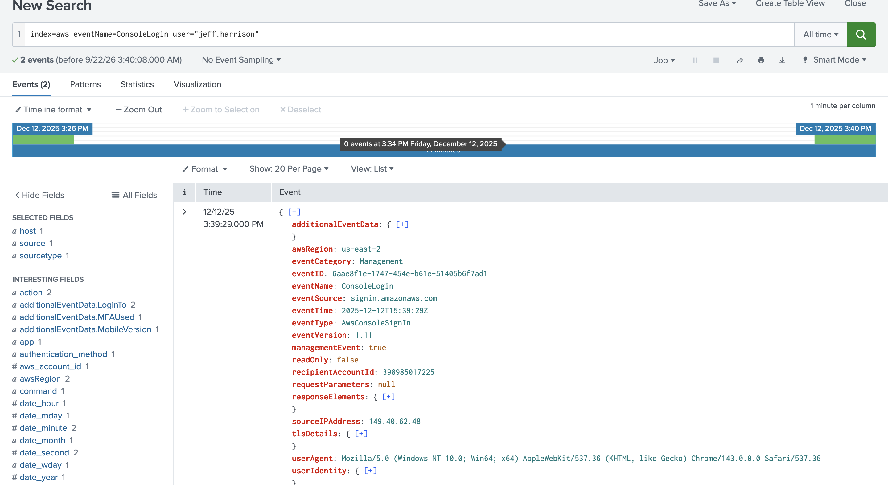
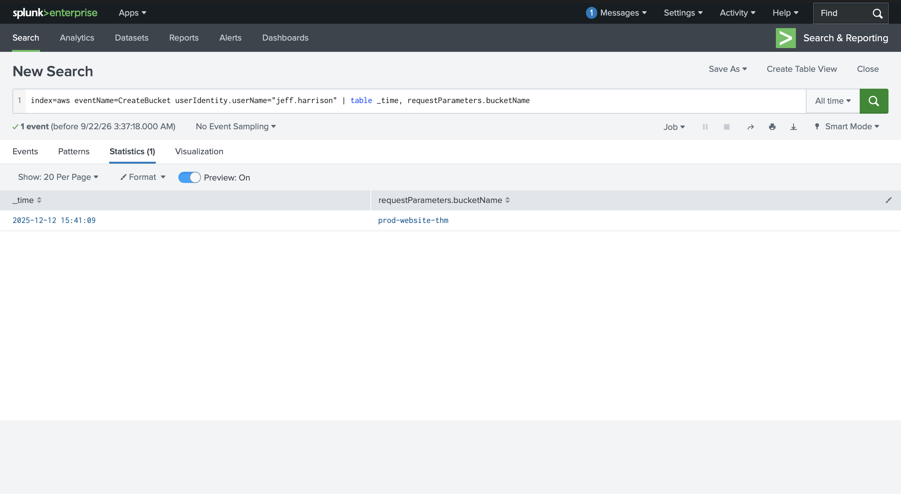
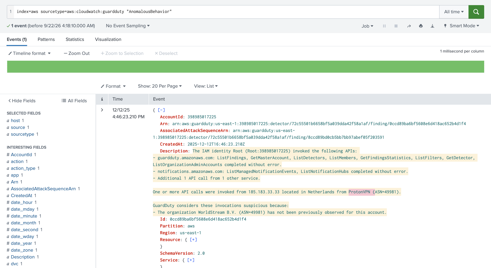
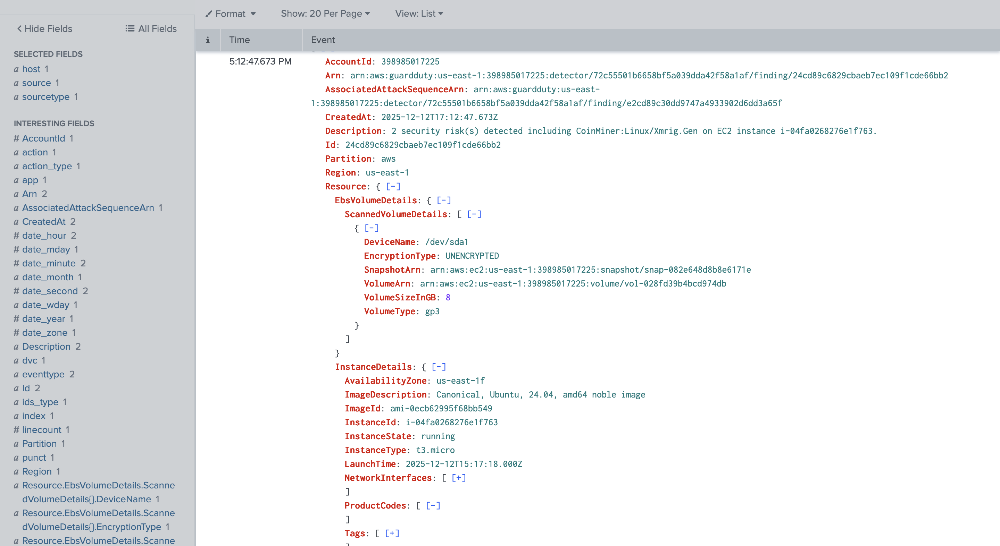
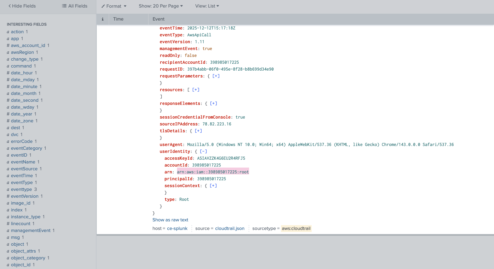
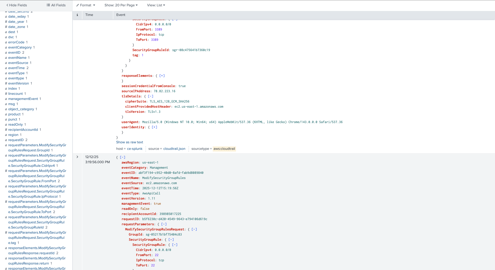
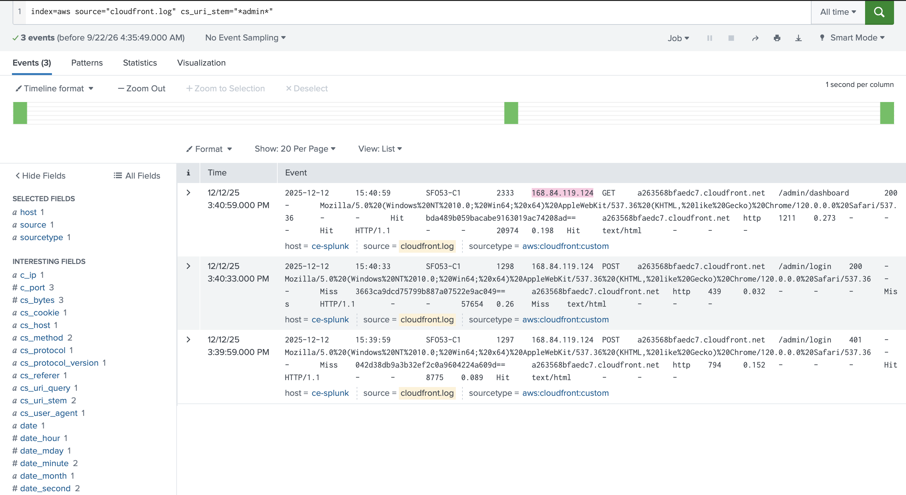
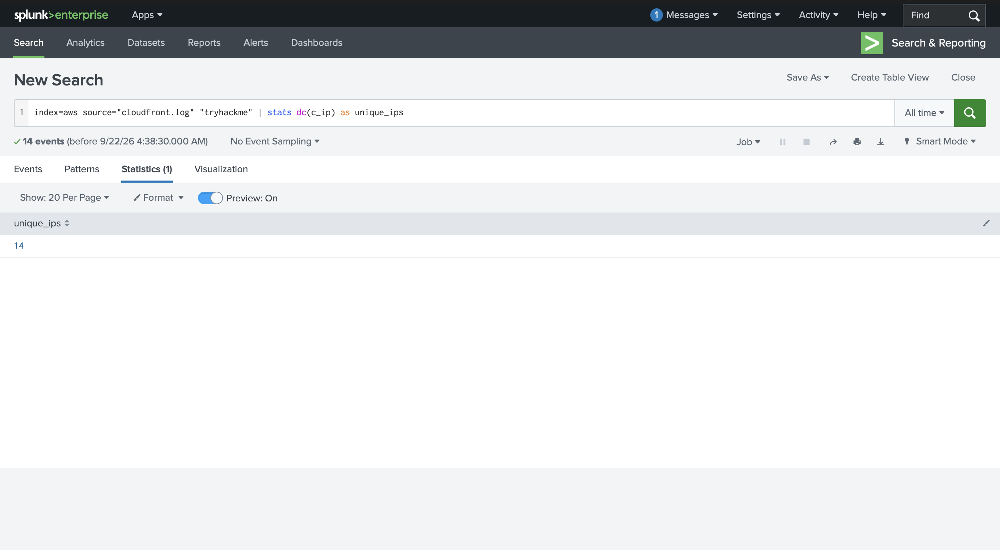
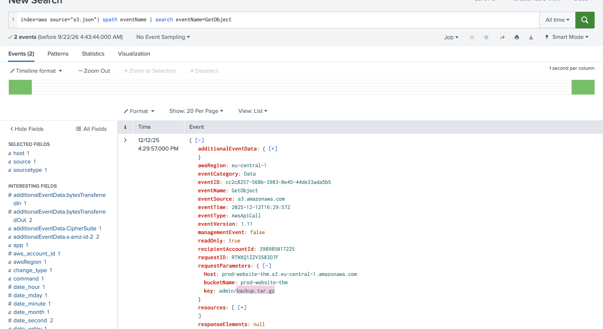

# AWS Security Logging

## Objective
This room covers how a SOC team monitors and audits AWS environments using core AWS logging services — CloudTrail (control plane), GuardDuty (automated threat detection), CloudFront (CDN/web traffic), and S3 Data Events (object-level file access). It builds directly on foundational cloud security concepts from the *Cloud Security Pitfalls* room (service models, the Shared Responsibility Model, and why cloud logging behaves differently than on-prem logging).

The goal was to investigate a real intrusion in an AWS account (`398985017225`): a compromised IAM user (`jeff.harrison`) logging in from a VPN, creating infrastructure, exposing remote-access ports to the internet, and an EC2 instance (`i-04fa0268276e1f763`) ultimately getting compromised with an XMRig cryptominer — tracing the full chain across CloudTrail, GuardDuty, CloudFront, and S3 logs in Splunk.

## Skills Demonstrated
- AWS CloudTrail log analysis (control plane API call auditing) in Splunk
- AWS GuardDuty finding interpretation (automated threat detection, nested JSON structures)
- CloudFront (CDN/W3C-format) access log analysis for web-layer attacks
- S3 Data Event analysis for object-level file access auditing
- Correlating identity (IAM user/ARN), network (source IP), and resource (EC2 instance, S3 bucket) context across multiple AWS log sources
- Understanding the boundary between control-plane visibility (CloudTrail) and service-specific/workload visibility (CloudFront, S3 Data Events, GuardDuty)
- Building targeted Splunk queries (`stats`, `dc()`, field filtering on deeply nested JSON) against real-world AWS log formats

## Tools Used
- Splunk (Search & Reporting)
- AWS CloudTrail
- AWS GuardDuty
- AWS CloudFront access logs
- AWS S3 Data Events
- MITRE ATT&CK framework (for context on cryptomining/malware behavior)

## Investigation Walkthrough

### Initial Access and Infrastructure Setup

**Screenshot 1 – User login: source IP and account**
The user `jeff.harrison` logged into the AWS console. The `ConsoleLogin` CloudTrail event revealed both the source IP address and the target AWS account ID (`398985017225`), establishing the starting point of the investigation.

**Screenshot 2 – S3 bucket created**
Shortly after logging in, `jeff.harrison` created a new S3 bucket named `prod-website-thm`, found via a `CreateBucket` CloudTrail event.

### GuardDuty Detections on the Compromised EC2 Instance

**Screenshot 3 – Anomalous behavior alert (ProtonVPN)**
A GuardDuty `AnomalousBehavior` finding flagged suspicious control plane activity originating from a VPN — identified as **ProtonVPN** — a strong indicator of an actor masking their real origin.

**Screenshot 4 – XMRig cryptominer detected (malware + volume details)**
GuardDuty's `Execution:EC2/MaliciousFile` finding identified a CoinMiner (`CoinMiner:Linux/Xmrig.Gen`) on EC2 instance `i-04fa0268276e1f763`. The malicious file was located at `/home/ubuntu/xmrig-6.24.0/xmrig`, and a companion DNS-based finding (`CryptoCurrency:EC2/BitcoinTool.B!DNS`) confirmed the instance queried `donate.v2.xmrig.com` — XMRig's own donation-tracking domain, a hallmark of an actively running cryptominer.

### Tracing the Compromised Instance Back to Its Creator

**Screenshot 5 – Instance creator ARN**
Pivoting into CloudTrail's `RunInstances` event for `i-04fa0268276e1f763` revealed the full ARN of the IAM identity that launched the compromised instance, tying the malware infection directly back to the same account activity chain.

**Screenshot 6 – Risky ports exposed to the internet**
`ModifySecurityGroupRules` CloudTrail events showed the same actor opening **port 22 (SSH)** and **port 3389 (RDP)** to `0.0.0.0/0` — exposing both major remote-access protocols to the entire internet, a critical misconfiguration that created the exposure window exploited to compromise the instance.

### Web-Layer Activity (CloudFront Logs)

**Screenshot 7 – Admin portal login IP**
CloudFront access logs showed a `POST /admin/login` request that failed (401) followed by a successful login (200) roughly 34 seconds later, then a follow-up `GET /admin/dashboard` — all from the same IP address, suggesting a short, targeted login attempt against the admin portal.

**Screenshot 8 – Unique IPs searching "tryhackme"**
Searching CloudFront logs for the keyword "tryhackme" returned 14 events, and piping the result into `stats dc(c_ip)` confirmed **14 unique IP addresses** — meaning every search came from a distinct source, not a single repeated actor.

### Object-Level Access (S3 Data Events)

**Screenshot 9 – Sensitive backup file accessed**
S3 Data Events revealed a `GetObject` call against the key `admin/backup.tar.gz` in the `prod-website-thm` bucket, retrieved via the AWS CLI (not a browser) from IP `185.183.33.33` — a deliberate, scripted download of what appears to be a sensitive backup archive from an administrative path.

## Findings
- The investigation traced a full AWS compromise chain: a VPN-masked login by `jeff.harrison`, creation of a production S3 bucket, public exposure of SSH and RDP on an EC2 instance, and eventual compromise of that instance with the XMRig cryptominer.
- GuardDuty's automated findings (AnomalousBehavior, MaliciousFile, BitcoinTool DNS) provided the initial alerting, but CloudTrail was required to establish full context — who created the instance, who modified the security groups, and the exact timeline of events.
- Publicly exposing SSH (22) and RDP (3389) to `0.0.0.0/0` was the root misconfiguration that most plausibly enabled the instance compromise — a classic, entirely preventable cloud security failure mirroring real-world incidents like Capital One's S3 misconfiguration.
- Web-layer (CloudFront) and object-level (S3 Data Events) logs surfaced separate but related activity: a fast, targeted admin portal login, and a scripted download of a sensitive backup archive — both plausibly tied to the same broader compromise.
- This exercise reinforced that no single AWS log source tells the whole story — CloudTrail (control plane), GuardDuty (automated detection), CloudFront (web layer), and S3 Data Events (object layer) each contributed a piece of the timeline that the others could not see.

## Lessons Learned
- **GuardDuty findings are a starting point, not the full investigation.** Findings often reference nested JSON fields several layers deep (e.g., `Resource.EbsVolumeDetails.ScannedVolumeDetails.ScanDetections.ThreatDetectedByName.ThreatNames.FilePaths`) — knowing how to drill into deeply nested structures in Splunk is essential to extracting real evidence like file paths and hashes.
- **CloudTrail event names are the anchor for investigation.** Knowing the right `eventName` (`ConsoleLogin`, `CreateBucket`, `RunInstances`, `ModifySecurityGroupRules`) is the fastest way to pivot through a cloud investigation, much like knowing the right Sysmon Event ID is for an on-prem one.
- **Different AWS services log in structurally different formats.** CloudTrail and GuardDuty are JSON; CloudFront logs are tab-delimited and W3C-style (closer to IIS logs). Recognizing and adapting to each format is a core cloud SOC skill.
- **Publicly exposed remote-access ports remain one of the most common and consequential cloud misconfigurations** — this single finding (SSH/RDP open to `0.0.0.0/0`) was arguably the most important root-cause indicator in the entire investigation.
- **Correlating identity across log sources (IAM ARN, source IP, user agent) is what turns isolated log entries into a coherent attack narrative** — the same techniques used to build an attack timeline in an on-prem AD investigation apply directly to AWS, just with different log sources.

## References
- TryHackMe — [AWS Security Logging](https://tryhackme.com/room/awssecuritylogging)
- TryHackMe — [Cloud Security Pitfalls](https://tryhackme.com/room/cloudsecuritypitfalls) (foundational concepts referenced throughout this investigation)
- AWS Documentation — [AWS CloudTrail](https://docs.aws.amazon.com/cloudtrail/)
- AWS Documentation — [Amazon GuardDuty Finding Types](https://docs.aws.amazon.com/guardduty/latest/ug/guardduty_finding-types.html)
- AWS Documentation — [Amazon CloudFront Access Logs](https://docs.aws.amazon.com/AmazonCloudFront/latest/DeveloperGuide/AccessLogs.html)
- AWS Documentation — [Logging Data Events for Amazon S3](https://docs.aws.amazon.com/AmazonS3/latest/userguide/cloudtrail-logging.html)
- MITRE ATT&CK — [T1496: Resource Hijacking](https://attack.mitre.org/techniques/T1496/) (cryptomining context)
