# Monitoring AWS Logins

## Objective
This room covers how a SOC monitors AWS authentication end-to-end: IAM fundamentals (users, groups, roles, policies), the three ways to authenticate into AWS (Management Console, access keys, IAM roles), the risks tied to each method, and how to detect misconfigurations before they turn into full breaches. It builds directly on the *AWS Security Logging* room, using the same CloudTrail-centric investigative approach against several new practice scenarios: console login abuse, a leaked-access-key extortion attack modeled on real-world incidents, IAM role assumption/role chaining, and an insecure root-credential integration.

## Skills Demonstrated
- Differentiating AWS authentication methods (console login, access keys, IAM roles) directly from CloudTrail event structure
- Identifying brute-force and credential-stuffing patterns via `ConsoleLogin` events
- Detecting MFA bypass/non-compliance through `additionalEventData.MFAUsed`
- Investigating a full access-key compromise and S3 extortion attack chain (identity → access → exfiltration → destruction → ransom note)
- Tracing `AssumedRole` activity back to its originating identity via `AssumeRole` events, including custom session-name obfuscation
- Understanding and detecting IAM misconfigurations (over-permissioned policies, MFA removal, unexpected access key creation)
- Recognizing insecure architecture patterns, such as third-party integrations authenticating as the AWS root user

## Tools Used
- Splunk (Search & Reporting)
- AWS CloudTrail
- AWS IAM (Identity and Access Management)
- AWS STS (Security Token Service)
- MITRE ATT&CK framework (for context on cloud extortion/ransomware behavior)

## Investigation Walkthrough

### Console Login Monitoring

**Screenshot 1 – Repeated failed console logins**
Filtering CloudTrail for `ConsoleLogin` events with a `Failed authentication` error message tied to user `thomas.bennett` revealed a cluster of failed login attempts, consistent with either a targeted brute-force attempt or persistent credential issues worth flagging to IT.
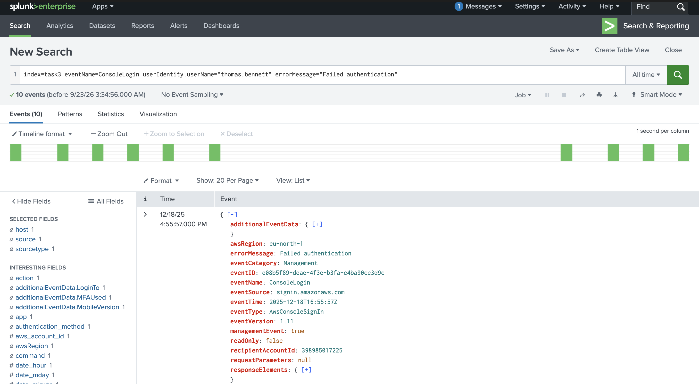

**Screenshot 2 – Successful login without MFA**
Filtering for `additionalEventData.MFAUsed="No"` on successful `ConsoleLogin` events surfaced a user (`otake.nao`) who signed in without MFA — a violation of the room's core monitoring rule that this field should always read "Yes."
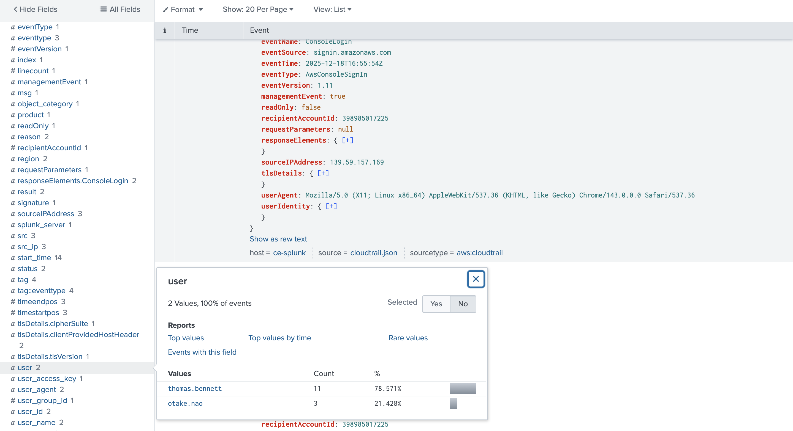

### Access Key Compromise — Michael Turner Extortion Scenario

This scenario mirrors real-world incidents covered in the room (the Unit 42 mass `.env` leak campaign): a leaked access key used to exfiltrate and delete S3 objects, followed by a ransom note dropped into the emptied bucket.

**Screenshot 3 – Compromised access key ID**
Identified the specific `AKIA*`-prefixed access key ID belonging to `michael.turner` that was used throughout the attack.
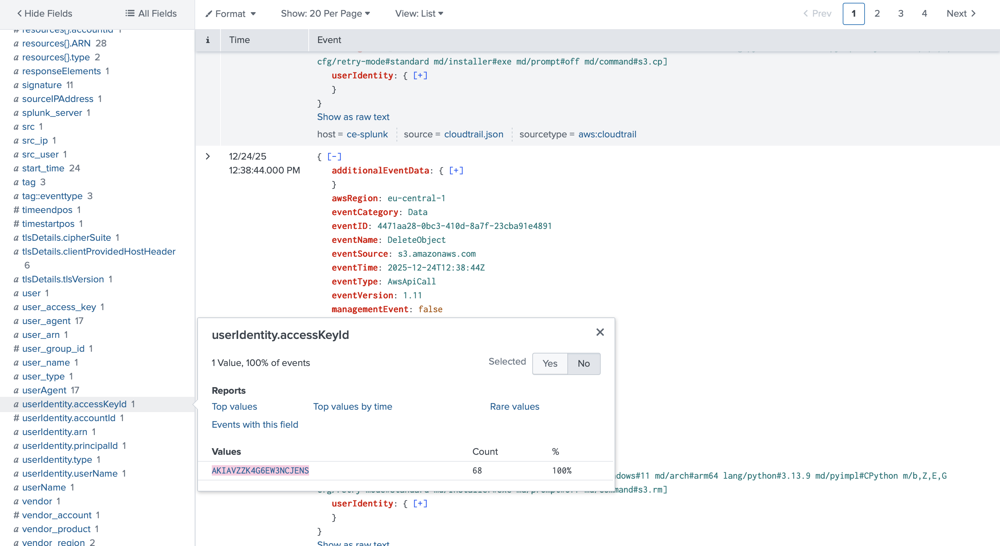

**Screenshot 4 – S3 bucket targeted**
Traced the access key's S3 activity to identify the specific bucket accessed and ultimately emptied by the attacker.

**Screenshot 5 – Files exfiltrated and deleted**
Counted `GetObject` (exfiltration) and `DeleteObject` (destruction) events tied to the compromised key to determine the scope of data loss.
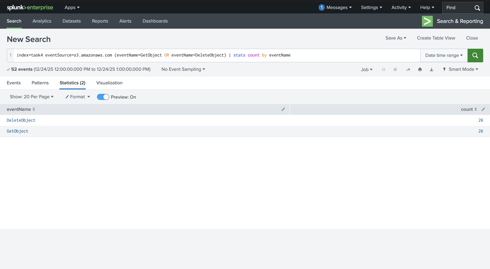

**Screenshot 6 – Ransom note uploaded**
Identified the final `PutObject` event of the attack chain — a ransom note file uploaded into the now-empty bucket, matching the pattern from the real-world Unit 42 case study referenced in the room.
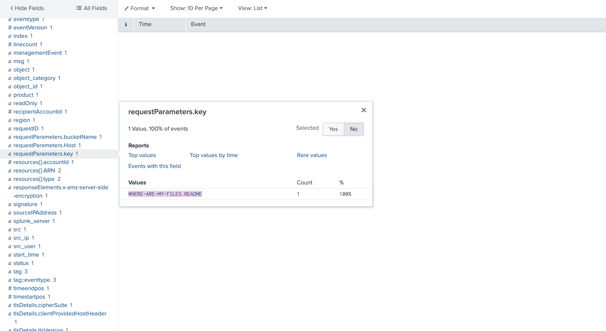

### IAM Roles for Services

**Screenshot 7 – EC2 instance using the UserAvatarsProcessor role**
Identified the EC2 instance ID that assumed the `UserAvatarsProcessor` role, visible as the default session name in the role's ARN (`assumed-role/UserAvatarsProcessor/[instance-id]`).
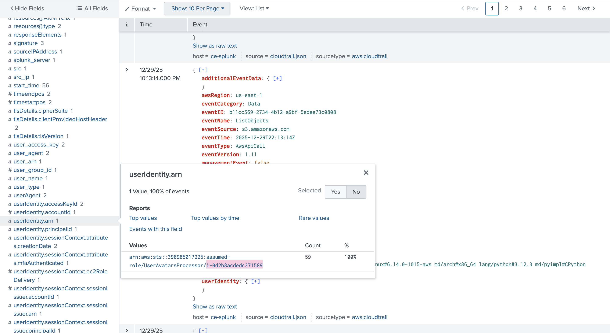

**Screenshot 8 – Custom session name for EU-RemoteSupport role**
Found that the `EU-RemoteSupport` role was assumed using a custom session name rather than an auto-generated username or instance ID — meaning subsequent actions in the logs would appear to come from the role itself, not the real actor, unless traced back further.
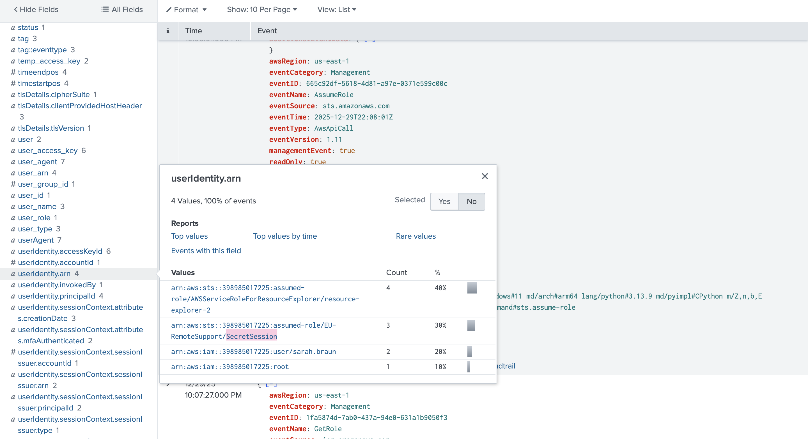

**Screenshot 9 – Tracing the real actor via AssumeRole**
Since the custom session name obscured the original identity, traced back to the actual `AssumeRole` event to identify the real IAM user who assumed the `EU-RemoteSupport` role.
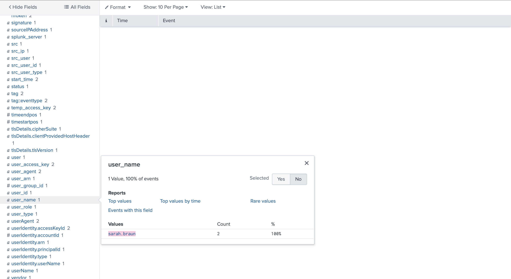

### Early Threat Detection — Insecure Root Integration

**Screenshot 10 – Splunk integration authenticating as root**
Audited an insecure Splunk-to-CloudTrail integration and found it authenticating under the AWS **root user ARN** rather than a scoped IAM user or role — one of the most severe possible misconfigurations, since root has unrestricted account-wide permissions with no ability to limit its scope.
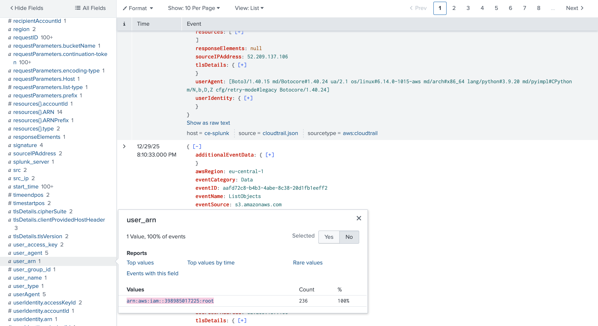

**Screenshot 11 – Over-privileged access key creation time**
Located the exact `CreateAccessKey` event and timestamp marking when this over-privileged root-level access key was created, establishing how long the exposure window had existed.
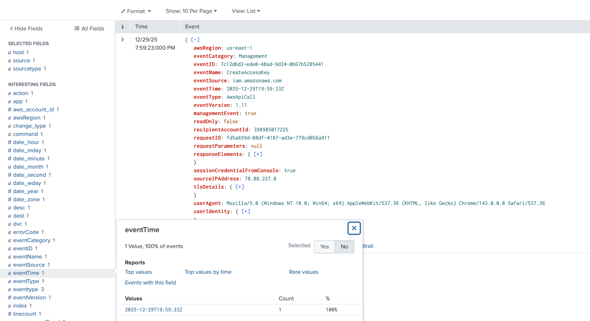

### Reference: Top AWS Service by Console (Non-Key) User

**Screenshot 12 – Amazon Bedrock most-used by console user**
Filtering out all access-key-based activity (`NOT userIdentity.accessKeyId=AKIA*`) and ranking remaining console-originated events by AWS service showed **Amazon Bedrock** as by far the most frequently used service (70 events vs. single digits for all others).
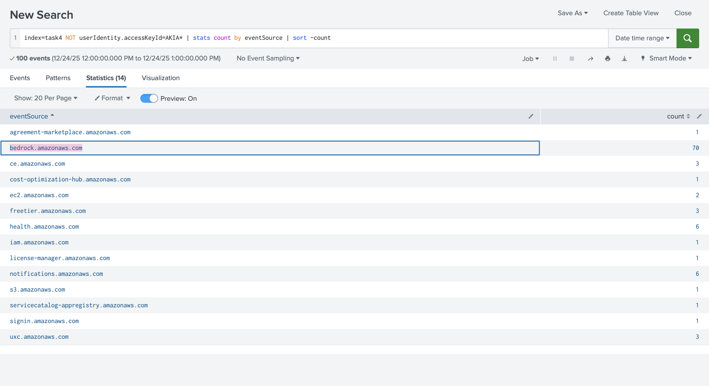

## Findings
- Console login monitoring surfaced two distinct issues worth flagging in a real environment: a user with a notable cluster of failed logins (`thomas.bennett`), and a user who successfully authenticated without MFA (`otake.nao`) — both violate the room's core monitoring rules for console access.
- The Michael Turner scenario demonstrated the full lifecycle of a leaked-access-key attack: identity compromise → S3 bucket access → mass exfiltration and deletion → ransom note upload, directly mirroring real-world incidents like the Unit 42 mass `.env` leak campaign referenced in the room.
- IAM role investigation confirmed that custom session names can obscure the real actor behind a role's actions in CloudTrail — the `EU-RemoteSupport` role required tracing back to its originating `AssumeRole` event to identify the true user, since default session-naming (which would have shown a username or instance ID automatically) was not used.
- The insecure Splunk integration authenticating as the AWS root user is a textbook example of the "early threat detection" principle covered in the room — this is exactly the kind of misconfiguration that, left unnoticed, could sit dormant for years before being discovered and exploited, echoing the room's 2023-exposed/2025-exploited root key example.

## Lessons Learned
- **`ConsoleLogin` events only exist for interactive, browser-based logins** — access key and role-based activity never generates this event type, which is itself a useful signal when investigating how a given action was actually performed.
- **The `additionalEventData.MFAUsed` field is a simple, high-value monitoring rule** — it should essentially always read "Yes," making any "No" value on a successful login worth immediate investigation.
- **Access keys remain the most common initial-access vector into AWS environments** — this was reinforced twice in this room (the Michael Turner scenario and the real-world case studies), and it's the single IAM event type (`CreateAccessKey`) most worth alerting on across an entire AWS estate.
- **IAM role investigations require thinking one layer deeper than the alerting event itself.** A suspicious action from a role isn't the full story — the real question is always "who assumed this role," which sometimes means walking backward through multiple `AssumeRole` events (role chaining) before reaching the actual human or service responsible.
- **Root credentials should never be used for ongoing integrations.** Any service, tool, or script authenticating as root — rather than a scoped IAM role or narrowly permissioned user — represents an outsized, avoidable risk, since root permissions cannot be limited the way IAM policies can.

## References
- TryHackMe — [Monitoring AWS Logins](https://tryhackme.com/room/monitoringawslogins)
- TryHackMe — [AWS Security Logging](https://tryhackme.com/room/awssecuritylogging) (foundational CloudTrail/GuardDuty concepts referenced throughout)
- Wiz — [AWS Phishing Campaign Using Fake Service Suspension Emails](https://www.wiz.io/blog)
- Unit 42 (Palo Alto Networks) — [Large-Scale Cloud Extortion Operation via Exposed .env Files](https://unit42.paloaltonetworks.com/)
- Permiso — [GUI-vil: Threat Actor Targeting AWS via Leaked Access Keys](https://permiso.io/blog)
- AWS Documentation — [Understanding and Getting Your Credentials](https://docs.aws.amazon.com/IAM/latest/UserGuide/id_credentials.html)
- AWS Documentation — [IAM Roles](https://docs.aws.amazon.com/IAM/latest/UserGuide/id_roles.html)
- AWS Documentation — [Logging IAM and AWS STS API Calls with CloudTrail](https://docs.aws.amazon.com/IAM/latest/UserGuide/cloudtrail-integration.html)
