# Monitoring AWS Services

## Objective
This room covers common attacks targeting individual AWS services — S3, EC2, RDS — and how to detect them at scale using CloudTrail, GuardDuty, and general cloud discovery/reconnaissance patterns. It builds on the *AWS Security Logging* and *Monitoring AWS Logins* rooms, applying the same CloudTrail-centric investigative approach to service-level exposure scenarios: a misconfigured S3 bucket leading to data exfiltration, an EC2 instance exposed via an insecure security group, an RDS database becoming internet-accessible, and a breached IAM user performing AWS discovery/reconnaissance before backdooring another account. It closes with Denial of Wallet (DoW) attacks — a cloud-specific cost-based threat distinct from traditional availability-focused DoS.

## Skills Demonstrated
- Detecting S3 bucket public exposure via `PutBucketPublicAccessBlock` and `PutBucketPolicy` CloudTrail events
- Distinguishing genuinely public bucket policies from misleadingly-named but IP-restricted ones by reading `Effect`/`Principal`/`Condition` fields directly
- Identifying anonymous external bucket scanning and brute-force filename enumeration via `GetObject`/`HeadObject` and `errorCode` analysis
- Investigating EC2 security group exposure using the room's "Hunt 1 / Hunt 2" playbooks (SG creation → risky rule → affected instance)
- Correlating GuardDuty findings (`Recon:EC2/PortProbeUnprotectedPort`) with CloudTrail-identified instances and security groups
- Investigating RDS database exposure across two independent conditions (`ModifyDBInstance` public access flag + security group ingress rule)
- Recognizing AWS discovery/reconnaissance patterns (`GetCallerIdentity`, `ListAttachedUserPolicies`, `GetAccountSummary`, `ListUsers`, `ListAccessKeys`) and tracing an attacker's pivot from one compromised identity to another
- Understanding Denial of Wallet (DoW) as a cost-based cloud attack distinct from traditional DoS

## Tools Used
- Splunk (Search & Reporting)
- AWS CloudTrail
- AWS GuardDuty
- AWS IAM, S3, EC2, RDS
- MITRE ATT&CK framework (Discovery tactic context)

## Investigation Walkthrough

### Task 2 — Attacks on S3
Covered how S3 buckets become publicly exposed: disabling the "S3 Public Access Block" feature (`PutBucketPublicAccessBlock`) combined with a public-allowing bucket policy (`PutBucketPolicy`). A key lesson: policy `Sid` names can be misleading — a policy named to sound restrictive or temporary may still grant genuine public access, while a policy that looks alarming may actually be scoped down via a `Condition` block (e.g., an IP restriction). Late detection relies on spotting anonymous `GetObject`/`HeadObject` activity and `AccessDenied` spikes indicating filename brute-forcing.

**Screenshot 1 – S3 Public Access Block disabled**
Located the `PutBucketPublicAccessBlock` event tied to the bucket owner's account and identified the exact timestamp the public access protection was disabled.
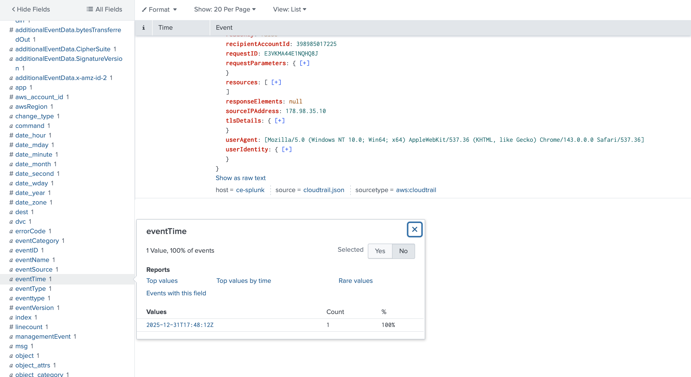

**Screenshot 2 – The policy that made the bucket genuinely public**
Two `PutBucketPolicy` events existed in the dataset — one matching the room's own illustrative example (IP-restricted, not actually public), and a second, distinct policy. Verified the second policy's `Effect`, `Principal`, and absence of a `Condition` block to confirm it granted genuine, unrestricted public read access, then identified its `Sid`.
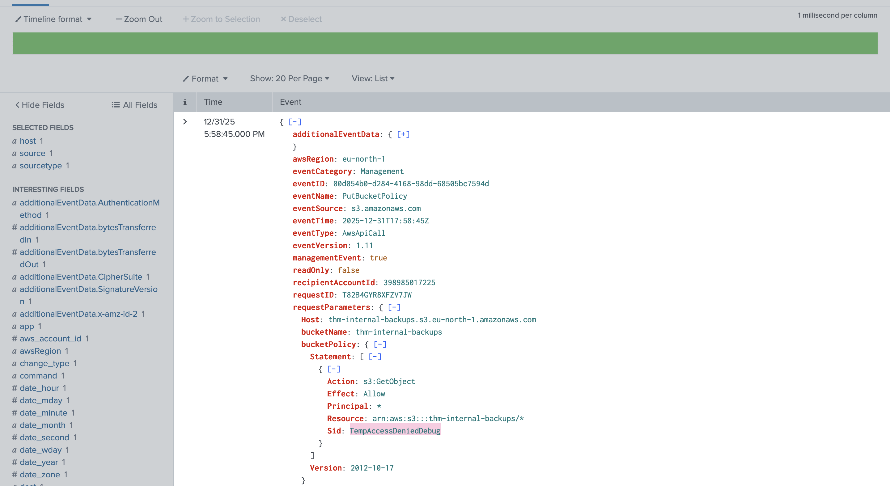

**Screenshot 3 – Anonymous scanning source IP**
Identified anonymous, unauthenticated `GetObject`/`HeadObject` activity against the exposed bucket, confirmed via the `userIdentity.type` field, and pinpointed the source IP responsible.
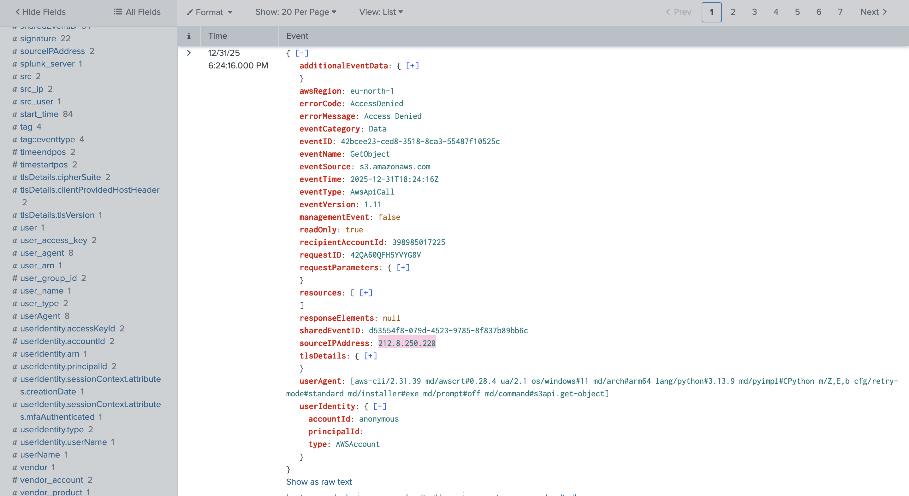

**Screenshot 4 – Brute-forced filenames and the exfiltrated file**
Counted the total distinct filenames the scanning IP attempted (mostly resulting in `AccessDenied`) and isolated the single successful `GetObject` request to identify the exfiltrated file.
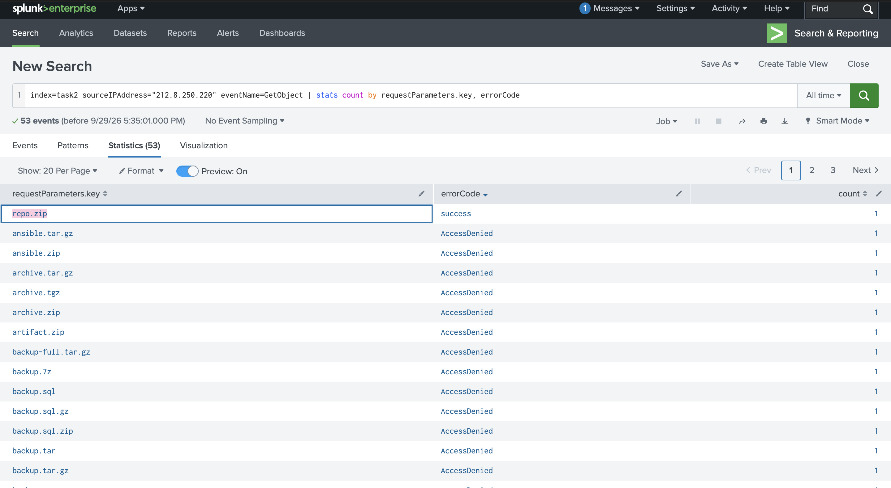

### Task 3 — EC2 Internet Exposure
Covered how EC2 instances become exposed via insecure security groups, and the two investigative playbooks for connecting a security group change to the actual affected instance(s) — since a security group can exist independently of any resource using it. Also covered GuardDuty's `Recon:EC2/PortProbeUnprotectedPort` finding as an automated detection layer, and the importance of verifying exposure isn't mitigated by other overlapping network controls before raising an incident.

**Screenshot 5 – Security group created with a risky exposed port**
Identified the security group created by the implicated user and confirmed, via its `AuthorizeSecurityGroupIngress` event, that it exposed a risky remote-access port (not the web ports also present in the same ruleset) to `0.0.0.0/0`.
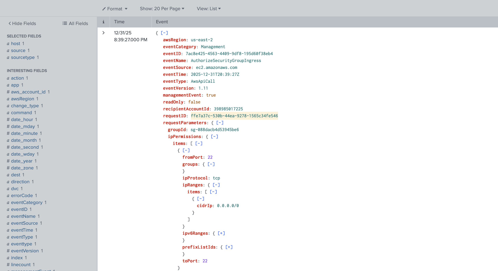

**Screenshot 6 – EC2 instance using the exposed security group**
Traced the security group ID forward to a `RunInstances` event to identify the specific EC2 instance launched using it, confirming the key-pair name matched the same user who created the security group.
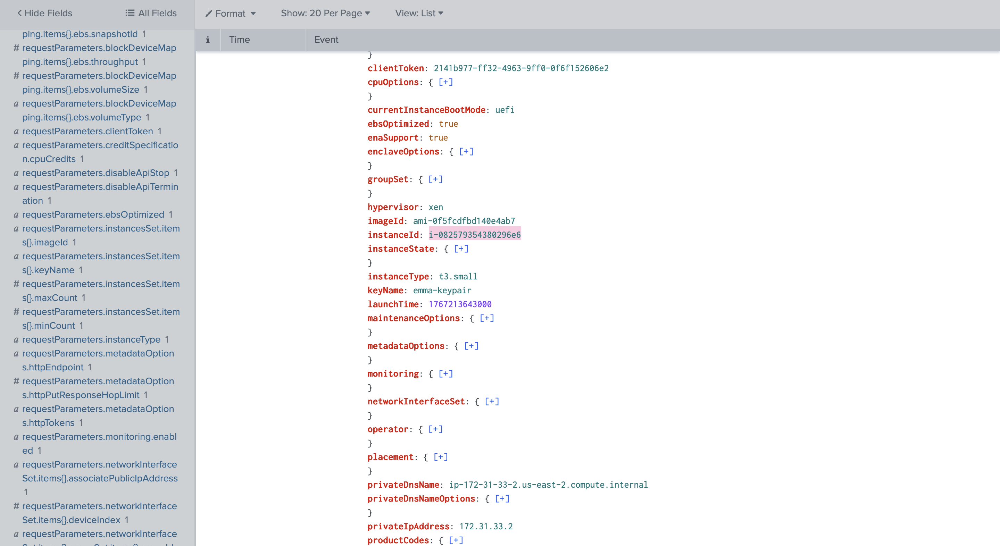

**Screenshot 7 – GuardDuty port-probe attacker IP**
Found the corresponding `Recon:EC2/PortProbeUnprotectedPort` GuardDuty finding for the affected instance, confirming an external actor was actively scanning the exposed port, and identified the source IP and its geolocation/ASN context.
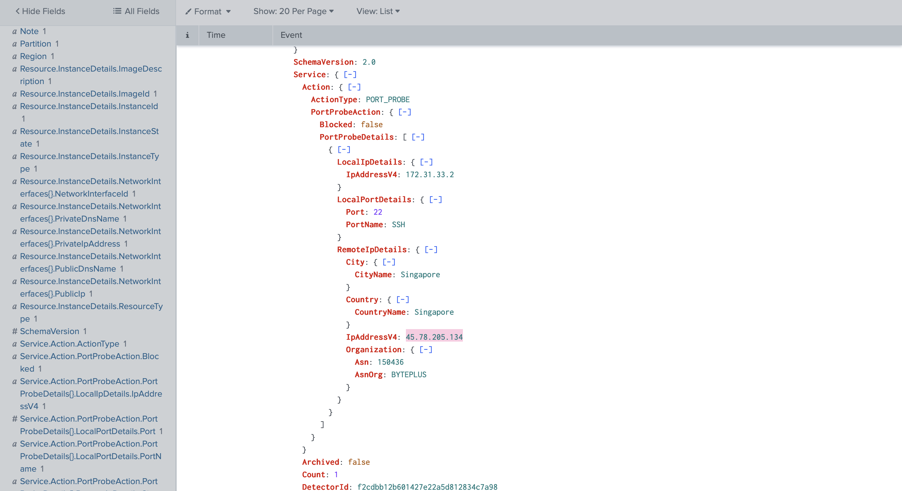

**Screenshot 8 – Insecure rule revoked**
Located the `RevokeSecurityGroupIngress` event where the same user who created the exposure later remediated it, and identified the exact timestamp the insecure rule was removed — establishing the total exposure window.
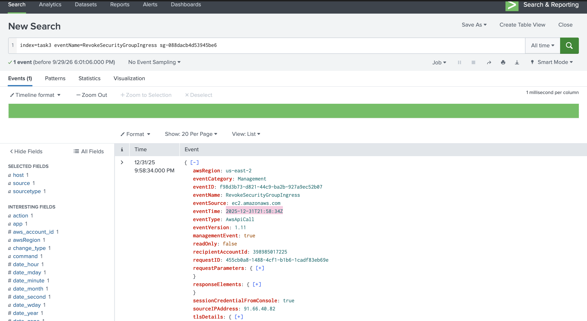

### Task 4 — Exposed Database (RDS)
Covered how RDS (and other database services) exposure differs from S3/EC2 — there's no single universal playbook, since exposure depends on a combination of the "Public Access" setting and the database's security group rules, and can occur at creation or via a later modification. Also covered why CSPM tools (AWS Config, Wiz, Lacework) are often more practical than fully manual detection at scale, illustrated by a real-world OpenSearch exposure case study.

**Screenshot 9 – RDS instance identifier**
Located the `CreateDBInstance` event and confirmed the database was **not** publicly accessible at creation, then identified its instance identifier for use in the rest of the investigation.
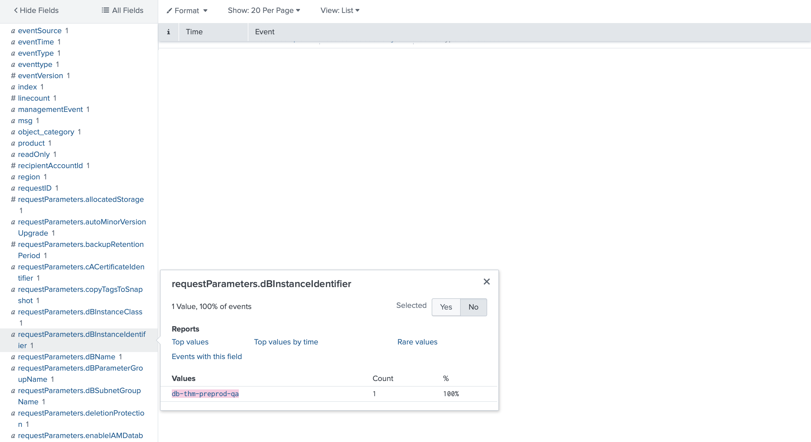

**Screenshot 10 – The two events indicating internet exposure**
Since the database was private at creation, traced forward to find the two separate conditions that together caused exposure: a `ModifyDBInstance` event flipping the public access flag to true, and a `ModifySecurityGroupRules` event opening the database's actual port to `0.0.0.0/0`. Verified both were tied to the correct instance/security group and confirmed their chronological order to identify which change happened first.
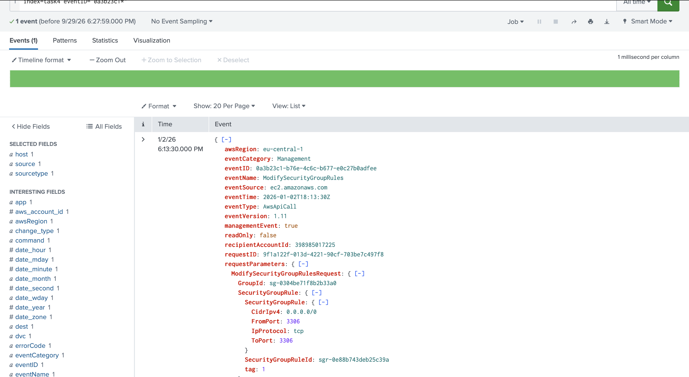

### Task 5 — Detecting Cloud Discovery
Covered how AWS reconnaissance mirrors on-prem "whoami"-style discovery: `GetCallerIdentity`, `ListAttachedUserPolicies`, and `GetAccountSummary` as initial identity/permission checks, followed by broader service enumeration (`ListBuckets`, `DescribeInstances`, `ListUsers`) and deeper, targeted lookups once an interesting resource or user is found. A single CloudTrail event can carry multiple independent red flags simultaneously — a known-bad source IP, a suspicious user-agent (e.g., a penetration-testing OS), and suspicious search filters — any one of which could justify escalation on its own.

**Screenshot 11 – Second Discovery command in the attacker's sequence**
Sorted all IAM-related events chronologically to confirm the exact order of the attacker's initial discovery commands, identifying the second command run immediately after their identity check.
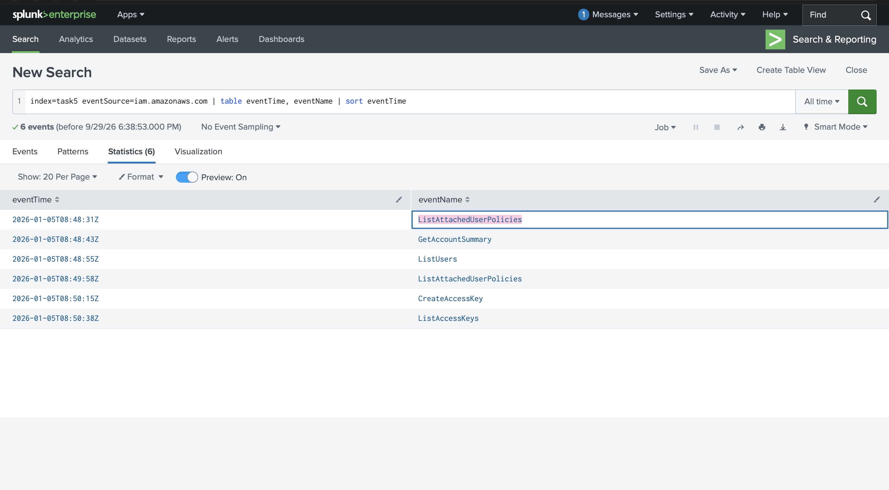

**Screenshot 12 – Second IAM user discovered by the attacker**
Following a broad `ListUsers` enumeration, identified the specific username the attacker targeted next via a `ListAccessKeys` lookup — distinct from the attacker's own compromised identity.
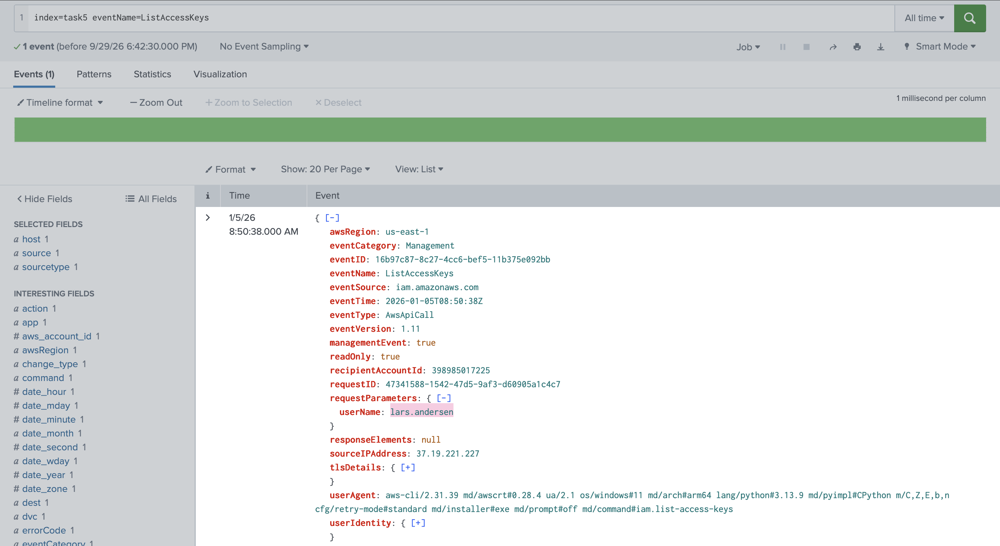

**Screenshot 13 – Backdoor action against the discovered user**
Confirmed how the attacker established persistence against the newly discovered user account by identifying the specific write action (credential or permission change) performed against it.

### Task 6 — Denial of Wallet Attacks
This task was conceptual, with no hands-on Splunk lab. Covered Denial of Wallet (DoW) — a cloud-era evolution of DoS where, instead of taking a service offline, an attacker drives up the victim's cloud costs through high-volume legitimate-looking requests (e.g., repeated large S3 downloads, or triggering EC2 Auto Scaling via a traffic flood). Even when the underlying DoS fails to cause downtime, the resulting AWS bill can still cause real financial harm. Covered the SOC's role (detection and short-term triage rather than full remediation) and the four-step general mitigation approach: validate whether the resource should be public, block bad actors with a WAF, cache/rate-limit with a CDN, and optimize compute efficiency.

## Findings
- The S3 exposure scenario illustrated a genuinely deceptive misconfiguration: a policy `Sid` implying a safe/temporary state actually granted full public read access, while a separate, alarming-looking policy was in fact safely IP-restricted — reinforcing that policy names must never substitute for reading `Effect`/`Principal`/`Condition` fields directly.
- The EC2 exposure scenario confirmed the room's "two-playbook" investigative approach works in practice: correlating a security group's creation, its risky ingress rule, and the specific EC2 instance using it required three separate but linked CloudTrail event types, not a single query.
- The RDS scenario demonstrated that database exposure can require **two independent conditions** to align (public access flag + network rule) rather than a single misconfiguration — and that these two conditions may be set by different actions at different times, requiring chronological correlation to fully understand the exposure timeline.
- The Discovery scenario showed a realistic AWS attack chain: identity confirmation → broad user enumeration → targeted lookup of a specific privileged account → backdoor persistence on that second account — mirroring the same "compromise one identity, pivot to another" pattern seen in the AD Post-Exploitation investigation from an earlier room, just executed via AWS API calls instead of Windows commands.

## Lessons Learned
- **Never trust a policy or resource name to describe its actual behavior.** Both the S3 policy Sid naming and general AWS resource naming conventions can be misleading, intentionally or not — the only reliable source of truth is the actual field values (`Effect`, `Principal`, `Condition`, `PubliclyAccessible`, `CidrIp`) in the CloudTrail event itself.
- **Security groups, database public-access flags, and IAM permissions are all independent of the resources they're attached to.** A security group or setting can exist, be modified, and be investigated separately from the actual instance/database it affects — meaning a full investigation often requires deliberately tracing forward or backward through multiple linked events rather than expecting one event to tell the whole story.
- **Timing and chronological order matter as much as the events themselves.** In both the EC2 and RDS scenarios, understanding *when* each contributing event happened — not just that it happened — was necessary to correctly reconstruct the exposure timeline and answer investigative questions accurately.
- **AWS discovery/reconnaissance follows a predictable pattern that mirrors traditional on-prem attacker behavior** (identity check → broad enumeration → targeted follow-up), meaning detection logic built around this pattern (e.g., alerting on a spike of distinct API calls across services from one identity) can catch AWS-native attacks using the same underlying investigative instincts developed for Windows/AD environments.
- **Denial of Wallet is a genuinely distinct risk category from Denial of Service**, deserving equal monitoring attention — a cloud environment can be technically "up" and fully available while still causing severe financial harm to its owner, which traditional availability-focused DoS monitoring alone would not catch.

## References
- TryHackMe — [Monitoring AWS Services](https://tryhackme.com/room/monitoringawsservices)
- TryHackMe — [AWS Security Logging](https://tryhackme.com/room/awssecuritylogging) (foundational CloudTrail/GuardDuty concepts referenced throughout)
- TryHackMe — [Monitoring AWS Logins](https://tryhackme.com/room/monitoringawslogins) (IAM and identity concepts referenced throughout)
- AWS Documentation — [Blocking Public Access to Your Amazon S3 Storage](https://docs.aws.amazon.com/AmazonS3/latest/userguide/access-control-block-public-access.html)
- AWS Documentation — [Amazon GuardDuty Finding Types](https://docs.aws.amazon.com/guardduty/latest/ug/guardduty_finding-types.html)
- AWS Documentation — [Amazon RDS: Hiding a DB Instance in a VPC](https://docs.aws.amazon.com/AWSEC2/latest/UserGuide/VPC_Scenario2.html)
- AWS Documentation — [Amazon EC2 Auto Scaling](https://docs.aws.amazon.com/autoscaling/ec2/userguide/what-is-amazon-ec2-auto-scaling.html)
