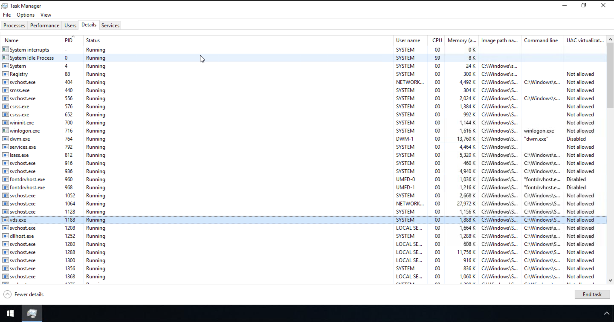

# Core Windows Processes

## Objective

This lab covers the core Windows processes that run on every Windows system at boot and during normal operation. Understanding the "normal" behavior of these processes — their expected parent-child relationships, file paths, and running accounts — is foundational to endpoint security monitoring, since it enables an analyst to quickly spot outliers, such as malware masquerading as a legitimate system process.

## Skills Demonstrated

- Identifying core Windows processes and their function in the OS boot sequence
- Analyzing parent-child process relationships using Task Manager and Process Explorer
- Distinguishing normal vs. unusual process behavior for common masquerading targets
- Understanding process masquerading techniques (misspelled process names, unexpected parents, abnormal file paths)
- Using Process Hacker to inspect service-hosting relationships within svchost.exe

## Tools Used

- Windows Task Manager
- Process Explorer
- Process Hacker
- TryHackMe – Core Windows Processes

## Screenshot 1 – Core Windows Processes in Task Manager

Using Task Manager's Details tab, I sorted all running processes by PID and reviewed the core Windows processes covered in this room, confirming their expected PIDs, status, and hierarchy as part of the standard Windows boot sequence.

## Process Reference Table

The table below summarizes each core process covered in this room, in the order they are spawned during the Windows boot sequence, along with the key indicators that would flag suspicious/masquerading activity.

| Process | Normal Parent | Normal Path | Key Red Flags |
|---|---|---|---|
| **System** (PID 4) | None / System Idle Process (0) | N/A (kernel) | PID other than 4, any parent process, multiple instances |
| **smss.exe** | System | `%SystemRoot%\System32\` | Parent other than System, path outside System32, more than one lingering instance |
| **csrss.exe** | Spawned by smss.exe (which self-terminates) | `%SystemRoot%\System32\` | An actual visible parent process, path outside System32, misspellings |
| **wininit.exe** | Spawned by smss.exe (which self-terminates) | `%SystemRoot%\System32\` | An actual visible parent process, multiple instances, not running as SYSTEM |
| **services.exe** | wininit.exe | `%SystemRoot%\System32\` | Parent other than wininit.exe, multiple instances, not running as SYSTEM |
| **svchost.exe** | services.exe | `%SystemRoot%\System32\` | Parent other than services.exe, missing `-k` parameter, misspellings (e.g., `scvhost.exe`) |
| **lsass.exe** | wininit.exe | `%SystemRoot%\System32\` | Parent other than wininit.exe, multiple instances, not running as SYSTEM — frequent target of credential-dumping tools like Mimikatz |
| **winlogon.exe** | Spawned by smss.exe (which self-terminates) | `%SystemRoot%\System32\` | An actual visible parent process, altered Shell registry value, not running as SYSTEM |
| **explorer.exe** | Spawned by userinit.exe (which exits) | `%SystemRoot%\` | An actual visible parent process, unexpected outbound TCP/IP connections, running as an unknown user |

## Findings

- Windows follows a strict, predictable boot chain: **System → smss.exe → csrss.exe/wininit.exe → services.exe/lsass.exe → svchost.exe**, with **winlogon.exe → userinit.exe → explorer.exe** completing the user logon session. Understanding this chain makes it much easier to spot a process running with an unexpected parent.
- Several of these processes (csrss.exe, wininit.exe, winlogon.exe) are spawned by smss.exe, which then self-terminates. This means a legitimate instance of these processes should show **no visible parent process** in analysis tools — seeing an actual parent listed is itself a red flag, not the absence of one.
- **svchost.exe** and **lsass.exe** are two of the most common targets for process masquerading and credential theft, respectively, since svchost.exe naturally runs many instances and lsass.exe holds credential material in memory.
- Task Manager alone cannot show parent-child relationships, which is why tools like **Process Explorer** and **Process Hacker** are preferred for real investigative work.

## Lessons Learned

- Knowing what's "normal" for a system is a prerequisite to spotting what's abnormal — this applies to individual processes just as much as it applies to broader network or user behavior baselining.
- Malware authors commonly rely on subtle misspellings (e.g., `scvhost.exe` instead of `svchost.exe`) or incorrect file paths to hide in plain sight among legitimate system processes — a quick path and parent-process check can catch this.
- PIDs are assigned somewhat randomly at boot (except PID 4, which is always reserved for System), so investigators should never rely on a specific PID number matching between environments — instead, focus on relationships (parent process, path, account) to validate legitimacy.

## References

1. TryHackMe. *Core Windows Processes*. https://tryhackme.com
2. Microsoft. *Windows Internals, 6th Edition*.
3. Microsoft Docs. *User-Mode and Kernel-Mode*. https://docs.microsoft.com/en-us/windows-hardware/drivers/gettingstarted/user-mode-and-kernel-mode
4. Wikipedia. *Session Manager Subsystem*. https://en.wikipedia.org/wiki/Session_Manager_Subsystem
5. Wikipedia. *Client/Server Runtime Subsystem*. https://en.wikipedia.org/wiki/Client/Server_Runtime_Subsystem
6. Wikipedia. *Service Control Manager*. https://en.wikipedia.org/wiki/Service_Control_Manager
7. Wikipedia. *Svchost.exe*. https://en.wikipedia.org/wiki/Svchost.exe
8. Hexacorn Blog. *The Typographical and Homomorphic Abuse of svchost.exe and Other Popular File Names*. https://www.hexacorn.com/blog/2015/12/18/the-typographical-and-homomorphic-abuse-of-svchost-exe-and-other-popular-file-names/
