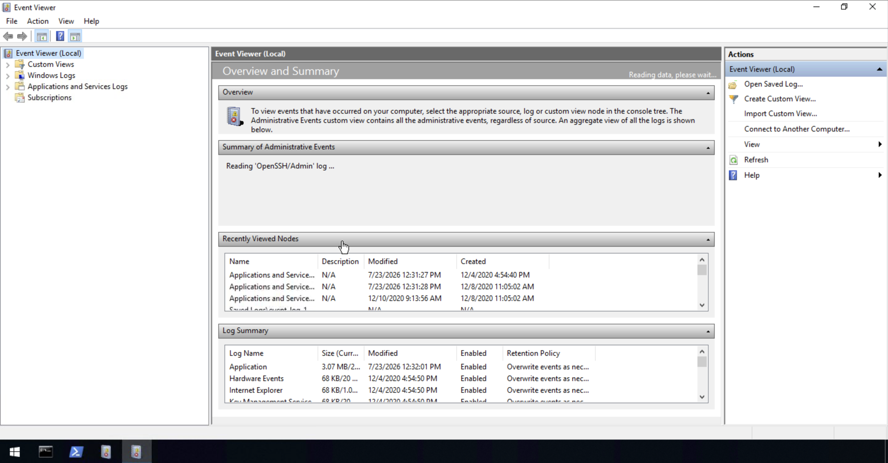
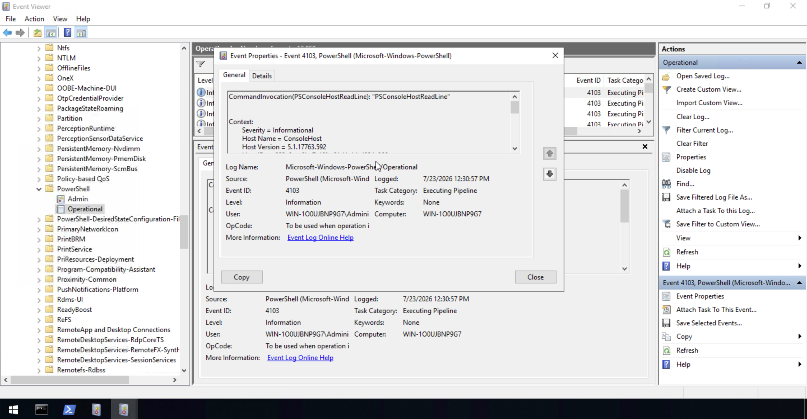
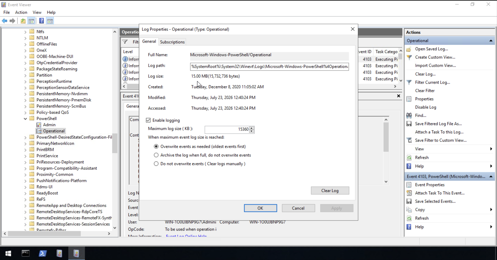

# Windows Event Logs

## Objective
This lab covers Windows Event Logs and the tools available to query them, from the GUI-based Event Viewer to command-line utilities like `wevtutil.exe` and the PowerShell cmdlet `Get-WinEvent`. Manually sifting through hundreds or thousands of events in Event Viewer isn't practical for real SOC work — being able to script and filter event log queries from the command line is a core skill for efficient log analysis and triage.

## Skills Demonstrated
- Navigating Event Viewer to inspect log properties and individual event details
- Querying event logs from the command line using `wevtutil.exe`
- Understanding `wevtutil` options for read direction, count, format, and log file paths
- Querying and filtering event logs using the PowerShell `Get-WinEvent` cmdlet
- Filtering events using `-FilterHashtable` and `-FilterXPath` for efficient, scriptable log queries
- Enumerating event log providers and identifying logs associated with specific applications/services

## Tools Used
- Windows Event Viewer
- wevtutil.exe
- PowerShell (Get-WinEvent)
- TryHackMe – Windows Event Logs

## Screenshot 1 – Event Viewer Overview
I opened Event Viewer and reviewed the default layout, including the log categories (Application, Security, Setup, System, Forwarded Events) and the custom Applications and Services Logs section.

## Screenshot 2 – Event 4103 Details
I located and inspected an Event ID 4103 entry (PowerShell module logging), reviewing the event's General and Details tabs to understand the structure of event metadata, including the provider name, keywords, and logged command details.

## Screenshot 3 – Log Properties
I opened the Properties dialog for a log to review its configuration, including maximum log size, current log size, and the log's overwrite/retention behavior.

## wevtutil.exe

`wevtutil.exe` is a command-line utility that retrieves information about event logs and publishers, and can be used to run queries, export, archive, and clear logs. Reviewing the built-in help (`wevtutil.exe /?` and `wevtutil qe /?`) is the fastest way to learn its command structure and available options.

Key commands and options explored:

\`\`\`bash
# List all log names on the machine
wevtutil el

# Count how many log names exist
wevtutil el | Measure-Object -Line

# Query the 3 most recent events from the Application log, in text format
wevtutil qe Application /c:3 /rd:true /f:text
\`\`\`

- `/lf` (logfile) — specifies that the given path is a log **file** rather than a live log name, allowing `query-events` to read from an exported `.evtx` file.
- `/q` — takes an XPath query as its value, used to filter which events are returned.
- `/rd` (reversedirection) — controls read direction; `/rd:true` returns the most recent events first.
- `/c` (count) — sets the maximum number of events to return.

## Get-WinEvent

`Get-WinEvent` is a PowerShell cmdlet that retrieves events from local and remote event logs and log files, and can combine and filter events from multiple sources using XPath queries, structured XML queries, or hash tables. It replaces the older `Get-EventLog` cmdlet.

\`\`\`bash
# List all event logs on the machine
Get-WinEvent -ListLog *

# List all event log providers
Get-WinEvent -ListProvider *

# Find logs related to OpenSSH
Get-WinEvent -ListLog * | Where-Object { $_.LogName -like "*OpenSSH*" }

# Search providers matching "PowerShell"
Get-WinEvent -ListProvider "*PowerShell*"

# Count how many event IDs are defined for the PowerShell provider
(Get-WinEvent -ListProvider Microsoft-Windows-PowerShell).Events | Measure-Object

# Filter Application log events by provider using FilterHashtable (more efficient than piping to Where-Object on large logs)
Get-WinEvent -FilterHashtable @{
  LogName='Application'
  ProviderName='WLMS'
}

# Find WLMS events at a specific timestamp using FilterXPath
Get-WinEvent -LogName Application -FilterXPath "*/System/Provider[@Name='WLMS'] and */System/TimeCreated[@SystemTime='2020-12-15T01:09:08.940277500Z']"

# Find logon events (Event ID 4720) for a specific user using FilterXPath
Get-WinEvent -LogName Security -FilterXPath "*/EventData/Data[@Name='TargetUserName']='Sam' and */System/EventID=4720"
\`\`\`

## Findings
- The OpenSSH-related logs on the machine are `OpenSSH/Admin` and `OpenSSH/Operational`.
- Using `-FilterHashtable` is significantly more efficient than piping full log results to `Where-Object`, since it filters at the source rather than sending every event object down the pipeline first.
- `-FilterXPath` allows precise filtering on specific event fields (e.g., `TargetUserName`, `EventID`, `TimeCreated`) without needing to manually parse full event objects.
- Enumerating providers with `-ListProvider` is a fast way to identify which providers write to which logs — useful for scoping an investigation to the right log source before running a query.
- The Windows Event Level values for `-FilterHashtable` filtering are: LogAlways=0, Critical=1, Error=2, Warning=3, Informational=4, Verbose=5.

## Lessons Learned
- Manually browsing Event Viewer doesn't scale — command-line tools like `wevtutil` and `Get-WinEvent` are essential once log volume grows beyond a handful of entries.
- Off-by-one counting errors are easy to make when manually eyeballing terminal output; piping to `Measure-Object` gives an exact, reliable count instead of miscounting scrolled output.
- Building XPath and hash table filters requires precision — a single quoting mismatch or incorrect field name will cause the query to silently return zero results rather than error out, so it's worth double-checking field names (e.g., `TargetUserName` vs `TargetUser`) against the actual event schema in Event Viewer before assuming a query is broken.
- A query can be syntactically correct and still return no results if the underlying log data doesn't contain a matching event — this isn't necessarily a mistake in the query itself.

## References
1. TryHackMe. *Windows Event Logs*. https://tryhackme.com
2. Microsoft Docs. *wevtutil*. https://docs.microsoft.com/en-us/windows-server/administration/windows-commands/wevtutil
3. Microsoft Docs. *Get-WinEvent*. https://docs.microsoft.com/en-us/powershell/module/microsoft.powershell.diagnostics/get-winevent
