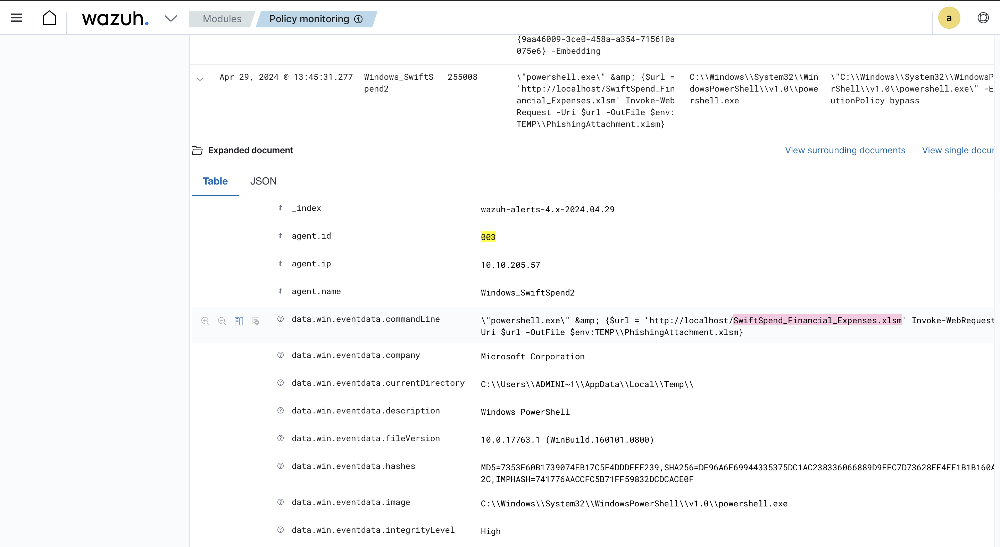
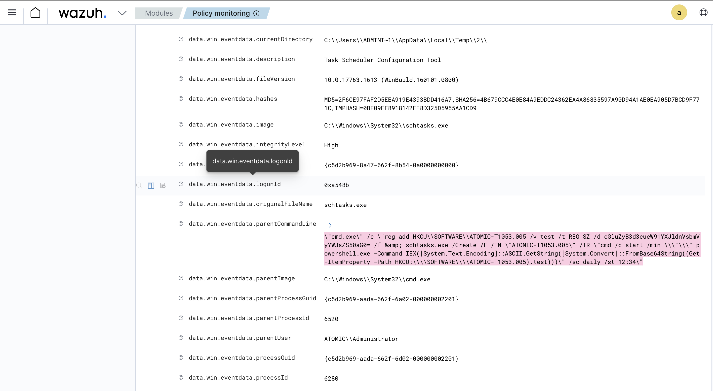
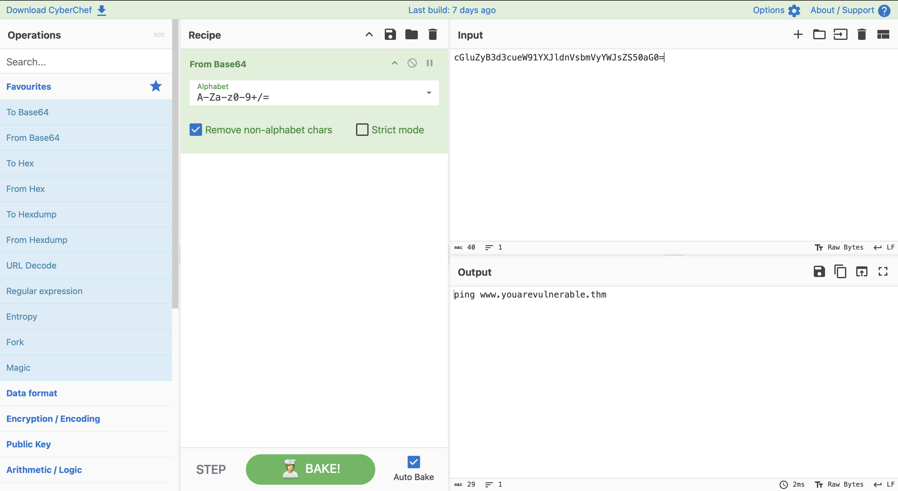
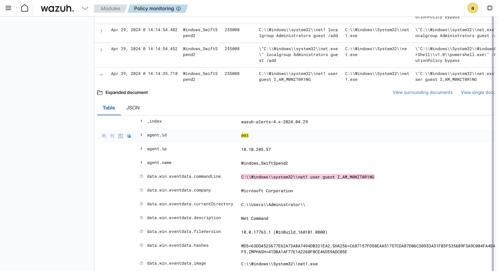
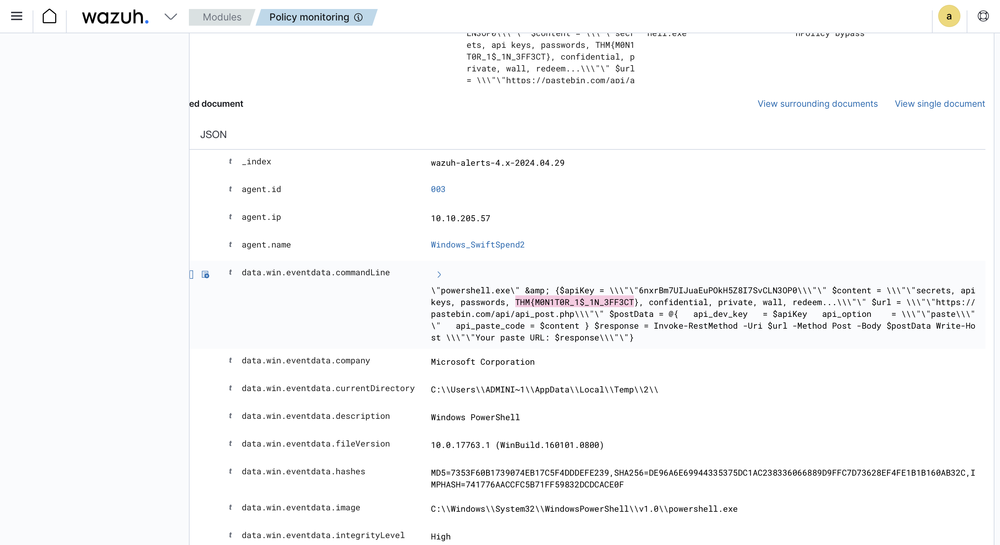

# Monday Monitor

## Objective
Investigate a simulated intrusion against Swiftspend Finance, a fictional fintech company, using Wazuh and Sysmon endpoint telemetry. Acting as the analyst brought in to review a security test run on April 29, 2024 (12:00–20:00), the goal is to reconstruct the full attack chain — initial access, persistence, defense evasion, credential access, and exfiltration — using only the raw Sysmon/Wazuh event data captured on the affected Windows host.

## Skills Demonstrated
- Investigating a simulated real-world intrusion end-to-end using Wazuh's Security Events and Policy Monitoring modules
- Reconstructing an attack chain from raw Sysmon telemetry: initial access → persistence → defense evasion → credential access → exfiltration
- Filtering and pivoting through high-volume alert data using Wazuh's Discover/Events interface, DQL search syntax, and Kibana time-range controls
- Distinguishing genuine malicious indicators from benign background noise (e.g., ruling out routine `svchost.exe`/`rundll32.exe` COM activity, PowerShell's own `__PSScriptPolicyTest` artifacts, and .NET's dynamically-compiled temp DLLs as false leads)
- Tracing a macro-enabled Office document (`.xlsm`) download through to shell execution via `parentImage`/`parentCommandLine` process-lineage analysis
- Identifying Windows persistence mechanisms, including Scheduled Task creation (`schtasks.exe`) and abuse of the built-in Guest account for privilege escalation
- Recognizing Base64-obfuscated PowerShell payloads staged in the Windows Registry and decoding them using CyberChef
- Mapping observed behavior to MITRE ATT&CK techniques (T1003.001 – OS Credential Dumping: LSASS Memory; T1053.005 – Scheduled Task; T1136 – Create Account)
- Identifying a renamed credential-dumping tool (Mimikatz disguised as `memotech.exe`) run under the Atomic Red Team testing framework
- Locating data exfiltration activity (a PowerShell script harvesting secrets and posting them to a Pastebin API endpoint) and extracting the embedded flag

## Tools Used
- Wazuh (Security Events module, Policy Monitoring module, Discover/Events interface)
- Sysmon (Windows endpoint telemetry)
- CyberChef (Base64 decoding)
- DQL (Wazuh/Kibana query syntax)

## Screenshot 1 – Initial Access: Malicious Document Download
Filtering Policy Monitoring events around the PowerShell/Office activity cluster (13:39–13:45) surfaced the actual download command responsible for initial access. A PowerShell process retrieved a macro-enabled Excel workbook from `http://localhost/SwiftSpend_Financial_Expenses.xlsm` and saved it locally as `PhishingAttachment.xlsm` in the user's Temp directory. The `.xlsm` extension and finance-themed filename align with the phishing lure aimed at a fintech company, and this event ties directly back to the very first alerts observed in the timeline ("Possible Office Macro Started" and "Microsoft Office Product Spawning Windows Shell").

## Screenshot 2 – Persistence: Scheduled Task with Base64-Encoded Payload
A `cmd.exe` process (spawned from the Office macro chain) first wrote a Base64-encoded string into the registry at `HKCU\SOFTWARE\ATOMIC-T1053.005`, then created a daily Scheduled Task (`schtasks.exe /Create /F /TN "ATOMIC-T1053.005" ... /sc daily /st 12:34`) configured to read that registry value, decode it, and execute it via PowerShell's `IEX` on a daily basis. Decoding the stored value using CyberChef revealed the payload: `ping www.youarevulnerable.thm` — a low-impact "proof of execution" callback consistent with Atomic Red Team's T1053.005 (Scheduled Task) test procedure.

## Screenshot 3 – Privilege Escalation: Guest Account Weaponization
Rather than creating a brand-new user account, the attacker reactivated and escalated the built-in, normally low-privilege **Guest** account. A `net1 user guest I_AM_M0NIT0R1NG` command set a password on the account, followed immediately by `net.exe localgroup Administrators guest /add`, elevating Guest into the local Administrators group. This is a stealthier persistence technique than creating a new account, since the Guest account already exists on every Windows host and is less likely to draw scrutiny.

## Screenshot 4 – Exfiltration: Credential Harvesting to Pastebin
A later PowerShell command (14:56) gathered a set of sensitive strings — labeled `secrets, api keys, passwords, confidential, private` in the script — including the embedded flag `THM{M0N1T0R_1$_1N_3FF3CT}`, and exfiltrated the collected data by POSTing it to `pastebin.com/api/api_post.php` via `Invoke-RestMethod`. This represents the final stage of the observed attack chain.

## Findings
| # | Question | Answer |
|---|----------|--------|
| 1 | Downloaded file used for initial access | `SwiftSpend_Financial_Expenses.xlsm` (saved locally as `PhishingAttachment.xlsm`) |
| 2 | Full command to create the scheduled task | `schtasks.exe /Create /F /TN "ATOMIC-T1053.005" /TR "cmd /c start /min \"\" powershell.exe -Command IEX([System.Text.Encoding]::ASCII.GetString([System.Convert]::FromBase64String((Get-ItemProperty -Path HKCU:\SOFTWARE\ATOMIC-T1053.005).test)))" /sc daily /st 12:34` |
| 3 | Scheduled task run time | 12:34 (daily) |
| 4 | What was Base64-encoded | `ping www.youarevulnerable.thm` |
| 5 | Password set on the new/weaponized user account | `I_AM_M0NIT0R1NG` (set on the built-in Guest account) |
| 6 | Executable used to dump credentials | `memotech.exe` (renamed Mimikatz, run under Atomic Red Team's T1003.001 test path) |
| 7 | Exfiltrated flag | `THM{M0N1T0R_1$_1N_3FF3CT}` |

Additional observations:
- The attack chain closely mirrors a real-world macro-based intrusion: a phishing-themed `.xlsm` file triggers an Office macro, which spawns a command shell, establishes persistence via both a scheduled task and a weaponized Guest account, dumps credentials with a renamed Mimikatz binary, and exfiltrates harvested secrets to an external paste service.
- The activity is consistent with the Atomic Red Team adversary emulation framework (explicit `AtomicRedTeam\atomics\` file paths and MITRE technique IDs such as T1003.001 and T1053.005 appear directly in command lines), indicating this was a controlled, technique-by-technique simulation rather than an organically evolving attack.
- Several file-creation events initially appeared suspicious but were ruled out as false leads during the investigation: PowerShell's own `__PSScriptPolicyTest_*.ps1` execution-policy check files, .NET's dynamically compiled `TransmogProvider.dll` temp assemblies, and a Windows System Diagnostics (`SDIAG_`) troubleshooting script — all routine background artifacts unrelated to the attacker's activity.

## Lessons Learned
- Not every suspicious-looking file creation event is malicious — PowerShell, .NET, and Windows' own diagnostic tooling generate plausible-looking artifacts (temp scripts, dynamically compiled DLLs) as part of completely normal operation. Learning to recognize and rule these out quickly is as important as spotting genuine indicators.
- When a specific alert or rule doesn't directly reveal the detail needed (e.g., a filename), pivoting to a different module or a different, more specific Sysmon Event ID (such as filtering directly on Event ID 11 for file creation, or searching full-text across all fields rather than guessing exact field names) can surface the answer faster than repeatedly re-examining the same alert.
- Attackers often prefer reactivating and escalating a built-in account (like Guest) over creating a brand-new one, since existing accounts are less likely to stand out during a routine account audit — a useful detection pattern to watch for in real environments.
- Reinforced the value of tools like CyberChef for quickly decoding obfuscated payloads (Base64-encoded PowerShell commands stored in the registry are a common technique for staging persistence while evading simple string-based detection).
- Practiced disciplined process-lineage analysis (`image`, `parentImage`, `commandLine`, `parentCommandLine`) to trace an attack chain backward from a downstream alert to its true root cause, rather than assuming the first alert encountered is the earliest event in the chain.

## References
- [TryHackMe – Monday Monitor Room](https://tryhackme.com/room/mondaymonitor)
- [MITRE ATT&CK T1003.001 – OS Credential Dumping: LSASS Memory](https://attack.mitre.org/techniques/T1003/001/)
- [MITRE ATT&CK T1053.005 – Scheduled Task](https://attack.mitre.org/techniques/T1053/005/)
- [MITRE ATT&CK T1136 – Create Account](https://attack.mitre.org/techniques/T1136/)
- [Atomic Red Team](https://github.com/redcanaryco/atomic-red-team)
- [CyberChef](https://gchq.github.io/CyberChef/)
