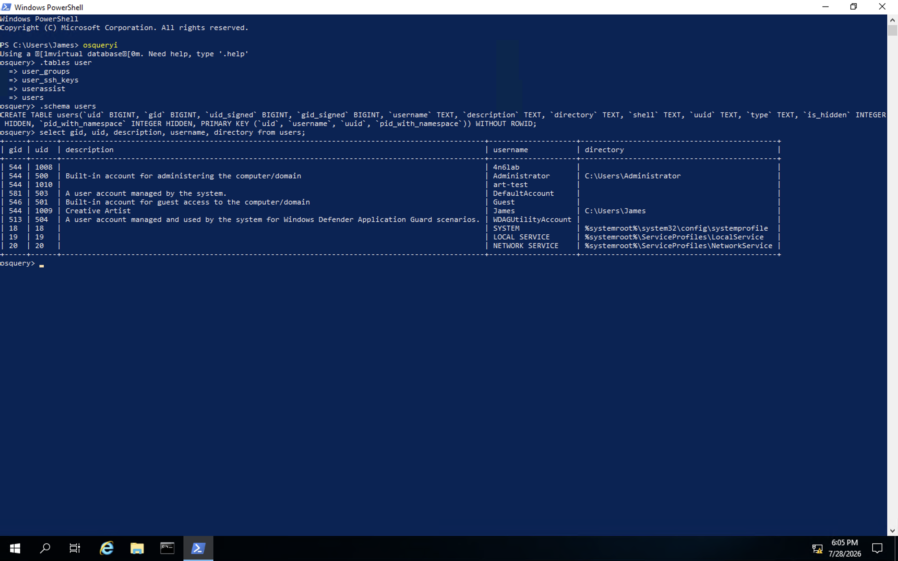
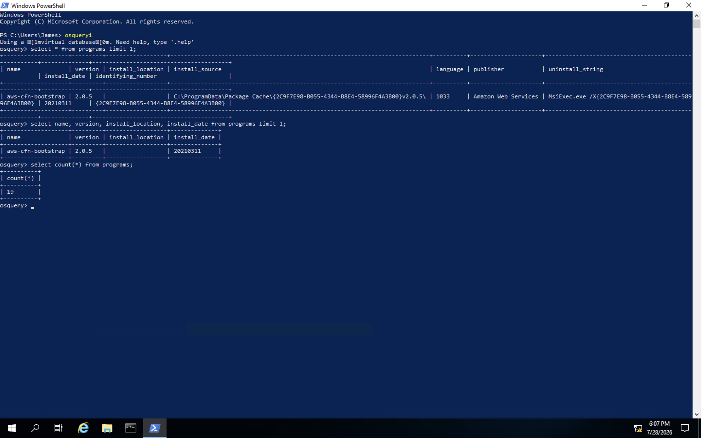
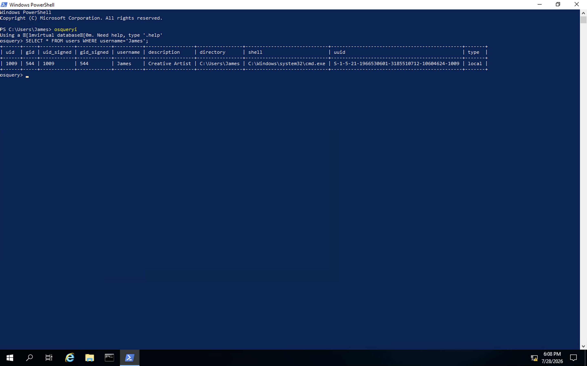
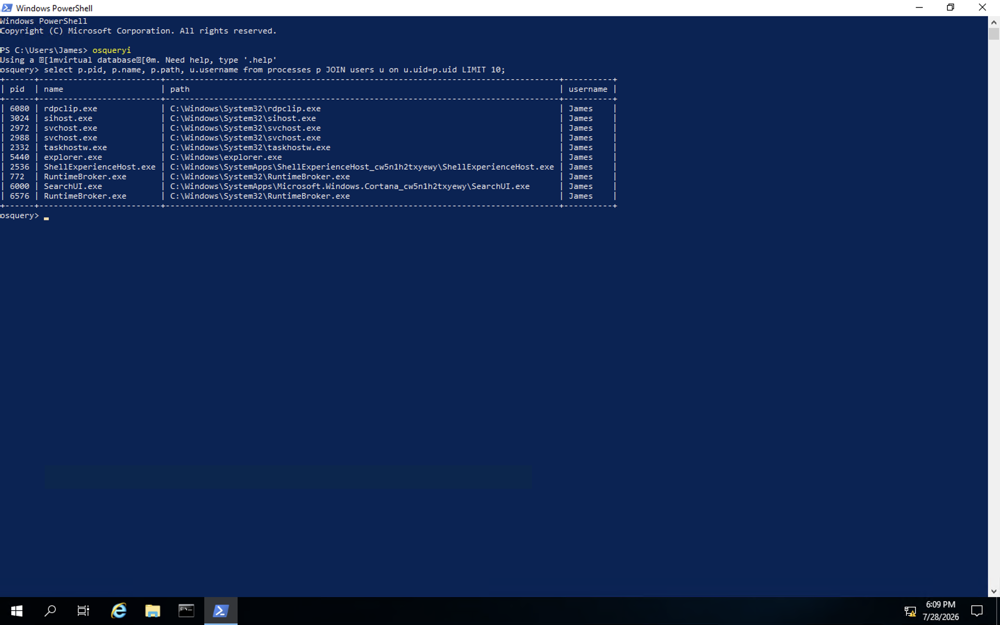
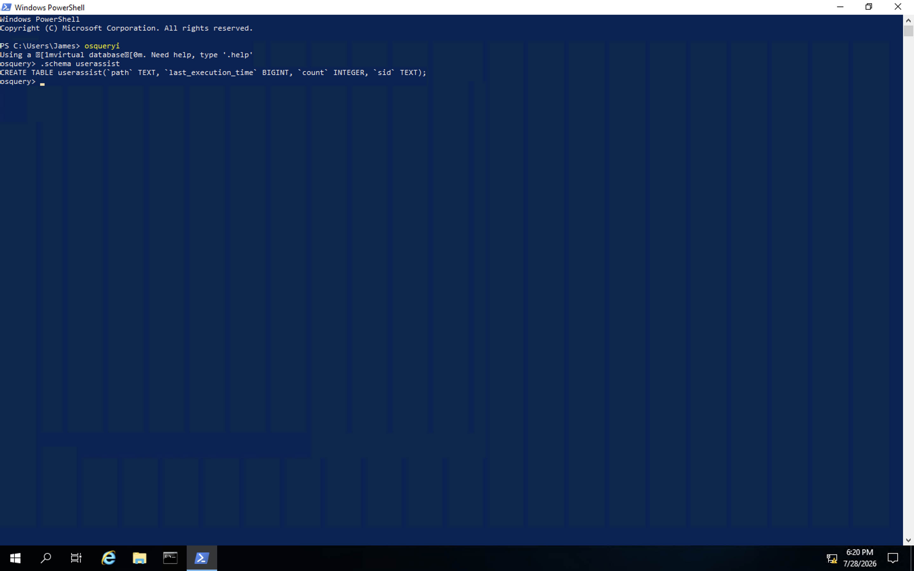
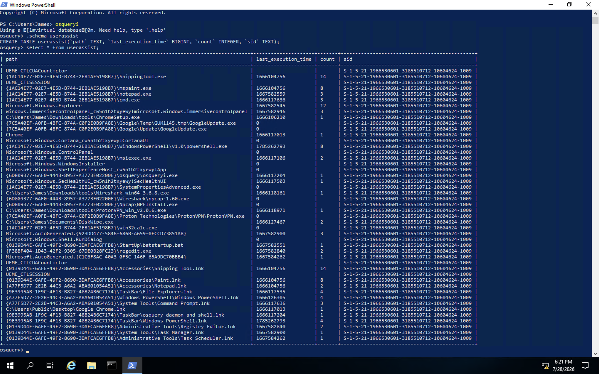
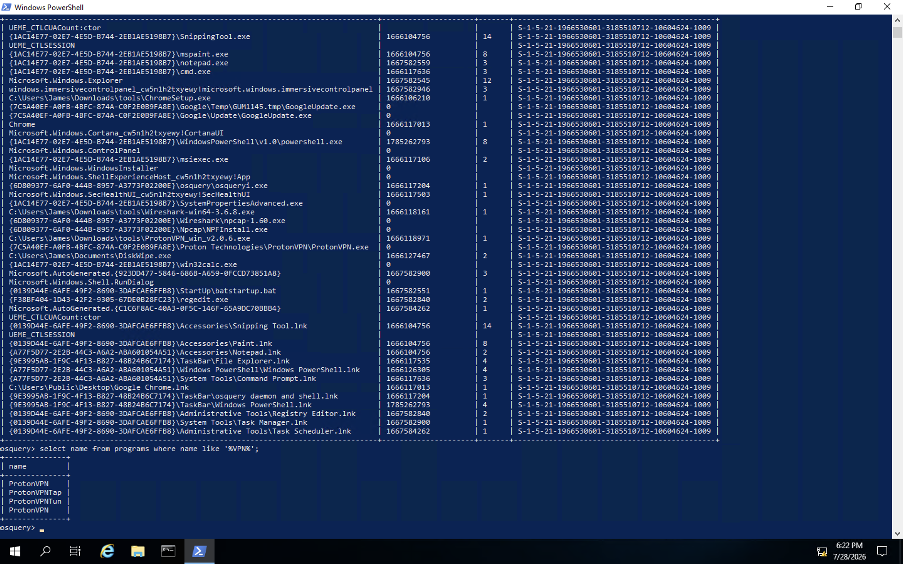
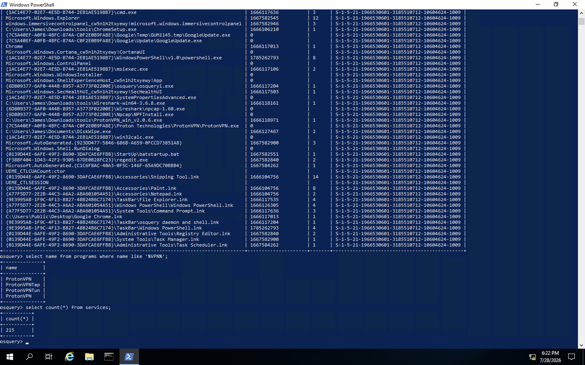
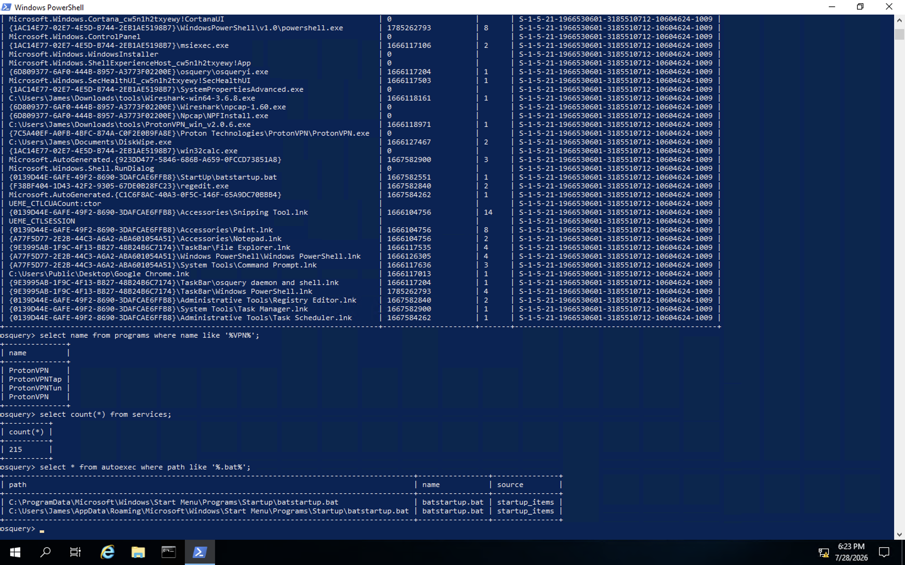

# Osquery: The Basics

## Objective
Osquery is an open-source tool that exposes an operating system as a high-performance relational database, allowing an analyst to write standard SQL queries to explore processes, installed programs, users, services, network connections, and many other aspects of a live endpoint. This room covers Osquery's interactive shell, core SQL query syntax, filtering, joining tables, and applies these skills to a hands-on investigative challenge on a live Windows host.

## Skills Demonstrated
- Navigating the Osquery interactive shell (`osqueryi`) and its meta-commands
- Listing and searching available tables with `.tables`
- Inspecting table schemas with `.schema` to identify available columns before querying
- Writing SQL `SELECT` queries, including column selection, `LIMIT`, and `count()`
- Filtering results using `WHERE` clauses and `LIKE` wildcard pattern matching
- Joining two related tables (`processes` and `users`) on a shared column to enrich query results
- Using Osquery to investigate a live endpoint for evidence of anti-forensic activity, unauthorized software, and persistence mechanisms

## Tools Used
- Osquery (osqueryi interactive shell)
- Windows PowerShell
- TryHackMe – Osquery: The Basics

## Osquery Interactive Mode
Osquery's interactive shell is launched with `osqueryi`. Meta-commands (prefixed with `.`) are used to explore the tool itself — `.tables` lists available tables (optionally filtered by keyword), and `.schema <table>` shows a table's columns and data types before querying it.

```bash
osqueryi
.tables user
.schema users
select gid, uid, description, username, directory from users;
```

## Screenshot 1 – Basic Navigation
Using `.tables user` to find user-related tables, `.schema users` to inspect the users table's columns, and a basic `SELECT` query to display selected columns from the table.


## Querying and Limiting Results
Osquery queries follow standard SQL syntax, always starting with `SELECT` and a `FROM` clause. `LIMIT` restricts the number of rows returned, and `count(*)` returns just the number of matching rows without displaying the data itself.

```bash
select * from programs limit 1;
select name, version, install_location, install_date from programs limit 1;
select count(*) from programs;
```

## Screenshot 2 – Programs Table Query
Querying the `programs` table for installed software, first retrieving all columns for a single result, then narrowing to specific columns, then counting the total number of installed programs.


## Filtering with WHERE
A `WHERE` clause narrows results based on a condition. Supported operators include `=`, `<>`, `>`, `<`, `BETWEEN`, and `LIKE` (with `%` and `_` as wildcards for pattern matching). Some tables, such as `file`, require a `WHERE` clause and will return an error if queried without one.

```bash
SELECT * FROM users WHERE username='James';
```

## Screenshot 3 – WHERE Clause
Filtering the `users` table to return only the record for the user "James".


## Joining Tables
Two tables sharing a common column can be joined to produce enriched results. Here, the `processes` table (which only stores a numeric `uid`) is joined with the `users` table (which maps `uid` to a readable `username`), producing a result that shows which user owns each running process.

```bash
select p.pid, p.name, p.path, u.username from processes p JOIN users u on u.uid=p.uid LIMIT 10;
```

## Screenshot 4 – JOIN Query
Joining the `processes` and `users` tables on the shared `uid` column to display each process's PID, name, path, and owning username in a single result.


## Investigative Challenge
Using the skills above, I investigated the live endpoint to answer a set of hands-on questions.

**Which table stores evidence of process execution in Windows OS?**
The `userassist` table — a well-known Windows forensic artifact that logs the path, execution count, and last execution time of GUI programs launched by a user, sourced from the UserAssist registry key.

```bash
.schema userassist
```

## Screenshot 5 – UserAssist Table Schema
Confirming the `userassist` table exists and inspecting its schema (`path`, `last_execution_time`, `count`, `sid`).


**One of the users executed a program to remove traces from the disk — what is the name of that program?**

```bash
select * from userassist;
```

## Screenshot 6 – UserAssist Query Results
Querying the full contents of the `userassist` table to identify programs executed on the host, including evidence of an anti-forensic/cleanup tool having been run.


**Identify the VPN installed on this host.**

```bash
select name from programs where name like '%VPN%';
```

## Screenshot 7 – VPN Software Search
Using a `LIKE` wildcard search against the `programs` table to identify installed VPN software by name.


**How many services are running on this host?**

```bash
select count(*) from services;
```

## Screenshot 8 – Services Count
Using `count(*)` against the `services` table to determine the total number of services running on the endpoint.


**A batch file was found to run automatically via the `autoexec` table — what is its name and full path?**

```bash
select * from autoexec where path like '%.bat%';
```

## Screenshot 9 – Autoexec Batch File
Querying the `autoexec` table, which lists executables configured to run automatically on the host, filtered to identify the auto-running `.bat` file and its full path.


## Findings
- Osquery treats the entire operating system as a queryable relational database, making it possible to answer investigative questions (installed software, running services, execution history) using standard SQL rather than manually browsing GUIs or parsing raw files.
- The `userassist` table is a valuable artifact for proving program execution history on a Windows endpoint, including evidence of anti-forensic tooling being used to attempt to cover tracks.
- The `autoexec` table is an efficient way to audit every mechanism configured to launch automatically on a host in a single query, rather than checking Startup folders, Registry Run keys, and Scheduled Tasks individually.
- Some tables (like `file`) intentionally require a `WHERE` clause to prevent an unbounded, resource-intensive scan of an entire filesystem.

## Lessons Learned
- Osquery's SQL must be run inside the `osqueryi` interactive shell — typing SQL directly into a standard PowerShell prompt fails, since PowerShell interprets `select` as its own built-in `Select-Object` cmdlet rather than passing it through as SQL.
- Checking a table's schema with `.schema <table>` before writing a query saves time and avoids querying for columns that don't exist.
- `LIKE` with `%` wildcards is a fast way to search for software or files matching a partial name, without needing to know the exact full name in advance.
- Joining tables on a shared key (e.g., `uid`) turns raw numeric identifiers into human-readable context, which is often the difference between a technically correct query and an actually useful one during an investigation.

## References
1. TryHackMe. *Osquery: The Basics*. https://tryhackme.com
2. Osquery. *Schema Documentation (v5.5.1)*. https://osquery.io/schema/5.5.1/
3. Osquery. *Official Documentation*. https://osquery.readthedocs.io/
