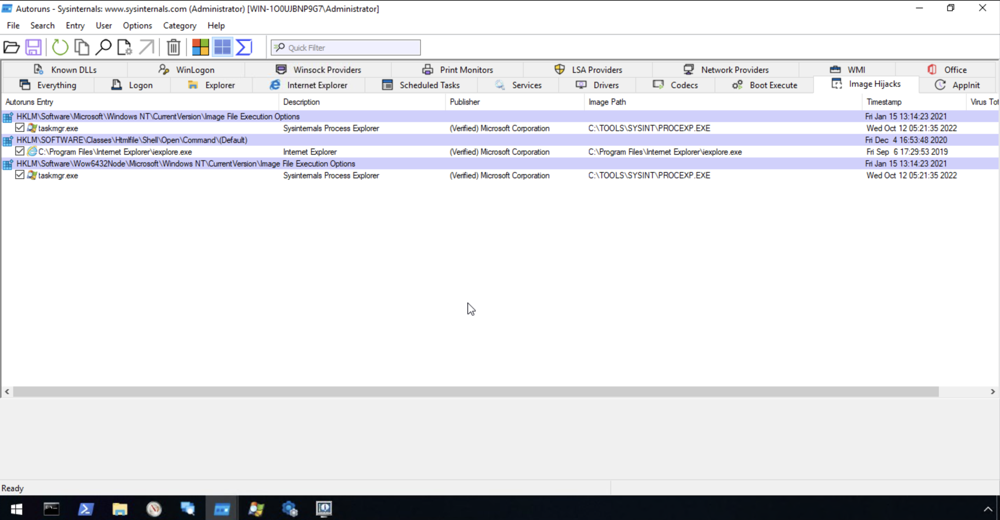
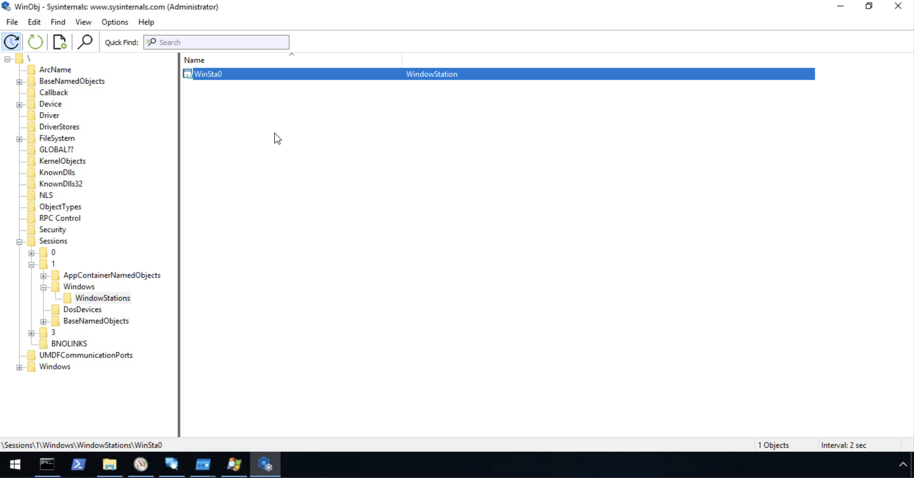
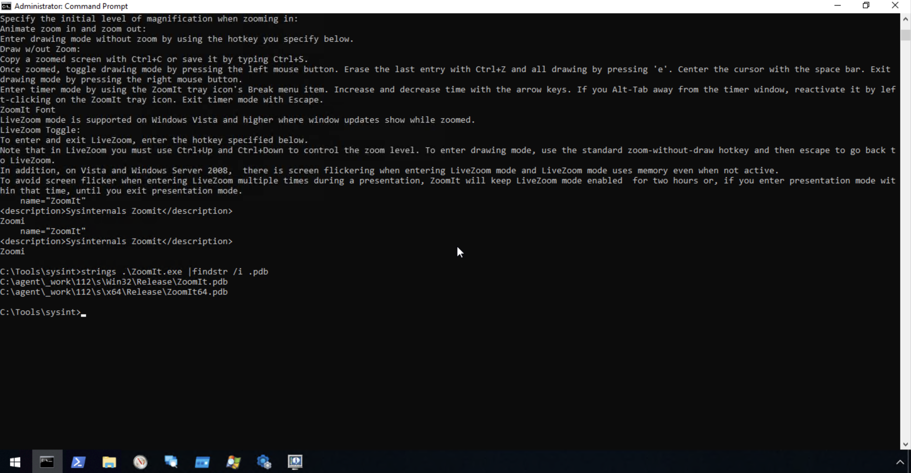

# Sysinternals

## Objective

This room introduces the Sysinternals suite — a collection of 70+ advanced Windows diagnostic and troubleshooting tools created by Mark Russinovich. These tools go far beyond built-in Windows utilities, giving SOC analysts and incident responders deep visibility into running processes, file system activity, registry changes, network connections, persistence mechanisms, and low-level object management. Several of these tools are dual-use: legitimate for administration, but also commonly abused by adversaries, making it essential to understand their normal use in order to recognize malicious use.

## Skills Demonstrated

- Installing and running the Sysinternals Suite locally
- Using Process Monitor (Procmon) to capture real-time file system, registry, and process activity
- Identifying and reading NTFS Alternate Data Streams (ADS) using the `streams` tool
- Filtering live network connections with TCPView to isolate genuine outbound activity
- Using Autoruns to identify persistence mechanisms and Image File Execution Options hijacking
- Investigating process handles and network activity with Process Explorer
- Validating suspicious IP addresses using external threat intelligence (Cisco Talos Reputation Center)
- Navigating the NT Object Manager namespace with WinObj to inspect Session 0/Session 1 objects
- Extracting embedded strings from a binary to identify debug symbol paths using the `strings` tool

## Tools Used

- Process Monitor (Procmon)
- Streams
- TCPView
- Autoruns
- Process Explorer
- WinObj
- Strings
- Cisco Talos Intelligence Reputation Center
- TryHackMe – Sysinternals

## Screenshot 1 – Exploring the Local Sysinternals Suite

I located the local copy of the Sysinternals Suite at `C:\Tools\Sysint`, confirming the full set of 160 tools included, organized alphabetically across categories such as File and Disk Utilities, Networking Utilities, Process Utilities, and Security Utilities.


## Screenshot 2 – Capturing Live Activity with Process Monitor

I launched Process Monitor (`procmon`) and confirmed it was actively capturing real-time file system, registry, and process activity across the system, including operations performed by `ctfmon.exe` and `svchost.exe`.

```bash
procmon
```


## Screenshot 3 – Discovering a Hidden Alternate Data Stream

Using the `streams` tool, I inspected `file.txt` on the desktop and discovered a hidden Alternate Data Stream named `ads.txt` attached to the file — data that is completely invisible in normal Windows Explorer.

```bash
cd C:\Users\Administrator\Desktop
streams file.txt
```


## Screenshot 4 – Reading the Hidden Stream Content

I used the `file:stream` syntax to open the hidden stream directly in Notepad, revealing its concealed content.

```bash
notepad file.txt:ads.txt
```


## Screenshot 5 – Filtering Live Connections with TCPView

I launched TCPView and applied filtering to disable UDP v4/v6 and exclude connections in the Listen state, narrowing the view down to only active, established outbound TCP connections and their associated processes.

```bash
tcpview -accepteula
```


## Screenshot 6 – Identifying Persistence with Autoruns

I ran Autoruns and reviewed the Image Hijacks tab, identifying entries where `taskmgr.exe` had been redirected to launch Sysinternals Process Explorer (`C:\TOOLS\SYSINT\PROCEXP.EXE`) instead, via the Image File Execution Options registry key — a known technique for hijacking a legitimate application's execution path.



## Screenshot 7 – Investigating Process Handles with Process Explorer

I used Process Explorer to inspect `svchost.exe` (PID 336), reviewing its open handles — including ALPC ports, file handles, and registry keys — to understand what system resources the process was actively using.


## Screenshot 8 – Validating a Remote IP with Talos Reputation Center

To confirm that an outbound connection observed via Process Explorer/TCPView was legitimate, I looked up the remote IP address (`52.154.170.73`) using the Cisco Talos Intelligence Reputation Center. The lookup confirmed the IP is owned by Microsoft Corp, carries a Neutral reputation, and is not listed on any spam/abuse blocklists — validating it as legitimate Sysinternals/WebDAV traffic rather than malicious activity.


## Screenshot 9 – Exploring Session Objects with WinObj

Using WinObj, I navigated the NT Object Manager namespace to `Sessions\1\Windows\WindowStations\WinSta0`, confirming the window station object associated with Session 1 (the interactive user session), reinforcing the Session 0/Session 1 separation covered in the Core Windows Processes room.



## Screenshot 10 – Extracting Embedded Strings from a Binary

I used the `strings` tool to search the embedded text within `ZoomIt.exe` for its debug symbol (`.pdb`) file path, demonstrating how binary string analysis can reveal build environment details left behind in compiled executables.

```bash
cd C:\Tools\sysint
strings .\ZoomIt.exe | findstr /i .pdb
```



## Findings

- Sysinternals tools provide significantly more depth than built-in Windows utilities (Task Manager, Resource Monitor), particularly around process handle inspection, persistence discovery, low-level object management, and file system/registry monitoring.
- Alternate Data Streams are a legitimate NTFS feature but are also a known technique for hiding data on an endpoint — a file's size and appearance in Explorer give no indication that hidden streams exist, making tools like `streams` essential for thorough forensic review.
- Filtering is critical when using tools like Process Monitor and TCPView — without it, the sheer volume of legitimate system activity (thousands of events per second) makes it nearly impossible to spot anomalies.
- Autoruns is one of the most valuable tools for identifying persistence mechanisms, including subtle techniques like Image File Execution Options hijacking, which can silently redirect a legitimate program to run something else instead.
- Several Sysinternals tools (PsExec, SDelete, Autoruns) are dual-use: legitimate for IT administration, but also documented MITRE ATT&CK techniques used by real adversaries for lateral movement, data destruction, and persistence.
- Verifying a suspicious-looking connection doesn't stop at the endpoint — cross-referencing the remote IP against external threat intelligence sources (like Talos) is a necessary step to confirm whether activity is benign or malicious.
- Binary string extraction is a quick, low-effort first step in file analysis — embedded debug paths, hardcoded strings, and configuration keys can reveal useful context about a file's origin and purpose without full reverse engineering.

## Lessons Learned

- Command syntax matters precisely in Windows paths — a missing letter (`User` vs. `Users`) or literal placeholder text (`<username>`) left in a command will cause it to fail silently or with a misleading error.
- Process Monitor's saved/default filters can carry over between sessions and unexpectedly hide events — always check and reset filters before assuming a tool isn't capturing anything.
- When filtering `strings` output, the search term must match what's actually likely to appear in the data — searching for a keyword like "zoom" will miss unrelated but relevant strings like a `.pdb` file path.
- Investigating a process's network activity (Process Explorer/TCPView) is most valuable when paired with an external reputation check — internal tools tell you *what* a process is doing, but external intelligence tells you whether that activity is *trustworthy*.

## References

1. TryHackMe. *Sysinternals*. https://tryhackme.com
2. Microsoft. *Sysinternals Suite Documentation*. https://docs.microsoft.com/en-us/sysinternals/
3. Microsoft. *Streams*. https://docs.microsoft.com/en-us/sysinternals/downloads/streams
4. Microsoft. *Autoruns*. https://docs.microsoft.com/en-us/sysinternals/downloads/autoruns
5. Microsoft. *Process Explorer*. https://docs.microsoft.com/en-us/sysinternals/downloads/process-explorer
6. Microsoft. *WinObj*. https://docs.microsoft.com/en-us/sysinternals/downloads/winobj
7. Microsoft. *Strings*. https://docs.microsoft.com/en-us/sysinternals/downloads/strings
8. Cisco Talos Intelligence. *IP & Domain Reputation Center*. https://talosintelligence.com/reputation_center
9. MITRE ATT&CK. *T1570 – Lateral Tool Transfer*. https://attack.mitre.org/techniques/T1570/
10. MITRE ATT&CK. *T1485 – Data Destruction*. https://attack.mitre.org/techniques/T1485/
