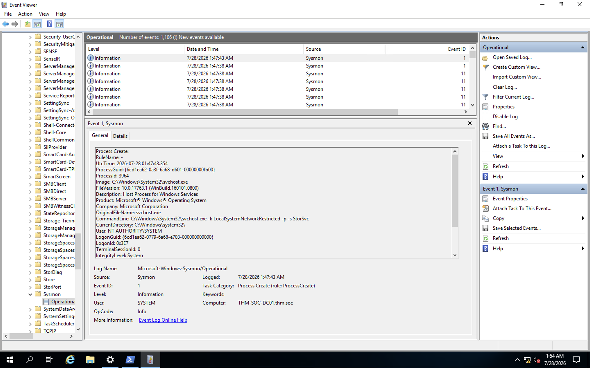
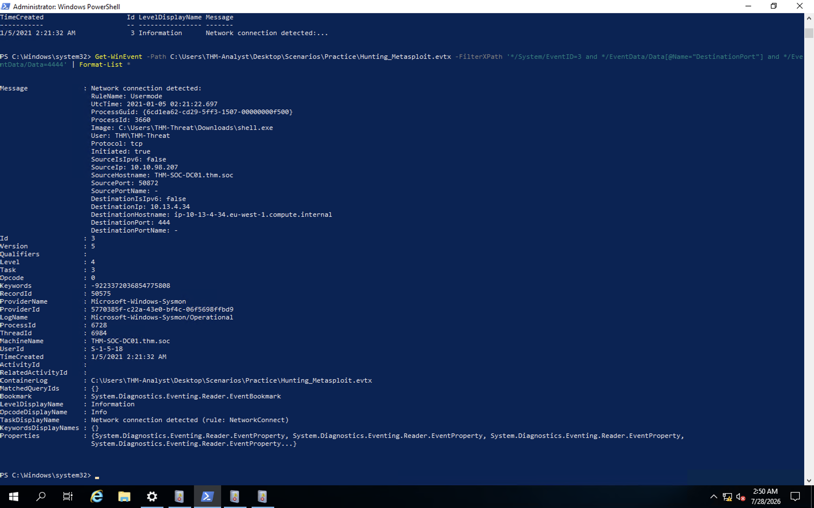
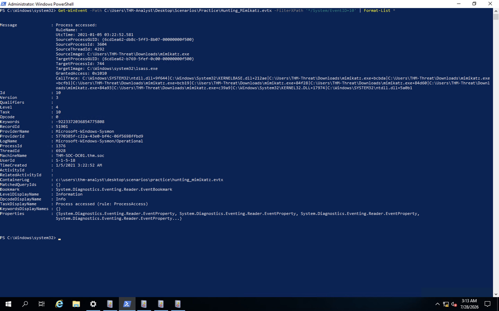
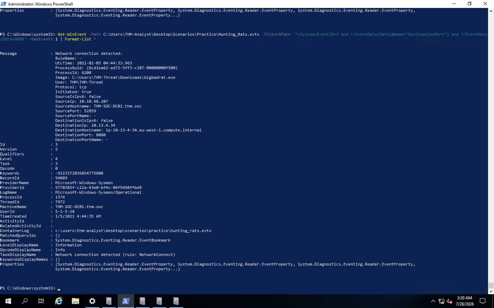
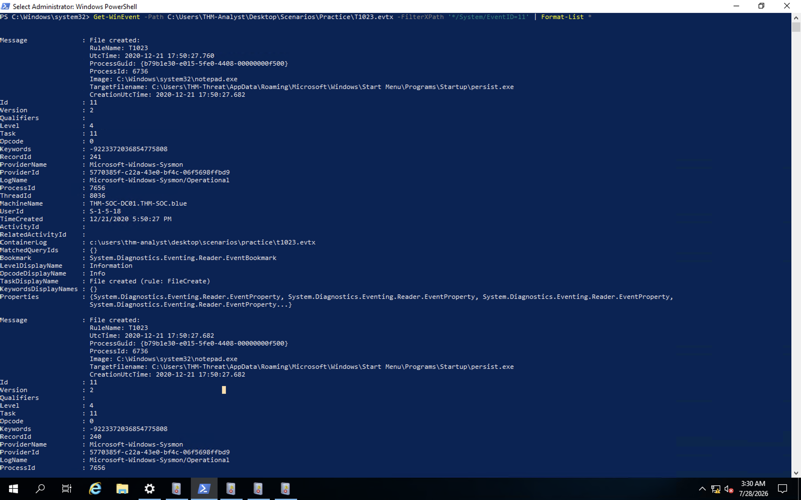
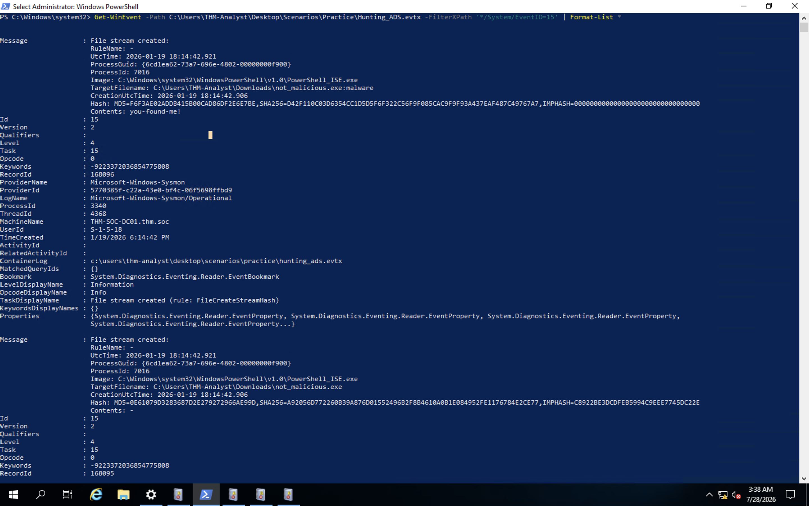
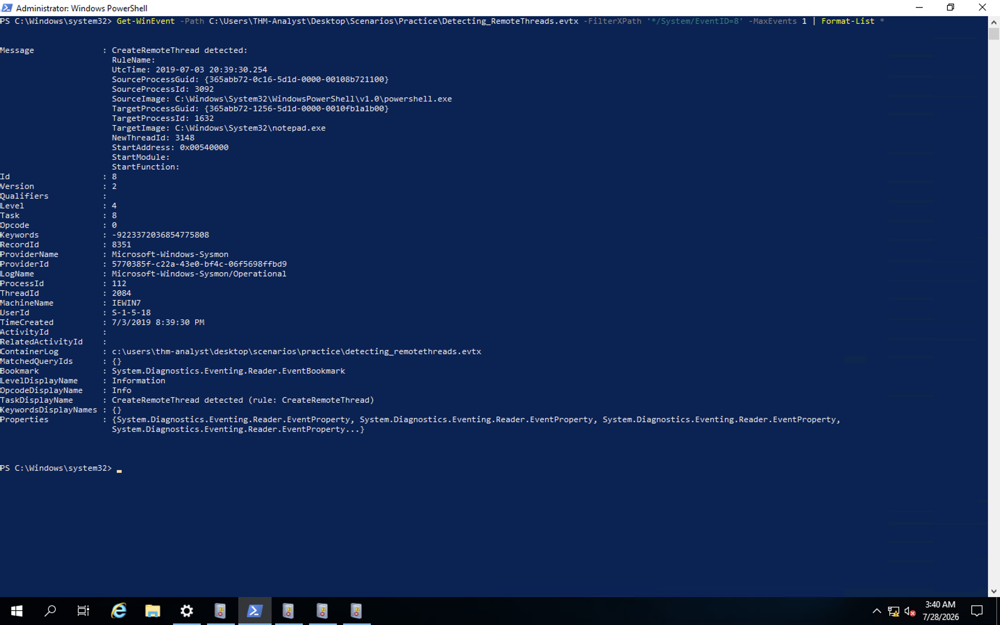
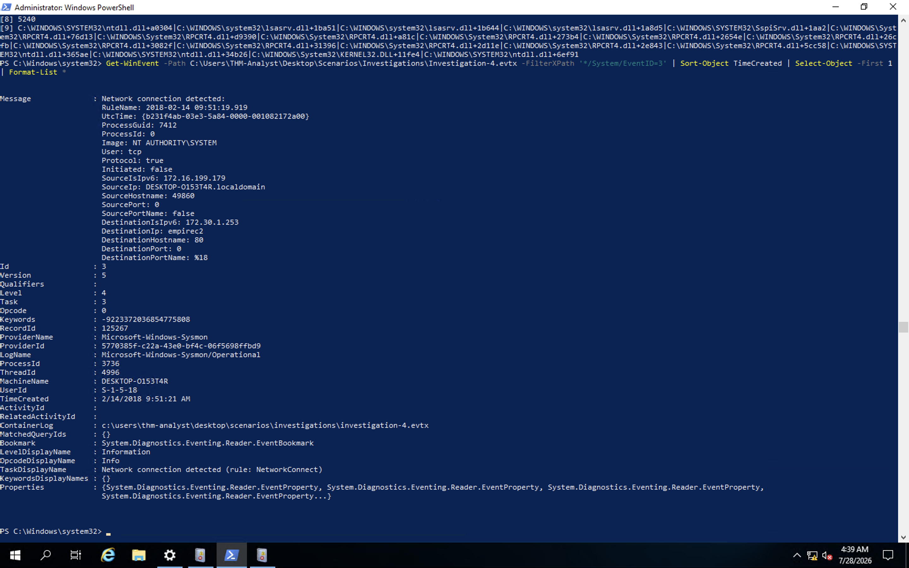

# Sysmon

## Objective
System Monitor (Sysmon) is a Windows system service and device driver that monitors and logs detailed system activity to the Windows event log, including process creation, network connections, and file creation time changes. Unlike default Windows logging, Sysmon requires a configuration file to define what activity to capture, and is commonly paired with a SIEM in production environments to detect malicious or anomalous behavior on an endpoint. This room covers Sysmon fundamentals, practical threat hunting techniques (Metasploit, Mimikatz, RATs/C2, persistence, evasion), and concludes with four hands-on incident investigations using real-world attack samples.

## Skills Demonstrated
- Understanding the purpose and architecture of Sysmon as an endpoint monitoring tool
- Interpreting Sysmon configuration files and the include/exclude rule philosophy
- Identifying key Sysmon Event IDs and their use cases
- Hunting Metasploit/meterpreter activity via suspicious network connections and process images
- Hunting credential-dumping tools (Mimikatz) via abnormal LSASS process access
- Hunting RAT/C2 activity via uncommon back-connect ports
- Hunting persistence mechanisms via Startup folder and Registry Run key monitoring
- Detecting evasion techniques: Alternate Data Streams (ADS) and remote thread injection (process hollowing)
- Conducting full incident investigations from raw `.evtx` samples, correlating process creation, network connection, registry, and process access events to reconstruct an attack chain
- Using `Get-WinEvent` with XPath queries for efficient, scriptable log analysis at scale
- Connecting to a remote lab machine via VPN and RDP for hands-on endpoint work

## Tools Used
- Sysmon (Sysinternals)
- Windows Event Viewer
- PowerShell (Get-WinEvent, XPath filtering)
- OpenVPN / TryHackMe VPN
- Microsoft Remote Desktop (Windows App)
- TryHackMe – Sysmon

## Sysmon Configuration Overview
Sysmon requires a configuration file to define how it should analyze and log events. Two configuration philosophies were covered in this room:
- **SwiftOnSecurity's config** — starts broad and **excludes** known-normal activity, reducing noise while retaining high-quality detection coverage.
- **ION-Storm's config** — takes a more proactive approach by primarily using **include** rules, only logging specifically defined activity.

Neither approach is universally "correct" — the right choice depends on a SOC team's tooling, log volume tolerance, and detection maturity. A key caution from the room: the ION-Storm config excludes port 53 (DNS) by default to reduce noise, but attackers increasingly abuse DNS for C2 traffic — a reminder to fully understand every exclusion in a config before trusting it in production.

## Key Sysmon Event IDs
| Event ID | Activity Monitored | Use Case |
|---|---|---|
| 1 | Process Creation | Detect known-bad or misspelled/masquerading processes |
| 3 | Network Connection | Detect suspicious outbound connections (e.g., scanning tools, C2 ports like 4444) |
| 7 | Image Loaded (DLL) | Detect DLL injection/hijacking (high system load — use selectively) |
| 8 | CreateRemoteThread | Detect process injection techniques (e.g., Cobalt Strike beacons, process hollowing) |
| 10 | ProcessAccess | Detect abnormal access to sensitive processes like lsass.exe |
| 11 | File Created | Detect dropped files, ransomware note filenames, etc. |
| 12/13/14 | Registry Event | Detect persistence mechanisms and credential abuse |
| 15 | FileCreateStreamHash | Detect files hidden in alternate data streams |
| 22 | DNS Event | Exclude known-safe domains to surface anomalous DNS queries |

## Screenshot 1 – Sysmon Operational Event Log
After connecting to the lab machine, I confirmed Sysmon was already installed and actively logging to `Applications and Services Logs/Microsoft/Windows/Sysmon/Operational` in Event Viewer, populated with real-time events including DNS queries and file creation activity.


## Hunting Metasploit
Metasploit's default listener port is 4444, making Event ID 3 (Network Connection) combined with destination port filtering a common hunting technique. Filtering strictly on port 4444 returned no results in the practice log — the actual malicious connection used port 444 instead, demonstrating that adversaries don't always use "textbook" default ports.

```bash
Get-WinEvent -Path C:\Users\THM-Analyst\Desktop\Scenarios\Practice\Hunting_Metasploit.evtx -FilterXPath '*/System/EventID=3' | Format-List *
```

## Screenshot 2 – Suspicious Network Connection Detected
Full detail output of the flagged network connection, showing a suspicious process (`shell.exe`, run directly from a Downloads folder) reaching out over a non-default port.


## Hunting Mimikatz / Abnormal LSASS Access
Mimikatz and similar credential-dumping tools operate by accessing `lsass.exe`, the process that holds credential material in memory. Legitimate LSASS access normally comes from `svchost.exe`; anything else accessing it is a strong indicator of credential theft. Event ID 10 (ProcessAccess) is used to hunt this behavior, filtering for events where `TargetImage` is `lsass.exe`.

```bash
Get-WinEvent -Path C:\Users\THM-Analyst\Desktop\Scenarios\Practice\Hunting_Mimikatz.evtx -FilterXPath '*/System/EventID=10' | Format-List *
```

## Screenshot 3 – Mimikatz Accessing LSASS
Confirmed evidence of `mimikatz.exe` (executed from a Downloads folder) directly accessing `lsass.exe`.


## Hunting RATs and C2 Servers
Similar methodology to Metasploit hunting — filtering Event ID 3 for uncommon back-connect ports associated with known RAT/C2 tooling. In the practice log, this surfaced a custom RAT operating on port 8080.

```bash
Get-WinEvent -Path C:\Users\THM-Analyst\Desktop\Scenarios\Practice\Hunting_Rats.evtx -FilterXPath '*/System/EventID=3 and */EventData/Data[@Name="DestinationPort"] and */EventData/Data=8080' -MaxEvents 1 | Format-List *
```

## Screenshot 4 – RAT/C2 Network Connection
Full detail of a single representative connection event on port 8080, isolated from the several repeated beaconing events using `-MaxEvents 1`.


## Hunting Persistence
Two persistence techniques were covered: dropping an executable into the Startup folder, and writing a script/payload path into a Registry Run key. Startup folder persistence was hunted using Event ID 11 (File Created), filtering for `TargetFilename` containing `\Startup\` or `\Start Menu`.

```bash
Get-WinEvent -Path C:\Users\THM-Analyst\Desktop\Scenarios\Practice\T1023.evtx -FilterXPath '*/System/EventID=11' | Format-List *
```

## Screenshot 5 – Startup Folder Persistence
Confirmed a malicious `persist.exe` dropped into the Startup folder, created by `notepad.exe` — an unusual and suspicious way for an executable to be written to disk.


## Detecting Evasion Techniques

### Alternate Data Streams (ADS)
Malware can hide payload data in a hidden "stream" attached to an otherwise normal-looking file, invisible to standard file browsing. Event ID 15 (FileCreateStreamHash) detects this.

```bash
Get-WinEvent -Path C:\Users\THM-Analyst\Desktop\Scenarios\Practice\Hunting_ADS.evtx -FilterXPath '*/System/EventID=15' | Format-List *
```

## Screenshot 6 – Alternate Data Stream Detected
A file named `not_malicious.exe` was created alongside a hidden stream (`not_malicious.exe:malware`) by `PowerShell_ISE.exe`, containing the hidden text "you-found-me!" — confirming the file's innocent name was a decoy for its hidden payload.


### Remote Thread Creation (Process Hollowing)
Adversaries can inject code into a legitimate, trusted process to evade detection. Event ID 8 (CreateRemoteThread) detects this, showing which process (`SourceImage`) injected code into another process (`TargetImage`).

```bash
Get-WinEvent -Path C:\Users\THM-Analyst\Desktop\Scenarios\Practice\Detecting_RemoteThreads.evtx -FilterXPath '*/System/EventID=8' -MaxEvents 1 | Format-List *
```

## Screenshot 7 – Remote Thread Injection Detected
`powershell.exe` (SourceImage) creating a remote thread inside `notepad.exe` (TargetImage) — a Reflective PE Injection technique where a trusted, boring process is used to disguise malicious code execution.


## Incident Investigations
Using real-world attack sample logs (sourced from EVTX-ATTACK-SAMPLES and SysmonResources), I conducted four independent investigations, reconstructing each attack chain from raw Sysmon events using `Get-WinEvent` and XPath filtering.

### Investigation 1 – Malicious USB
A malicious USB device dropped a file onto the host. Registry analysis of the `Enum\WpdBusEnumRoot` key identified the connected device as a SanDisk U3 Cruzer Micro drive. Tracing Event ID 9 (RawAccessRead) confirmed raw disk access via `\Device\HarddiskVolume3`. Reviewing the full Process Creation chain (rather than relying on the very first, unrelated driver-host process) revealed the actual attack chain: `explorer.exe → rundll32.exe → calc.exe` — a well-known proof-of-concept pattern for demonstrating arbitrary code execution via `rundll32.exe`.

- **USB registry key:** `HKLM\System\CurrentControlSet\Enum\WpdBusEnumRoot\UMB\2&37c186b&0&STORAGE#VOLUME#_??_USBSTOR#DISK&VEN_SANDISK&PROD_U3_CRUZER_MICRO&REV_8.01#4054910EF19005B3&0#\FriendlyName`
- **RawAccessRead device:** `\Device\HarddiskVolume3`
- **First exe executed (attack chain):** `rundll32.exe`

### Investigation 2 – Disguised HTA Payload
A file appeared to be an HTML file but was actually an HTA (HTML Application) payload, evading basic AV detection. The user opened `update.html` in Internet Explorer, which handed execution to `mshta.exe` (a legitimate, signed Microsoft binary) to run the real payload cached in Temporary Internet Files.

- **Payload path:** `C:\Users\IEUser\AppData\Local\Microsoft\Windows\Temporary Internet Files\Content.IE5\S97WTYG7\update.hta`
- **Disguise file:** `C:\Users\IEUser\Downloads\update.html`
- **Signed binary used:** `C:\Windows\System32\mshta.exe`
- **Adversary IP / back-connect port:** identified via the Network Connection event's DestinationIp / DestinationPort fields

### Investigation 3.1 – Registry-Based Persistence
The adversary established persistence by storing a Base64-encoded PowerShell payload in an obscure, non-standard registry key rather than a well-monitored location like `CurrentVersion\Run`. The launch command itself was not present in a Process Creation event, but was recovered by inspecting the raw `.Properties` array of the Registry Set event directly, bypassing a malformed message template.

- **Adversary IP / C2 hostname:** `172.30.1.253` / `empirec2`
- **Affected endpoint hostname:** `DESKTOP-O153T4R`
- **Registry location of payload:** `HKLM\SOFTWARE\Microsoft\Network\debug`
- **PowerShell launch code:** `"C:\Windows\System32\WindowsPowerShell\v1.0\powershell.exe" -c "$x=$((gp HKLM:Software\Microsoft\Network debug).debug);start -Win Hidden -A \"-enc $x\" powershell";exit;`
- A secondary Sticky Keys (`sethc.exe`) backdoor registry modification was also observed as a bonus finding, an unrelated additional persistence technique in the same log.

### Investigation 3.2 – Scheduled Task Persistence
The adversary created a scheduled task disguised as a legitimate "Updater" task, which launched a hidden PowerShell process to decode and execute a payload stored in an Alternate Data Stream — directly reusing the ADS technique covered earlier in this room.

- **Adversary IP:** `172.168.103.188`
- **Payload location:** `C:\Windows\System32\Tasks\Updater`
- **Scheduled task creation command:** `"C:\WINDOWS\system32\schtasks.exe" /Create /F /SC DAILY /ST 09:00 /TN Updater /TR "C:\Windows\System32\WindowsPowerShell\v1.0\powershell.exe -NonI -W hidden -c \"IEX ([Text.Encoding]::UNICODE.GetString([Convert]::FromBase64String($(cmd /c 'more < c:\users\q\AppData:blah.txt'))))\""`
- The payload's actual hidden content was stored in an ADS at `c:\users\q\AppData:blah.txt`.
- `schtasks.exe` was observed accessing a sensitive process as suspicious ProcessAccess behavior, consistent with the credential-dumping pattern from the Mimikatz hunt.

### Investigation 4 – C2 Botnet Infrastructure
The final investigation confirmed the same adversary infrastructure observed in Investigation 3.1 was reused across multiple endpoints — the same IP, hostname, and port reappeared, demonstrating persistent C2 infrastructure reuse by a single threat actor.

- **Adversary IP:** `172.30.1.253`
- **Port:** `80`
- **C2 framework:** `Empire` (identified via the `empirec2` hostname)

## Screenshot 8 – Investigation 4 C2 Connection
Network connection evidence confirming the adversary's infrastructure (`172.30.1.253`, hostname `empirec2`, port 80) matched the same C2 server identified in Investigation 3.1, confirming shared adversary infrastructure across multiple compromised endpoints.


## Findings
- Sysmon's default logging is minimal until paired with a configuration file — the config is what actually determines detection quality and noise level.
- Filtering strictly on "textbook" indicators (e.g., Metasploit's default port 4444) can miss real activity if the indicator was even slightly non-default; broadening a hunt when the primary indicator returns no results is essential.
- The strongest indicators of compromise across these investigations were often process execution context (an executable named `shell.exe` or `mimikatz.exe` running from a Downloads folder) rather than any single network indicator.
- Adversaries reused the same C2 infrastructure (`172.30.1.253` / `empirec2` / Empire) across multiple separate investigations, demonstrating the value of correlating indicators across incidents rather than treating each investigation in isolation.
- Not every relevant piece of evidence appears in a nicely formatted `Message` field — some Sysmon events render with malformed or unresolved message templates, requiring inspection of the raw `.Properties` array to recover the actual data.
- Persistence and evasion techniques are often layered and reused: the same Alternate Data Stream technique used in the standalone ADS hunting exercise reappeared as part of the real attack chain in Investigation 3.2.

## Lessons Learned
- Don't over-anchor a hunt on a single well-known indicator — always broaden the search if the primary indicator returns no results, since attackers can and do change defaults.
- Piping `Get-WinEvent` output to `Format-List *` is far more useful than the default table view when hunting, since it exposes every field needed to pivot an investigation.
- When a `Message` field's data appears garbled, mislabeled, or contains unresolved template placeholders (e.g., `%7`, `%21`), inspect the event's raw `.Properties` array directly (indexed `[0]`, `[1]`, etc.) rather than assuming the data doesn't exist.
- On large `.evtx` files, Event Viewer's status bar count is a faster and more reliable way to get an exact match count than piping `Get-WinEvent` results through additional PowerShell cmdlets, which can take a long time to process on bigger logs.
- Setting up remote access (VPN + RDP) is its own skill separate from the room content itself — troubleshooting OpenVPN installation via Homebrew, correctly locating `.ovpn` config files, and connecting via Microsoft's Windows App were all valuable practical exercises in their own right.
- Always verify machine-specific credentials provided partway through a room rather than assuming generic credentials shown earlier in the room still apply.
- Command-line tools (PowerShell/XPath) consistently outperform the Event Viewer GUI for anything beyond a casual first look — especially once log volume grows past a few dozen events.

## References
1. TryHackMe. *Sysmon*. https://tryhackme.com
2. Microsoft Docs. *Sysmon*. https://docs.microsoft.com/en-us/sysinternals/downloads/sysmon
3. SwiftOnSecurity. *sysmon-config*. https://github.com/SwiftOnSecurity/sysmon-config
4. ION-Storm. *sysmon-config*. https://github.com/ion-storm/sysmon-config
5. MITRE ATT&CK. *Software*. https://attack.mitre.org/software/
6. sbousseaden. *EVTX-ATTACK-SAMPLES*. https://github.com/sbousseaden/EVTX-ATTACK-SAMPLES
7. jymcheong. *SysmonResources*. https://github.com/jymcheong/SysmonResources
