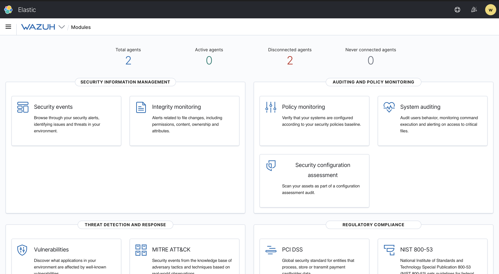
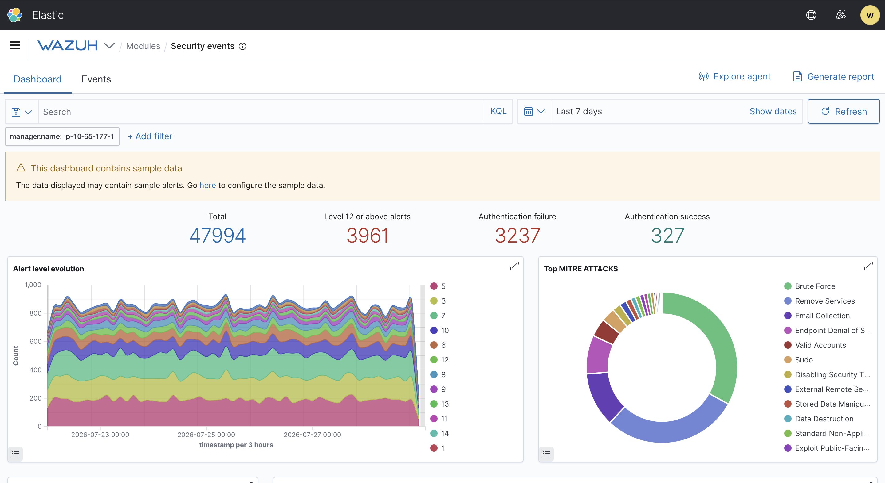

# Wazuh

## Objective
Explore Wazuh, a free and open-source unified security platform that combines endpoint detection and response (EDR), log management, vulnerability assessment, and regulatory compliance reporting. This room covers Wazuh's manager/agent architecture, the security dashboard, log ingestion from both Windows (via Sysmon) and Linux (via application logs and `auditd`), the REST API, and the built-in reporting module.

## Skills Demonstrated
- Connecting to a Wazuh management server (Kibana-based dashboard) and navigating its module layout
- Distinguishing Wazuh's endpoint-centric XDR/EDR architecture from a traditional source-agnostic SIEM
- Interpreting agent status, Security Configuration Assessment (SCA) scan results, and compliance mappings (NIST, MITRE ATT&CK, PCI DSS, GDPR)
- Reading and interpreting Wazuh security alerts, including rule IDs, MITRE technique mapping, and severity levels for both failed and successful authentication events
- Understanding the end-to-end log ingestion pipeline for Windows (Sysmon → Wazuh agent → custom manager rule) and Linux (application logs / `auditd` → Wazuh agent → existing ruleset)
- Using Wazuh's REST API via `curl` (token-based authentication) and the built-in browser-based API console
- Generating and locating PDF security event reports through the Reporting module
- Troubleshooting an empty/misleading dashboard by identifying and enabling Wazuh's bundled sample data set
- Adjusting Kibana time-range filters (quick select, absolute custom ranges) and managing/disabling search filters

## Tools Used
- Wazuh (manager + Kibana-based dashboard)
- TryHackMe OpenVPN connectivity
- `curl` (Wazuh REST API interaction)
- Sysmon (Windows event instrumentation)
- `auditd` (Linux kernel-level auditing)
- Wazuh Reporting module (PDF export)

## Screenshot 1 – Wazuh Dashboard Login & Agent Overview
After connecting to the TryHackMe VPN and deploying the attached Wazuh management server, I logged into the Wazuh/Kibana web interface at the provided reverse-proxy URL using the supplied credentials. The Modules overview dashboard confirmed a successful connection, showing 2 total agents, both in a disconnected state (active: 0, disconnected: 2) — matching the room's note that agent disconnection is expected in this environment. The dashboard also displayed the full range of available Wazuh modules: Security Information Management (Security events, Integrity monitoring), Auditing and Policy Monitoring (Policy monitoring, System auditing, Security configuration assessment), Threat Detection and Response (Vulnerabilities, MITRE ATT&CK), and Regulatory Compliance (PCI DSS, NIST 800-53, and others).

## Screenshot 2 – Populated Security Events Dashboard (Sample Data)
Initial attempts to view Security Events data for agent-001 returned no results, even across wide, multi-year date ranges — including with filters removed entirely. This was resolved by navigating to Wazuh → Settings → Sample Data and enabling the bundled sample datasets, which are disabled by default to preserve server performance. Once enabled and the dashboard time range was set to at least the last 7 days, the Security Events dashboard populated fully: 47,994 total events, 3,961 Level 12+ (high severity) alerts, 3,237 authentication failures, and 327 authentication successes, along with an alert level evolution chart and a MITRE ATT&CK technique breakdown (Brute Force, Remove Services, and Email Collection among the most frequent).

## Findings
- The Wazuh management server managed **2 agents**, both reporting a **disconnected** status — expected behavior for this room's environment.
- Agent-001 (Ubuntu 20.04.1 LTS, Wazuh v4.2.5) returned an SCA (CIS Benchmark for Debian/Linux 10) score of **38%** (72 passed / 113 failed / 192 total checks), illustrating how out-of-the-box compliance baselines are often quite strict.
- The dashboard's Security Events module initially returned no data regardless of date range, ultimately traced to Wazuh's sample data being disabled by default rather than a date/time filtering issue — a useful reminder to verify data existence before troubleshooting query syntax.
- Once sample data was enabled, the environment surfaced a substantial volume of realistic alert data (47,994 total events over 7 days), with Brute Force and Remove Services as the top MITRE ATT&CK techniques represented.
- Wazuh differentiates severity between failed and successful authentication events by default (failed SSH logins to non-existent users are tagged under MITRE T1110 – Brute Force), though this severity weighting is fully configurable per environment.
- Log ingestion architecture differs by OS: Windows requires Sysmon to be installed and configured with its own XML ruleset, the Wazuh agent must be pointed at the Sysmon event channel, and a custom rule must be added on the manager to interpret the forwarded events. Linux ingestion is comparatively simpler, since Wazuh ships with ~900 pre-built rulesets (e.g., Apache2, Docker, FTP, WordPress) that only require the agent to be pointed at the correct log file.
- `auditd` was covered as a kernel-level Linux auditing mechanism, capable of flagging root-executed commands (`execve` syscalls with `euid=0`) — a detection method that is harder to evade than reading application-level logs alone.
- The Wazuh REST API (port 55000) requires token-based authentication and supports standard HTTP verbs (GET/POST/PUT/DELETE); Wazuh also provides a built-in browser-based API console (Wazuh → Tools) as a lower-friction alternative to using `curl` directly.

## Lessons Learned
- When a dashboard shows no data, the root cause isn't always the query or date range — it's worth confirming the underlying data source actually contains records before spending time adjusting filters. In this case, enabling Wazuh's disabled-by-default sample dataset resolved what initially looked like a persistent filtering issue.
- Learned to distinguish Wazuh's endpoint-centric XDR/EDR model, which actively runs agents performing local monitoring and response, from a traditional SIEM's role as a broader, source-agnostic log correlation platform.
- Reinforced that meaningful endpoint visibility typically requires configuration at three layers: the log source itself (e.g., Sysmon, auditd, or an application's native logging), the collection agent (Wazuh agent forwarding the correct file or event channel), and the central manager (a rule that knows how to interpret and score the incoming data) — a useful mental model for diagnosing "why isn't this showing up" issues in any SIEM/EDR platform.
- Practiced adjusting Kibana/OpenSearch Dashboards time-range pickers (quick select presets vs. absolute custom ranges) and managing search filters (editing vs. disabling vs. deleting), which carried over directly from earlier Splunk work in this portfolio.

## References
- [TryHackMe – Wazuh Room](https://tryhackme.com/room/wazuh)
- [Wazuh Official Documentation](https://documentation.wazuh.com/)
- [MITRE ATT&CK Framework](https://attack.mitre.org/)
