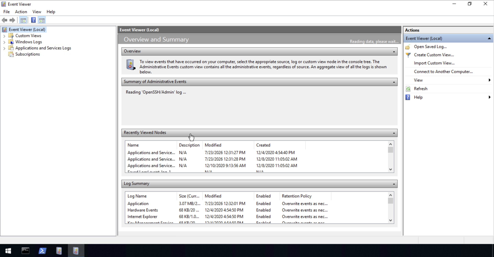
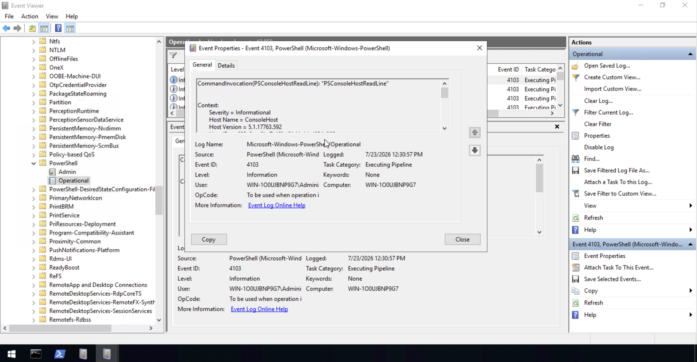
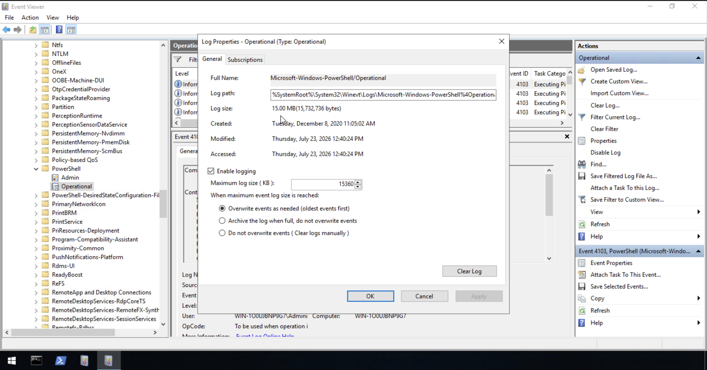

# Windows Event Logs

## Objective

This room covers Windows Event Logs — how they're structured, categorized, and stored, along with the tools used to query and investigate them, including Event Viewer, wevtutil.exe, and the Get-WinEvent PowerShell cmdlet. Windows Event Logs are foundational for endpoint investigation, recording authentication events, application activity, system changes, and more in a standardized format.

## Skills Demonstrated

- Understanding the categories of Windows Event Logs (System, Security, Application, Directory Service, File Replication Service, DNS, Custom)
- Navigating Event Viewer's console tree and Overview and Summary landing page
- Interpreting individual event properties (Event ID, Level, Source, Task Category, User, Computer)
- Understanding log rotation settings and their operational tradeoffs
- Recognizing log clearing as a potential indicator of anti-forensic activity

## Tools Used

- Windows Event Viewer
- TryHackMe – Windows Event Logs

## Screenshot 1 – Event Viewer Overview and Summary

I launched Event Viewer and reviewed its default landing page, the Overview and Summary pane, which provides a high-level snapshot of recently viewed log nodes and a summary of all logs on the system, including their current size, modification time, and retention policy.

## Screenshot 2 – Reviewing Event 4103 Details

I navigated to Applications and Services Logs → Microsoft → Windows → PowerShell → Operational, and reviewed the details of Event ID 4103 (Executing Pipeline). The event details include the raw command invocation message, along with structured metadata such as Log Name, Source, Level, User, Computer, and Task Category.

## Screenshot 3 – Reviewing Log Properties and Rotation Settings

I reviewed the Log Properties for the PowerShell/Operational log, confirming its full path (`%SystemRoot%\System32\Winevt\Logs\...`), maximum log size (15 MB / 15,360 KB), and rotation behavior, which is set to overwrite the oldest events first once the maximum size is reached. This window also contains the Clear Log function, which — while sometimes used legitimately for maintenance — can also indicate anti-forensic activity when used by an adversary attempting to cover their tracks.

## Findings

- Windows Event Logs are broken into distinct categories (System, Security, Application, Directory Service, File Replication Service, DNS, Custom), each serving a different investigative purpose depending on the type of activity being reviewed.
- Event Viewer's Overview and Summary page gives a fast first look at overall log health across a system — log sizes, retention policies, and recently accessed logs — before drilling into any specific event source.
- Event Viewer's three-pane layout (log tree, event list/details, actions) allows an analyst to drill from a broad category down to a single event's full structured metadata and raw message content.
- Log rotation policy (max size and overwrite behavior) is a real operational tradeoff between storage capacity and retention — logs set to "overwrite oldest first" can lose evidence of older activity if not exported/forwarded to a SIEM before rotation occurs.
- The presence of a "Clear Log" function is a reminder that log integrity itself is an attack surface — an adversary attempting to cover their tracks may clear logs, making log forwarding/centralization (e.g., to Splunk or another SIEM) an important defensive control.

## Lessons Learned

- Event IDs are not globally unique in meaning — the same Event ID number can represent a completely different type of event depending on which log source generated it, so context (source + Event ID) matters, not the ID alone.
- Reviewing a log's rotation settings is just as important as reviewing its contents, since it determines how much historical data will actually be available during an investigation.
- Checking the overall Log Summary before diving into individual events helps prioritize which logs are worth investigating first, based on size, retention policy, and how recently they were modified.

## References

1. TryHackMe. *Windows Event Logs*. https://tryhackme.com
2. Microsoft. *Windows Event Log Types*. https://docs.microsoft.com/en-us/windows/win32/wes/eventmanifestschema-leveltype-complextype
