# Splunk Basics

## Objective
Learn the fundamentals of Splunk Search & Reporting by performing searches, filtering events, and analyzing Windows logs.

## Tools Used
- Splunk Enterprise
- TryHackMe Splunk: Exploring SPL

## Skills Demonstrated
- Searching indexes
- Filtering events
- Using the Time Picker
- Working with fields
- Search operators
- SPL commands
- Basic log analysis

## Investigation Steps

### 1. Initial Search
Query:
`index=windowslogs`

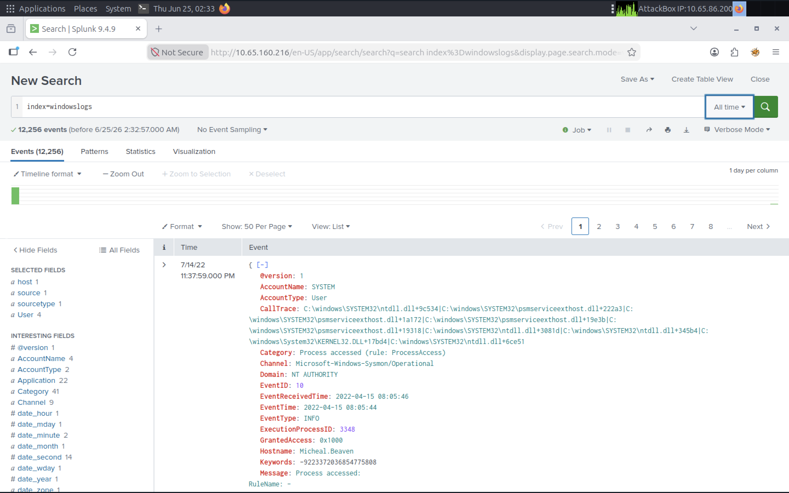

### 2. SourceIP Analysis
I reviewed the SourceAddress field to identify the IP addresses generating the most events in the Windows logs.

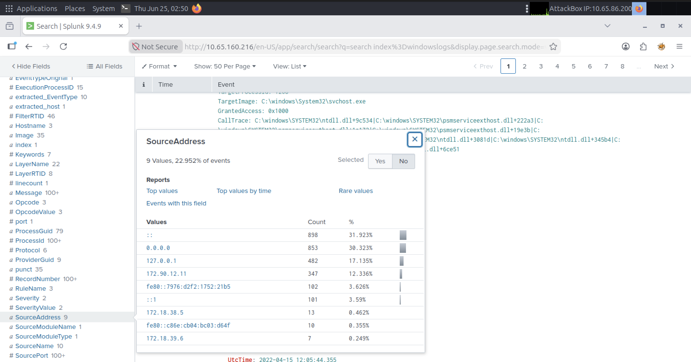

### 3. Time Filtering
I used Splunk's Date Time Range filter to narrow the search to events occurring between 08:05 AM and 08:06 AM on April 15, 2022. Time filtering helps analysts focus on activity during a specific incident window.

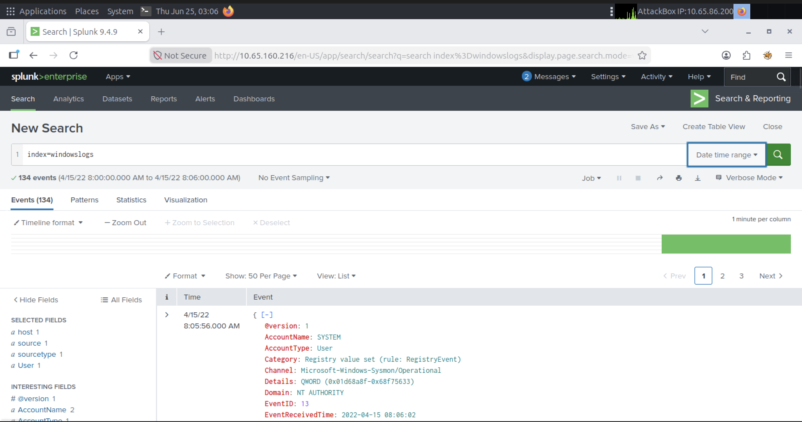

### 4. Search Operators

### 4.1 Relational Operator (!=)
I used the `!=` search operator to exclude events where the `AccountName` was `SYSTEM`. This allowed me to focus on user-generated activity instead of system-generated events, making it easier to analyze relevant logs.

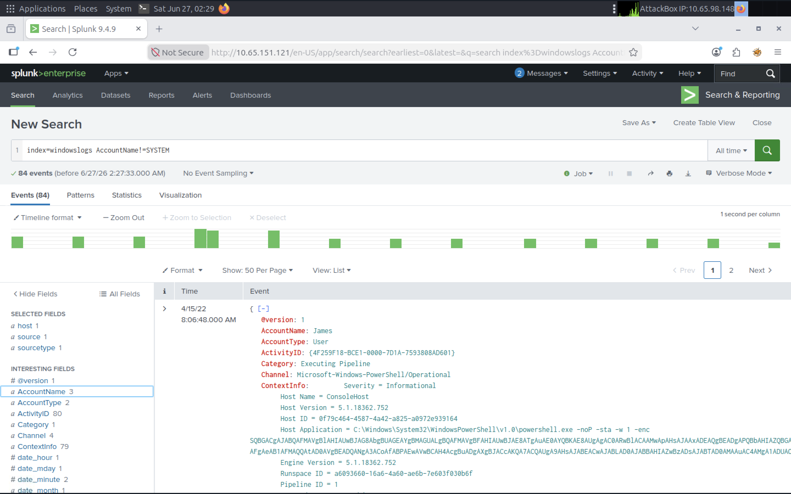

### 4.2 Search Operators (Logical Operator - AND)

Query:
`index=windowslogs AccountName!=SYSTEM AND AccountName=James`

I used the `AND` logical operator to combine multiple search conditions in a single query. This search excluded events generated by the `SYSTEM` account and returned only events where the `AccountName` was `James`, allowing me to narrow the results and focus on activity from a specific user.

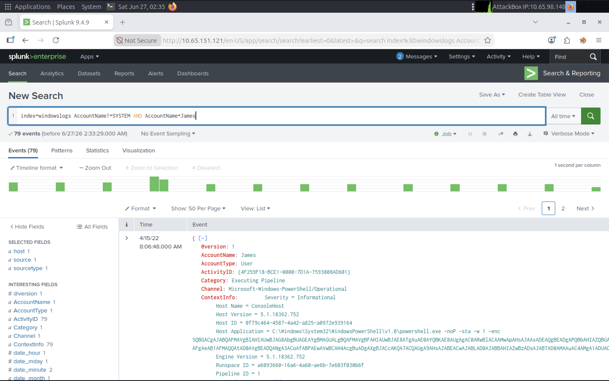

#### 4.3 Wildcard Search (*)

Query:
`index=windowslogs DestinationIp=172.*`

I used the wildcard operator (`*`) to search for all events where the destination IP address begins with `172.`. Wildcards allow analysts to match partial values, making it easier to identify activity across an IP range instead of searching for a single address.

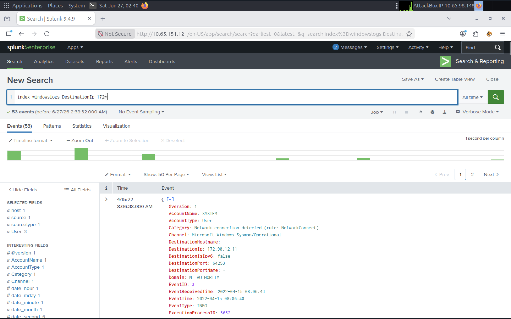


### 5. Structuring Results

#### 5.1 Fields Command

I used the `fields` command to display only the most important information from the Windows logs. By limiting the output to the `Hostname`, `User`, `SourceIp`, `Image`, and `EventID` fields, I removed unnecessary data and made the results easier to read during the investigation. This allowed me to focus on the most relevant information without being distracted by hundreds of other fields in each event.

Query:
```spl
index=windowslogs
| fields Hostname User SourceIp Image EventID
```

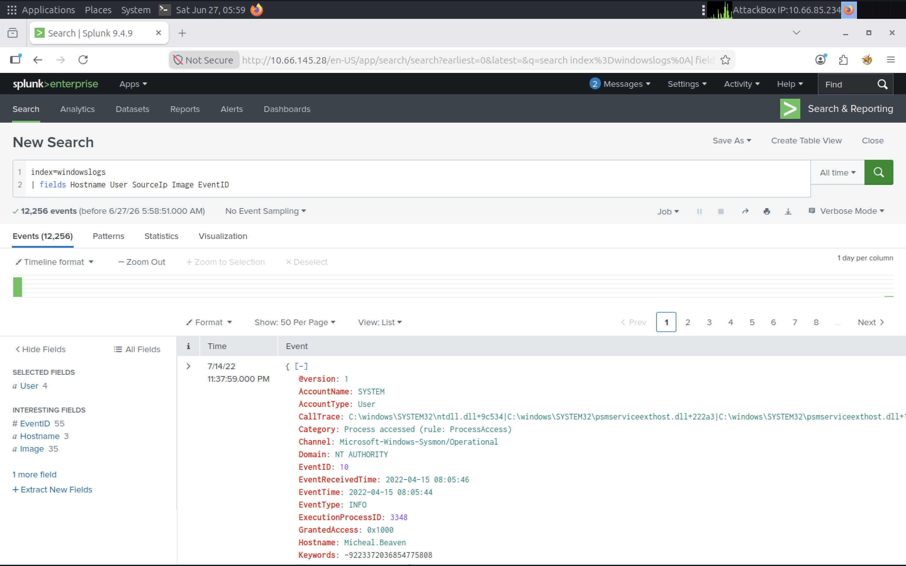

#### 5.2 Dedup Command

I used the `dedup` command to remove duplicate `SourceIp` values from the search results. This returned only one event for each unique source IP address, reducing the results to seven unique events. Using `dedup` helps eliminate repetitive log entries and allows analysts to quickly identify distinct systems communicating on the network.

Query:
```spl
index=windowslogs
| fields Hostname User SourceIp Image EventID
| dedup SourceIp
```

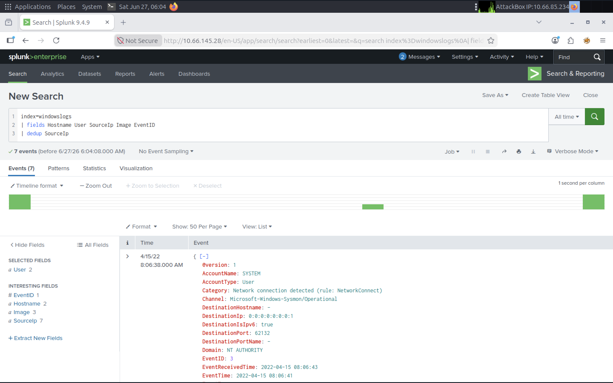

#### 5.3 Rename Command

I used the `rename` command to change the `User` field to `Employee`, making the search results easier to understand. Renaming fields improves readability and creates clearer reports without modifying the original log data. This is especially useful when presenting findings to other analysts or non-technical stakeholders.

Query:
```spl
index=windowslogs
| fields Hostname User SourceIp Image EventID
| rename User as Employee
```

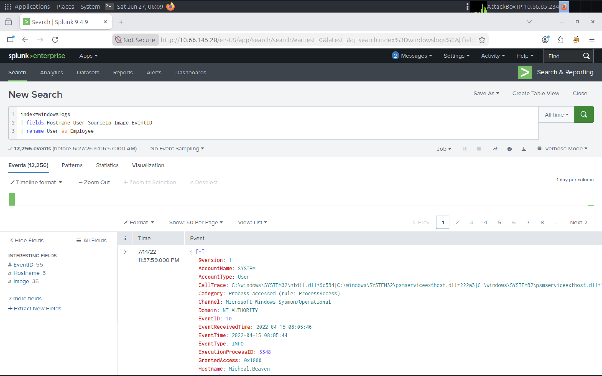

#### 5.4 Regex Command

I used the `regex` command to filter events using a regular expression. This query returned only events where the `Image` field ended with `.exe`, allowing me to focus on executable files. Regular expressions are powerful for identifying patterns in log data and are commonly used during threat hunting, malware analysis, and forensic investigations.

Query:
```spl
index=windowslogs
| regex Image="\.exe$"
```

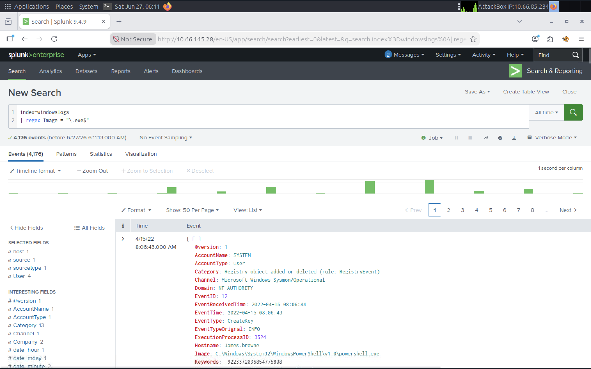

### 6. Transforming Commands

#### 6.1 Table Command

Query:

```spl
index=windowslogs
| table _time EventID Hostname SourceName
```

I used the `table` command to display only the most relevant fields in a structured format. This makes the search results much easier to read by removing unnecessary information and presenting the data in a clean table.

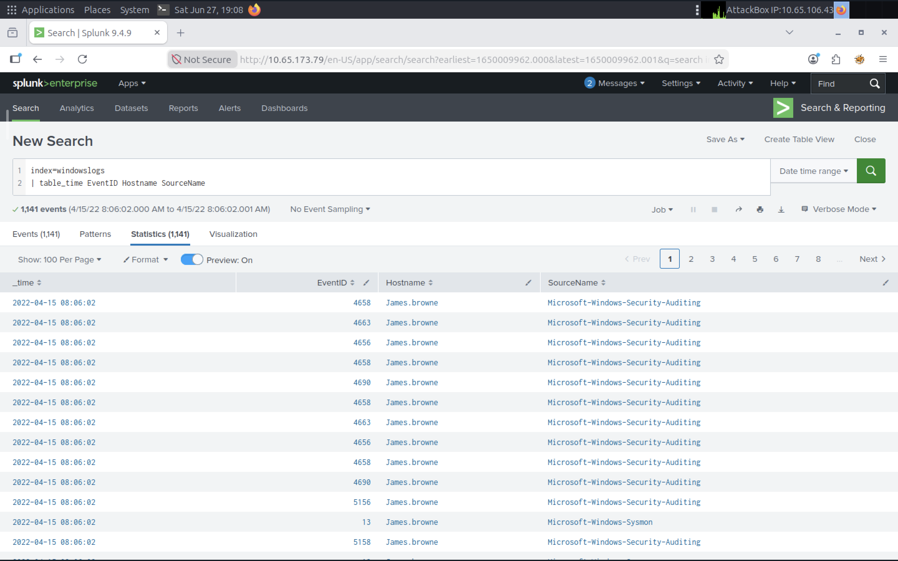

#### 6.2 Timeline with Reverse

Query:

```spl
index=windowslogs Hostname=James.browne
| table _time Hostname EventID Category
| reverse
```

I used the `table` and `reverse` commands to organize events into a chronological timeline for a specific host. Displaying only the timestamp, hostname, event ID, and category made it easier to follow the sequence of activity and understand how events occurred during the investigation.

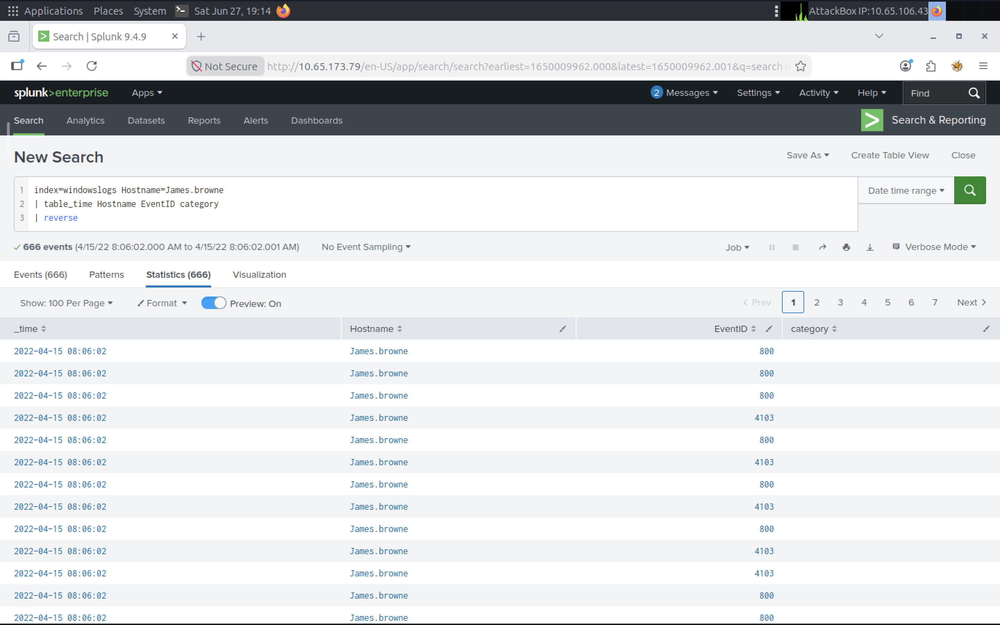

7. Transforming Commands

## 7.1 Top Command

The `top` command was used to identify the most frequently occurring process images in the Windows event logs. This allows analysts to quickly establish a baseline of normal activity and identify processes that appear unusually often during an investigation.

### SPL Query
```spl
index=windowslogs
| top Image limit=5
```

### Result
The search returned the five most common process images. The most frequent process was **C:\Windows\System32\svchost.exe**, a legitimate Windows system process that commonly hosts Windows services.

### Screenshot

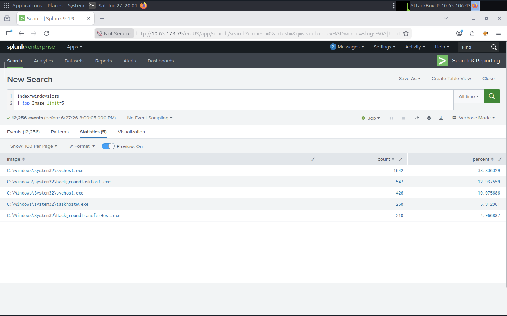

## 7.2 Highlight Command

The `highlight` command was used to visually emphasize important fields and keywords within raw Windows event logs. Highlighting values such as usernames, event IDs, process images, and event descriptions makes it easier to quickly identify relevant information during an investigation without manually scanning every log entry.

### SPL Query

```spl
index=windowslogs
| highlight User EventID Image "Process accessed"
```

### Result

The search highlighted key fields directly in the raw event data, allowing important information such as the user account, process image, Event ID, and the **"Process accessed"** event description to stand out immediately.

### Screenshot

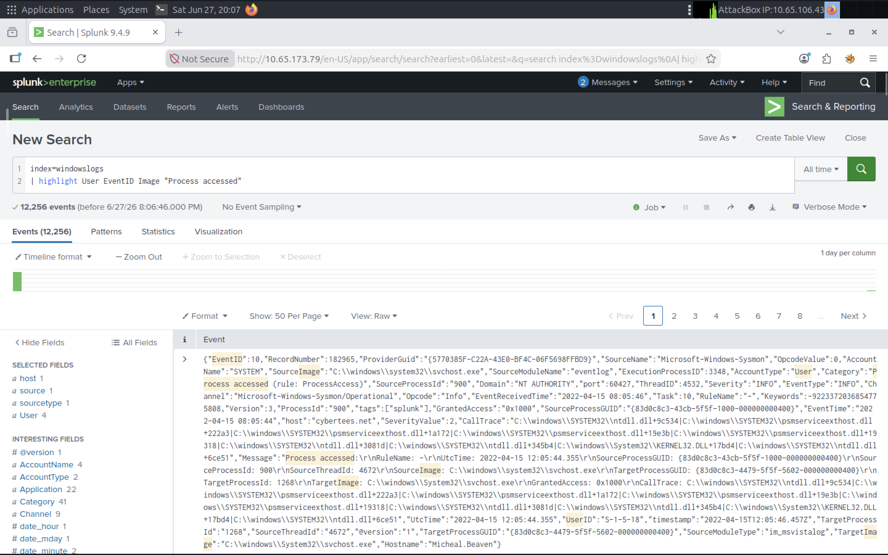

## 7.3 Stats Command

The `stats` command was used to summarize Windows event logs by counting the number of occurrences for each Event ID. Rather than reviewing thousands of individual log entries, this command aggregates the data into a concise table that helps identify the most common event types and overall system activity.

### SPL Query

```spl
index=windowslogs
| stats count by EventID
| sort EventID
```

### Result

The search grouped all events by their Event ID and displayed the total occurrence count for each value. This provides a high-level overview of event distribution and helps analysts quickly identify frequently occurring Windows events.

### Screenshot

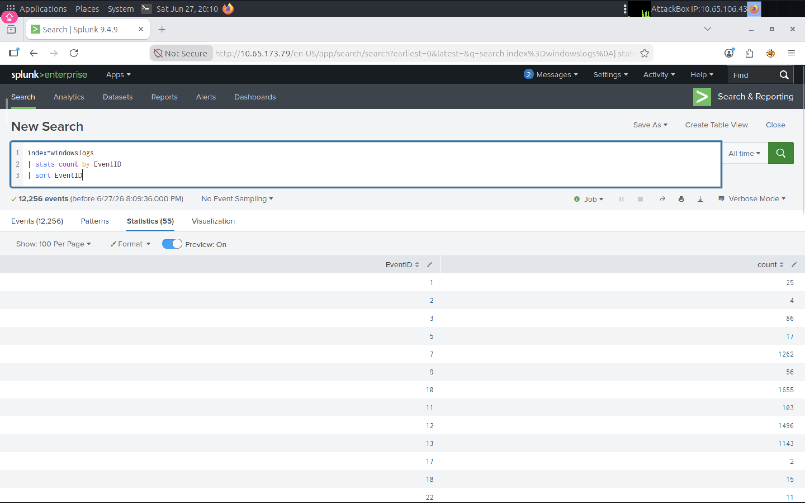

## 7.3 Chart Command

The `chart` command was used to visualize the number of events generated by each user account. Charts make it easier to identify activity patterns and compare event counts without manually reviewing large numbers of log entries.

### SPL Query

```spl
index=windowslogs
| chart count by User
```

### Result

The chart displayed the event count for each user account. The **NT AUTHORITY\SYSTEM** account generated the highest number of events, followed by other system and user accounts.

### Screenshot

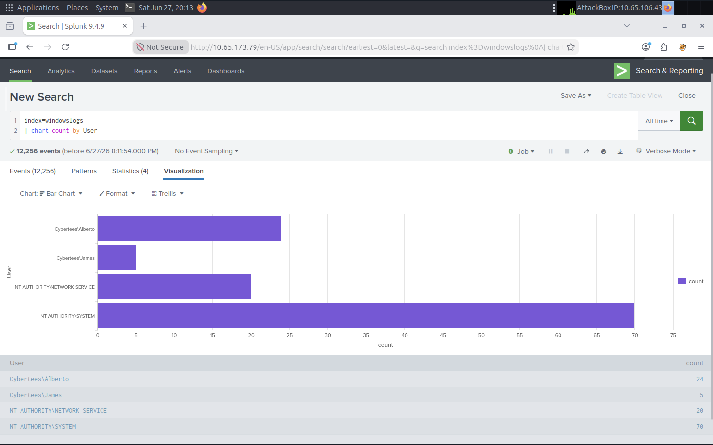

## 7.5 Timechart Command

The `timechart` command was used to visualize process activity over time. By grouping events into 30-minute intervals, it becomes easier to identify trends, spikes, and unusual behavior during an investigation.

### SPL Query

```spl
index=windowslogs Image!=""
| timechart span=30m count by Image limit=5
```

### Result

The visualization displayed the five most common process images over 30-minute intervals. This makes it easier to detect changes in process activity and identify abnormal spikes.

### Screenshot

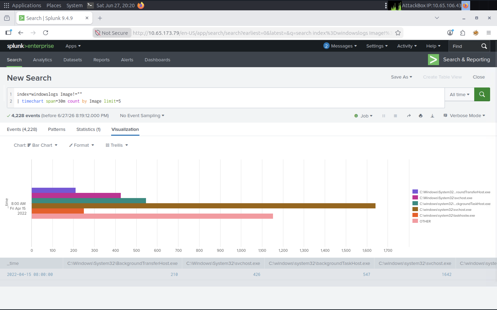

### Findings

- Displayed process activity over time.
- Grouped events into 30-minute intervals.
- Highlighted the five most common process images.
- Useful for identifying trends and unusual spikes in activity.


### Findings

- Converted raw log data into a visual chart.
- Quickly identified which accounts generated the most events.
- Demonstrated how visualizations improve log analysis and reporting.


### Findings
- Successfully searched Windows logs.
- Filtered events using SPL.
- Identified high-volume SourceIP values.
- Applied time-based filtering.
- Used SPL commands to organize and analyze results.

## Skills Practiced
- Splunk Search & Reporting
- SPL
- Log Analysis
- Windows Event Logs
- SOC Investigation
