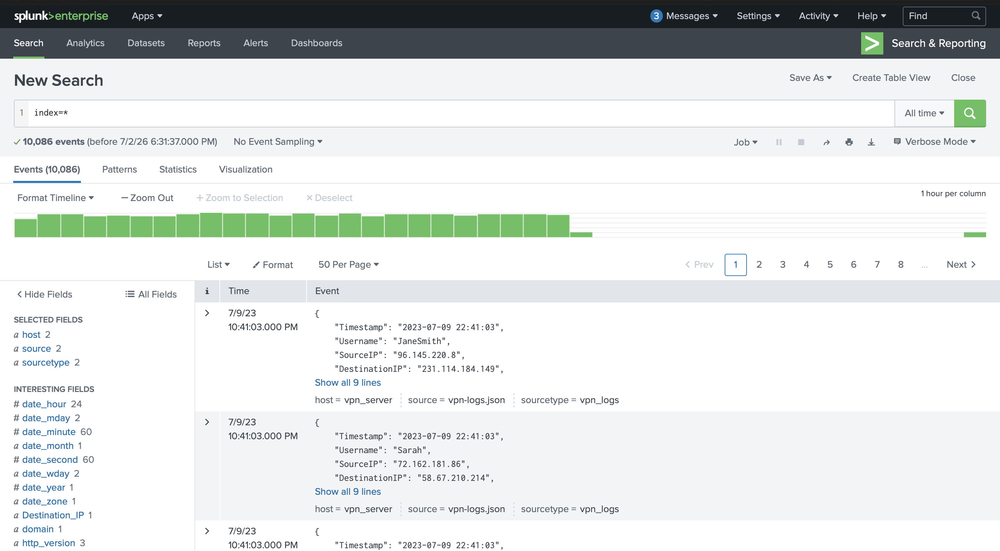
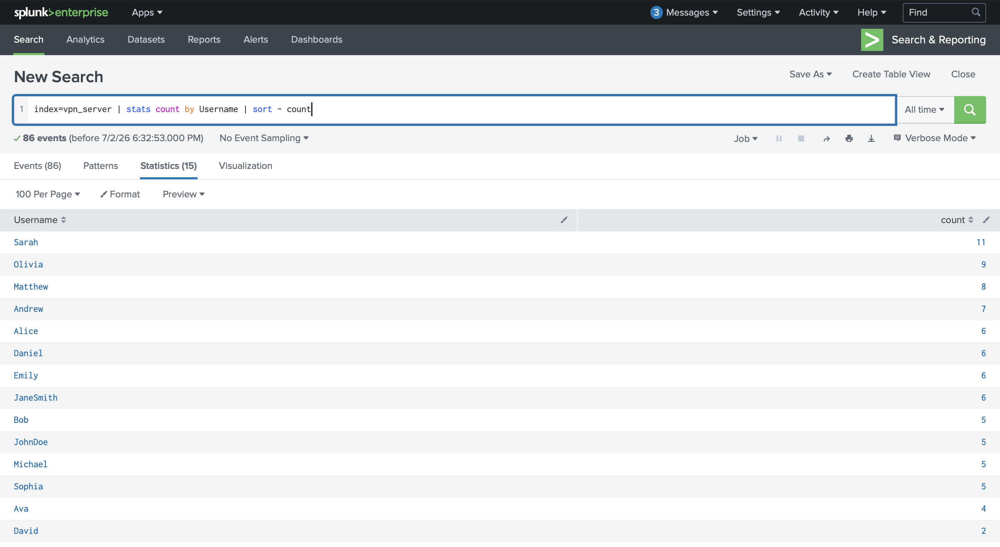
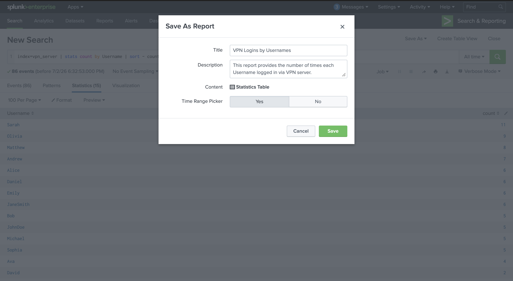
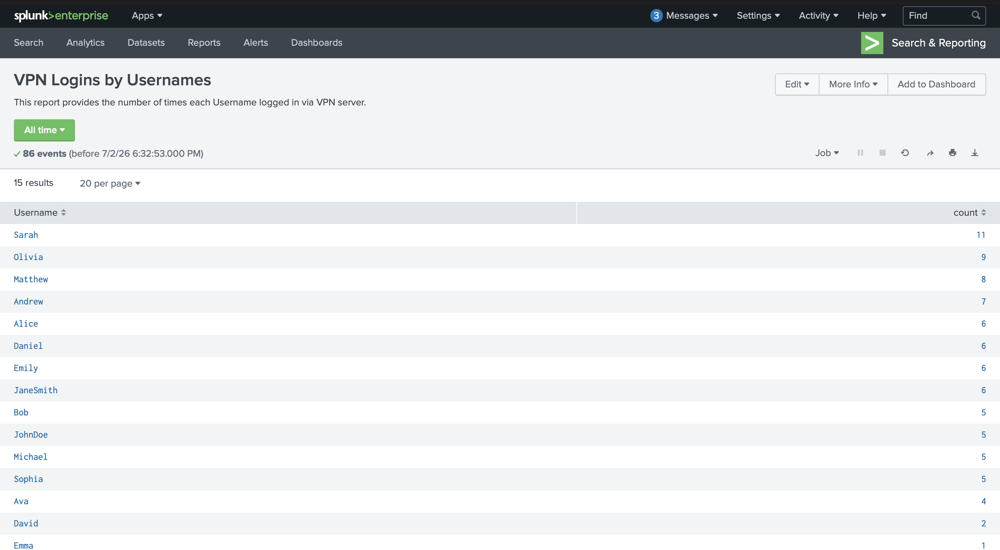
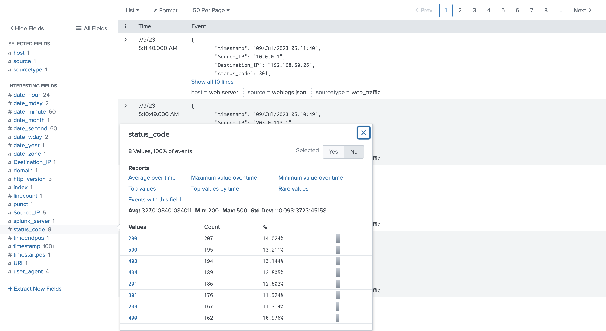
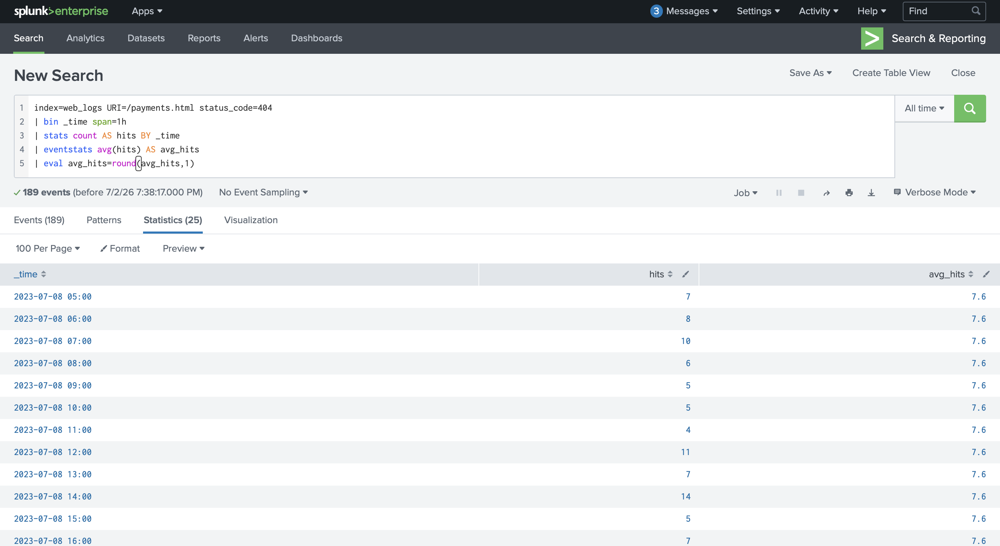
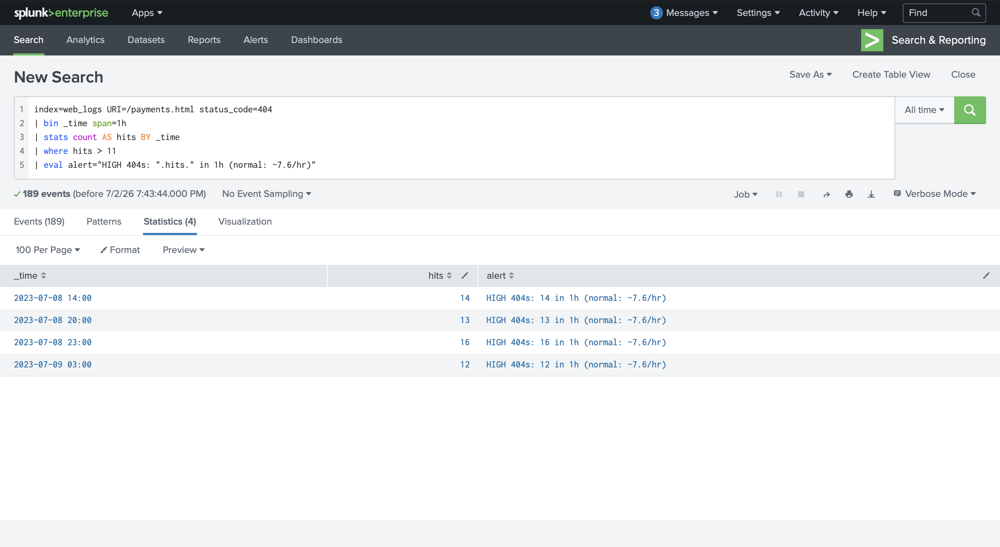

# Splunk Dashboards and Reports

## Objective

This lab demonstrates how Splunk reports can be used to summarize large datasets, identify authentication trends, establish security baselines, and detect abnormal activity using threshold-based searches.

---

## Skills Demonstrated

- Creating Splunk reports
- Using the `stats` command
- Sorting search results
- Saving reports
- Establishing baselines
- Threshold-based detection
- Investigating web logs
- Monitoring HTTP status codes
- Writing SOC detection queries

---

## Tools Used

- Splunk Enterprise
- TryHackMe – Splunk Dashboards & Reports

---

## Screenshot 1 – Initial Data Overview

To begin the lab, I searched all indexed data using `index=*`, set the time range to **All time**, and reviewed the available events before beginning report creation.



---

## Screenshot 2 – VPN Username Report Query

I created a report that counts VPN logins by username using the `stats` command. The results are sorted from the highest number of logins to the lowest, allowing analysts to quickly identify the most active VPN users.

```spl
index=vpn_server
| stats count by Username
| sort - count
```



---

## Screenshot 3 – Creating the Report

The VPN username query was saved as a report named **VPN Logins by Usernames**. This allows analysts to quickly reuse the search without recreating it.



---

## Screenshot 4 – Completed VPN Report

The completed report displays VPN login counts for every username. Reports provide an efficient way for SOC analysts to review authentication activity and identify unusual login patterns.



---

# Alerting and Detection

## Screenshot 5 – Suspicious Restricted Page Search

To identify potential unauthorized access, I searched for requests to `/restricted.html` while excluding private IP address ranges. Any remaining results represent external systems attempting to access an internal resource.

```spl
index=web_logs URI=/restricted.html NOT Source_IP IN (10.0.0.0/8,172.16.0.0/12,192.168.0.0/16)
```


---

## Screenshot 6 – Reviewing HTTP Status Codes

Next, I reviewed the HTTP status codes returned by `/payments.html`. Understanding the normal distribution of response codes helps establish a baseline before creating detection rules.

```spl
index=web_logs URI=/payments.html
```



---

## Screenshot 7 – Establishing a Baseline

I calculated the average number of HTTP 404 responses per hour. This baseline helps determine what is considered normal activity before defining an alert threshold.

```spl
index=web_logs URI=/payments.html status_code=404
| bin _time span=1h
| stats count AS hits BY _time
| eventstats avg(hits) AS avg_hits
| eval avg_hits=round(avg_hits,1)
```



---

## Screenshot 8 – Threshold Detection

Finally, I created a threshold-based detection rule that identifies hours where HTTP 404 responses exceed the normal baseline. Any hour with more than 11 responses is flagged for investigation.

```spl
index=web_logs URI=/payments.html status_code=404
| bin _time span=1h
| stats count AS hits BY _time
| where hits > 11
| eval alert="HIGH 404s: ".hits." in 1h (normal: ~7.6/hr)"
```



---

## Summary

This lab demonstrated how Splunk reports and threshold-based searches can improve security monitoring. By creating reusable reports, establishing activity baselines, and identifying abnormal spikes in HTTP errors, analysts can detect suspicious behavior more efficiently and reduce manual investigation time.
