# Splunk: Data Manipulation

## Objective

This lab focuses on how Splunk ingests, parses, and normalizes machine data. It covers building a custom Splunk application, configuring multiple scripted data inputs, correcting event boundary issues — both events that are incorrectly merged together and events that are incorrectly split apart — and masking sensitive data using Splunk's configuration files. These skills are foundational for correctly structuring raw data so it can be searched, correlated, and used to build accurate detections while maintaining data protection standards.

## Skills Demonstrated

- Understanding Splunk's data ingestion and parsing pipeline
- Navigating Splunk's default application structure
- Creating a custom Splunk application
- Writing and testing custom scripted data inputs
- Configuring `inputs.conf` for multiple data sources
- Diagnosing incorrect event boundary parsing (both over-merging and over-splitting)
- Building and validating regular expressions with regex101
- Configuring `props.conf` to control event breaking (`SHOULD_LINEMERGE`, `MUST_BREAK_AFTER`, `BREAK_ONLY_BEFORE`)
- Masking sensitive data using `SEDCMD` and `sed`-style regex substitution
- Applying data protection practices aligned with standards like PCI DSS and HIPAA
- Restarting Splunk services to apply configuration changes
- Verifying log ingestion and parsing accuracy through SPL search

## Tools Used

- Splunk Enterprise
- Python 3 (custom scripted inputs)
- regex101.com (regex testing)
- Splunk configuration files: `inputs.conf`, `props.conf`, `transforms.conf`, `fields.conf`
- TryHackMe – Splunk: Data Manipulation

## Task 1-4 – Introduction, Scenario Briefing, How Splunk Processes Data, Exploring Configuration Files

These tasks covered the conceptual foundation for the lab: how Splunk ingests raw machine data, breaks it into events, and uses configuration files (`inputs.conf`, `props.conf`, `transforms.conf`, `fields.conf`) to control parsing and indexing behavior. Splunk applies these configuration files in a defined precedence order, with settings in an app's `local` directory taking priority over `default`. No hands-on lab actions were required for these sections.

# Creating a Splunk App

## Screenshot 1 – Reviewing Default Applications

Before creating a custom app, I navigated to **Settings → Apps → Manage Apps** to review Splunk's default installed applications. The instance listed 26 total apps, confirming 25 default apps were present prior to creating a custom one.


## Screenshot 2 – Creating the App

I created a new custom Splunk application named **DataApp** using the **Create App** form, which generates the app's standard directory structure automatically.


## Screenshot 3 – Reviewing the App Directory Structure

Using the command line, I navigated to the new app's directory and listed its contents, confirming the standard Splunk app structure: `bin`, `default`, `local`, and `metadata`.

```bash
cd /opt/splunk/etc/apps/DataApp
ls
```


## Screenshot 4 – Building and Testing a Custom Script

Inside the `bin` directory, I created a simple Python script, `samplelogs.py`, to generate sample log output. I then executed the script directly to confirm it produced valid output before configuring Splunk to ingest it.

```bash
echo 'print("This is a sample log...")' > samplelogs.py
python3 samplelogs.py
```


## Screenshot 5 – Configuring the Scripted Input

I created an `inputs.conf` file in the app's `local` directory to tell Splunk to run the script on a five-second interval and route its output to the `main` index using a custom sourcetype and host value.

```ini
[script:///opt/splunk/etc/apps/DataApp/bin/samplelogs.py]
INDEX = main
SOURCETYPE = testing
HOST = test
INTERVAL = 5
```


## Screenshot 6 – Restarting Splunk

After saving the configuration, I restarted Splunk for the new scripted input to take effect.

```bash
/opt/splunk/bin/splunk restart
```


## Screenshot 7 – Verifying Log Ingestion

Finally, I switched to the DataApp context in Splunk Web and searched `index=main` with the time range set to **All time**, confirming that the scripted input was successfully generating and ingesting log events on schedule.

```spl
index=main
```


# Configuring Event Boundaries

## Screenshot 8 – Testing the VPN Log Script

I copied the `vpnlogs` executable into the app's `bin` directory and ran it directly to understand the log format before ingesting it into Splunk. Each output line contains three key fields: the connecting **User**, the **Server**, and the **Action** (CONNECT or DISCONNECT).

```bash
cp /home/ubuntu/Downloads/scripts/vpnlogs /opt/splunk/etc/apps/DataApp/bin/
cd /opt/splunk/etc/apps/DataApp/bin
./vpnlogs
```


## Screenshot 9 – Configuring the VPN Log Input

I added a second stanza to `inputs.conf` in the app's `local` directory, instructing Splunk to run the `vpnlogs` script every five seconds and ingest its output into the `main` index using a dedicated sourcetype and host.

```ini
[script:///opt/splunk/etc/apps/DataApp/bin/vpnlogs]
INDEX = main
SOURCETYPE = vpn_logs
HOST = vpn_server
INTERVAL = 5
```


## Screenshot 10 – Identifying Broken Event Boundaries

After restarting Splunk and searching `index=main sourcetype=vpn_logs`, I found that Splunk was unable to correctly determine where one event ended and the next began. Each indexed event incorrectly contained ten lines of log data merged together instead of a single VPN connection record.

```spl
index=main sourcetype=vpn_logs
```


## Screenshot 11 – Testing the Event-Breaking Regex

To fix this, I needed a regular expression that reliably marks the end of each event. Since every log line ends in either `CONNECT` or `DISCONNECT`, I tested the pattern `(CONNECT|DISCONNECT)` against sample log data using regex101 to confirm it matched correctly before implementing it in Splunk.


## Screenshot 12 – Creating props.conf

With the regex validated, I created a `props.conf` file in the app's `local` directory to apply the fix. This configuration disables Splunk's automatic line-merging behavior and instructs it to break a new event immediately after encountering `CONNECT` or `DISCONNECT`.

```ini
[vpn_logs]
SHOULD_LINEMERGE = false
MUST_BREAK_AFTER = (CONNECT|DISCONNECT)
```

```bash
/opt/splunk/bin/splunk restart
```


## Screenshot 13 – Verifying Correct Event Boundaries

After restarting Splunk, I re-ran the search `index=main sourcetype=vpn_logs` with the time range set to **All time (real time)**. The event boundaries are now correctly defined, with Splunk indexing 29 individual events — each representing a single VPN connection or disconnection — instead of merged multi-line blocks.

```spl
index=main sourcetype=vpn_logs
```


# Parsing Multi-Line Events

## Screenshot 14 – Testing the Authentication Log Script

I copied the `authentication_logs` executable into the app's `bin` directory and ran it directly to review its output format. Unlike the VPN logs, each authentication event spans multiple lines, including the authentication type, affected machine, timestamp, department, and a risk assessment of the login attempt.

```bash
cp /home/ubuntu/Downloads/scripts/authentication_logs /opt/splunk/etc/apps/DataApp/bin/
cd /opt/splunk/etc/apps/DataApp/bin
./authentication_logs
```

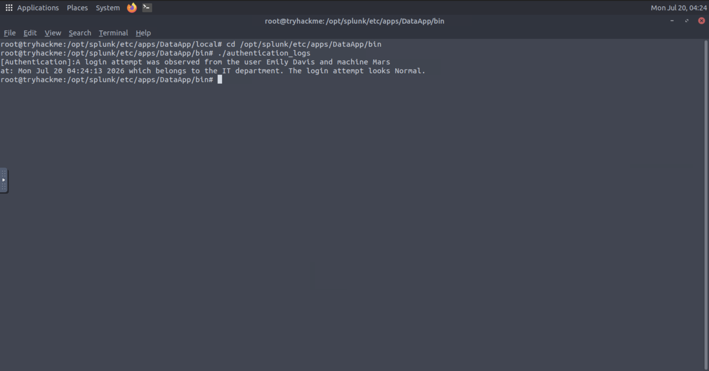

## Screenshot 15 – Configuring the Authentication Log Input

I added a third stanza to `inputs.conf`, instructing Splunk to run the `authentication_logs` script every five seconds and ingest its output into the `main` index under a dedicated sourcetype and host.

```ini
[script:///opt/splunk/etc/apps/DataApp/bin/authentication_logs]
index = main
sourcetype = auth_logs
host = auth_server
interval = 5
```

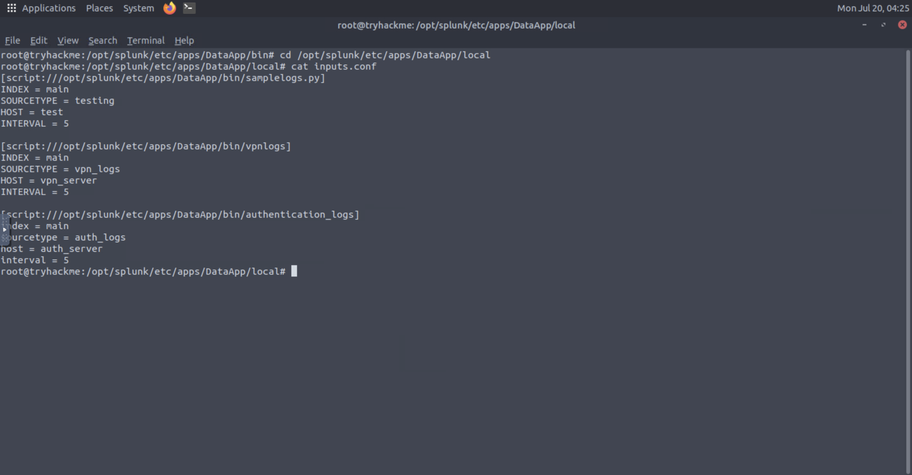

## Screenshot 16 – Fixing Multi-Line Event Boundaries

After restarting Splunk, the initial search of `index=main sourcetype=auth_logs` showed the opposite problem from the VPN logs — Splunk was splitting each multi-line authentication event into two separate events, since it couldn't determine that the log entry continued onto a second line. To fix this, I added a new stanza to `props.conf` that tells Splunk to merge lines together and only break into a new event when it encounters the `[Authentication]` marker.

```ini
[auth_logs]
SHOULD_LINEMERGE = true
BREAK_ONLY_BEFORE = \[Authentication\]
```

```bash
/opt/splunk/bin/splunk restart
```

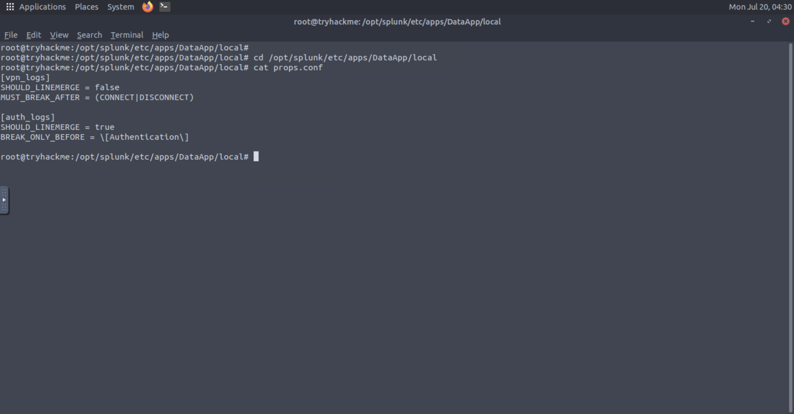

## Screenshot 17 – Verifying Correct Event Boundaries

By the time I captured this screenshot, the `props.conf` fix had already been applied, so the search results reflect the corrected behavior rather than the original split-event issue. Running `index=main sourcetype=auth_logs` with the time range set to **All time (real time)** confirmed 192 correctly parsed events, with each authentication attempt combined into a single event containing both the `[Authentication]:` line and the corresponding `at:` timestamp line.

```spl
index=main sourcetype=auth_logs
```

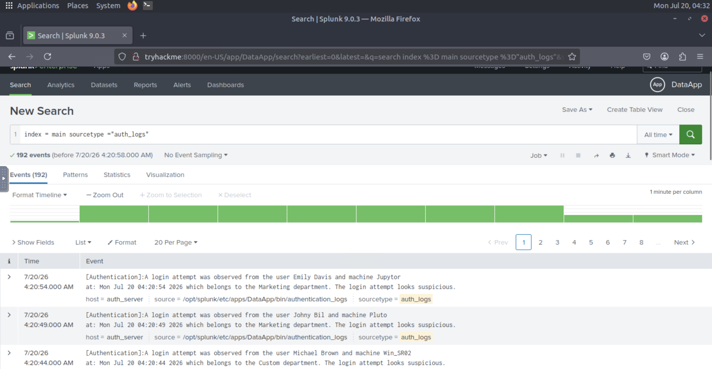

# Masking Sensitive Data

## Screenshot 18 – Testing the Purchase Log Script

I copied the `purchase-details` executable into the app's `bin` directory and ran it directly to review the log format. Each event tracks a user and the full, unmasked credit card number used in a purchase — sensitive data that will need to be protected before indexing.

```bash
cp /home/ubuntu/Downloads/scripts/purchase-details /opt/splunk/etc/apps/DataApp/bin/
/opt/splunk/etc/apps/DataApp/bin/purchase-details
```

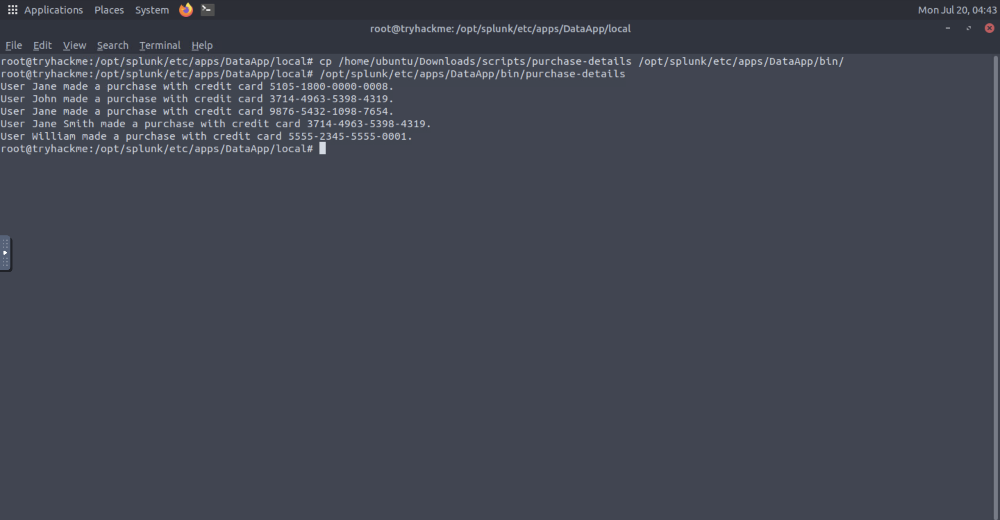

## Screenshot 19 – Configuring the Purchase Log Input

I added a fourth stanza to `inputs.conf`, instructing Splunk to run the `purchase-details` script every five seconds and ingest its output into the `main` index under a dedicated sourcetype and host.

```ini
[script:///opt/splunk/etc/apps/DataApp/bin/purchase-details]
index = main
sourcetype = purchase_logs
host = order_server
interval = 5
```

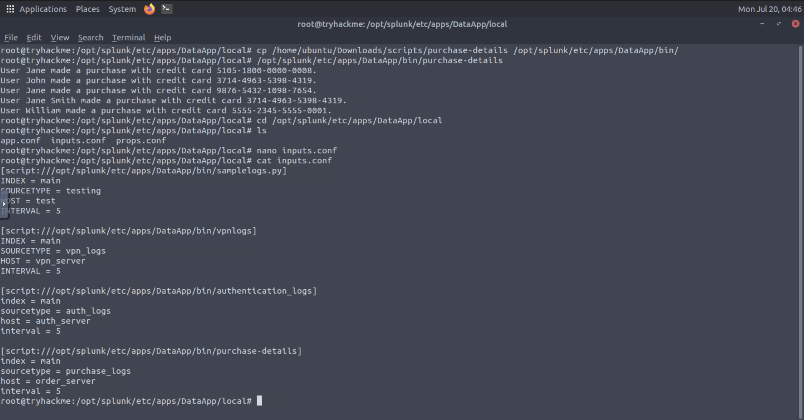

## Screenshot 20 – Testing the Event-Breaking Regex

Since each purchase log ends with the last four digits of the credit card number followed by a period, I tested the pattern `\d{4}\.` against sample log data using regex101 to confirm it reliably matched the end of every event before implementing it in Splunk.

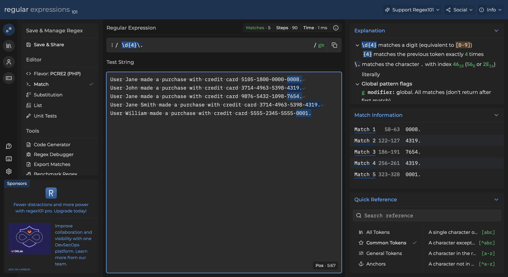

## Screenshot 21 – Configuring Event Boundaries

With the regex validated, I added a `purchase_logs` stanza to `props.conf`, instructing Splunk to merge lines together and break into a new event only after matching four digits followed by a period.

```ini
[purchase_logs]
SHOULD_LINEMERGE = true
MUST_BREAK_AFTER = \d{4}\.
```

```bash
/opt/splunk/bin/splunk restart
```

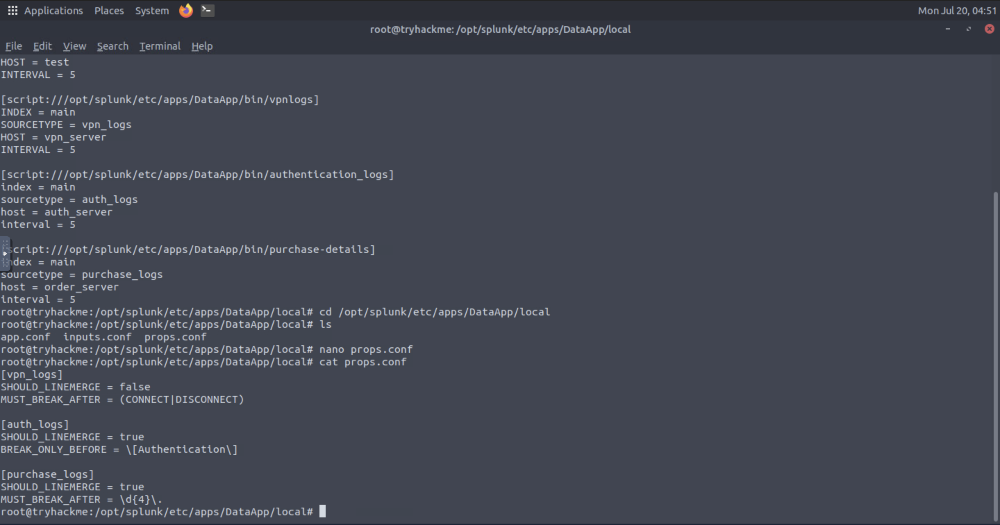

## Screenshot 22 – Verifying Ingestion and Identifying Exposed Data

After restarting Splunk, I searched `index=main sourcetype=purchase_logs` with the time range set to **All time (real time)**. The event boundaries were correctly parsed, confirming 665 individual purchase events. However, this also revealed a data exposure issue: full, unmasked credit card numbers were visible in every event.

```spl
index=main sourcetype=purchase_logs
```

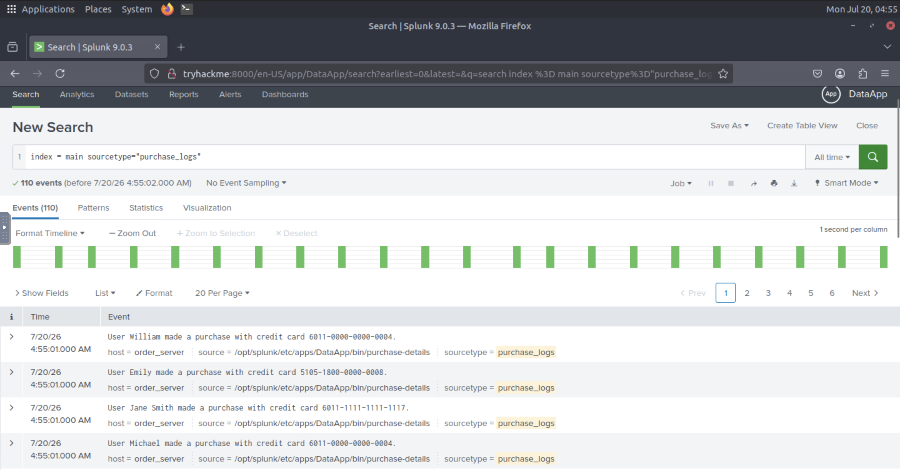

## Screenshot 23 – Masking Sensitive Credit Card Data

To remediate the exposure, I added a `SEDCMD` rule to the `purchase_logs` stanza in `props.conf`. This setting uses `sed`-style regex substitution to replace the last three groups of four digits in each credit card number with `XXXX`, leaving only the first four digits visible.

```ini
[purchase_logs]
SHOULD_LINEMERGE = true
MUST_BREAK_AFTER = \d{4}\.
SEDCMD-cc = s/-\d{4}-\d{4}-\d{4}/-XXXX-XXXX-XXXX/g
```

```bash
/opt/splunk/bin/splunk restart
```

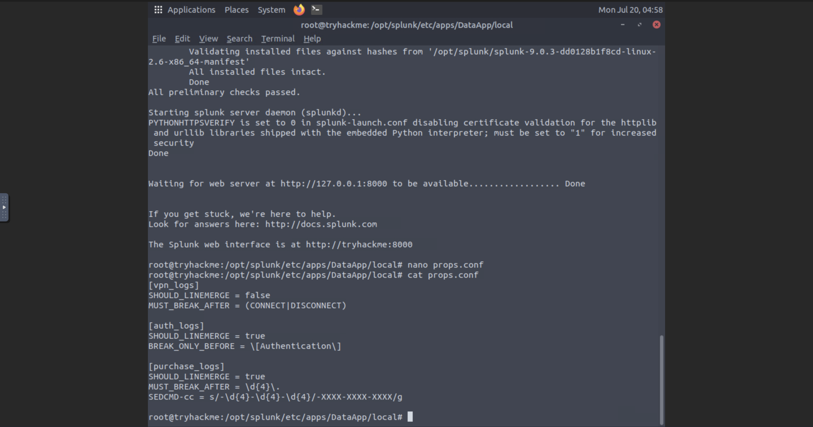

## Screenshot 24 – Verifying Masked Data

After restarting Splunk, I re-ran the search `index=main sourcetype=purchase_logs`. Credit card numbers are now correctly masked in every event (e.g., `3530-XXXX-XXXX-XXXX`), satisfying data protection requirements similar to PCI DSS while preserving the log's utility for investigation.

```spl
index=main sourcetype=purchase_logs
```

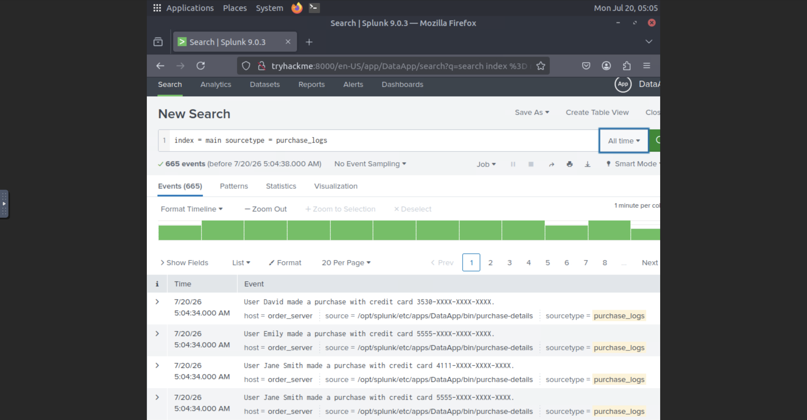

## Findings

- Splunk does not automatically know how to break raw script output into individual events — without explicit configuration, it defaults to merging multiple lines into a single event, which can go too far (merging unrelated events) or not far enough (splitting a single multi-line event apart).
- Configuration file precedence matters: settings in an app's `local` directory override `default`, and a scripted input's success depends on `inputs.conf` correctly referencing the executable's path.
- Validating a regex pattern externally (regex101) before deploying it in `props.conf` is a fast way to avoid misconfigured event breaking in production.
- `props.conf` offers different tools depending on the direction of the problem: `MUST_BREAK_AFTER` for splitting over-merged single-line logs, and `SHOULD_LINEMERGE` combined with `BREAK_ONLY_BEFORE` for correctly joining multi-line logs that Splunk has split apart.
- Sensitive data such as credit card numbers must be masked at index time using `SEDCMD`, rather than relying on search-time filtering, to ensure the raw sensitive values are never stored or displayed unmasked.

## Lessons Learned

- Configuration files must be placed in the correct directory relative to the app (`local/` inside the app folder, not an absolute `/local` path) — an easy mistake to make when troubleshooting under time pressure.
- File naming precision matters in Splunk — a typo like `input.conf` instead of `inputs.conf` will cause the config to silently fail to load, with no obvious error.
- Restarting Splunk is required for `inputs.conf` and `props.conf` changes to take effect.
- `SHOULD_LINEMERGE = false` combined with `MUST_BREAK_AFTER` is a reliable pattern for handling single-line, delimiter-terminated logs, while `SHOULD_LINEMERGE = true` combined with `BREAK_ONLY_BEFORE` correctly handles multi-line logs that share a consistent starting marker.
- `SEDCMD` provides a straightforward way to mask sensitive data at index time using familiar `sed` substitution syntax, without needing to modify the source data itself.

## References

1. TryHackMe. *Splunk: Data Manipulation*. https://tryhackme.com
2. Splunk Inc. *Splunk Enterprise Documentation*. https://docs.splunk.com/Documentation/Splunk
3. Splunk Inc. *Search Processing Language (SPL) Search Reference*. https://docs.splunk.com/Documentation/Splunk/latest/SearchReference/Aboutthesearchlanguage
4. regex101. *Regex Testing Tool*. https://regex101.com
