# Splunk: Data Manipulation

## Objective

This lab focuses on how Splunk ingests, parses, and normalizes machine data. It covers building a custom Splunk application, configuring scripted data inputs, and correcting event boundary issues using regular expressions and configuration files. These skills are foundational for correctly structuring raw data so it can be searched, correlated, and used to build accurate detections.

## Skills Demonstrated

- Understanding Splunk's data ingestion and parsing pipeline
- Navigating Splunk's default application structure
- Creating a custom Splunk application
- Writing and testing custom scripted data inputs
- Configuring `inputs.conf` for multiple data sources
- Diagnosing incorrect event boundary parsing
- Building and validating regular expressions with regex101
- Configuring `props.conf` to control event breaking (`SHOULD_LINEMERGE`, `MUST_BREAK_AFTER`)
- Restarting Splunk services to apply configuration changes
- Verifying log ingestion and parsing accuracy through SPL search

## Tools Used

- Splunk Enterprise
- Python 3 (custom scripted input)
- regex101.com (regex testing)
- Splunk configuration files: `inputs.conf`, `props.conf`, `transforms.conf`, `fields.conf`
- TryHackMe – Splunk: Data Manipulation

## Task 1-4 – Introduction, Scenario Briefing, How Splunk Processes Data, Exploring Configuration Files

These tasks covered the conceptual foundation for the lab: how Splunk ingests raw machine data, breaks it into events, and uses configuration files (`inputs.conf`, `props.conf`, `transforms.conf`, `fields.conf`) to control parsing and indexing behavior. Splunk applies these configuration files in a defined precedence order, with settings in an app's `local` directory taking priority over `default`. No hands-on lab actions were required for these sections.

# Creating a Splunk App

## Screenshot 1 – Reviewing Default Applications

Before creating a custom app, I navigated to **Settings → Apps → Manage Apps** to review Splunk's default installed applications. The instance listed 26 total apps, confirming 25 default apps were present prior to creating a custom one.

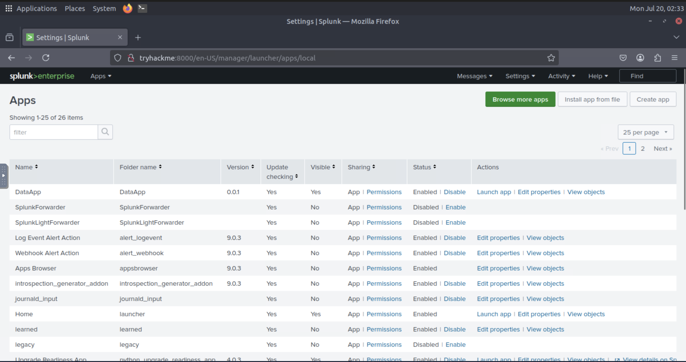

## Screenshot 2 – Creating the App

I created a new custom Splunk application named **DataApp** using the **Create App** form, which generates the app's standard directory structure automatically.

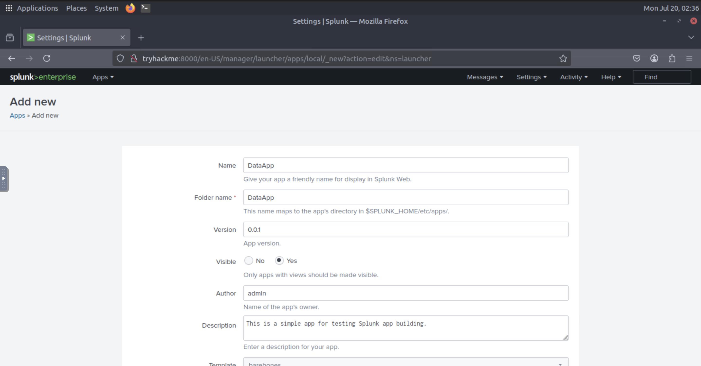

## Screenshot 3 – Reviewing the App Directory Structure

Using the command line, I navigated to the new app's directory and listed its contents, confirming the standard Splunk app structure: `bin`, `default`, `local`, and `metadata`.

```bash
cd /opt/splunk/etc/apps/DataApp
ls
```

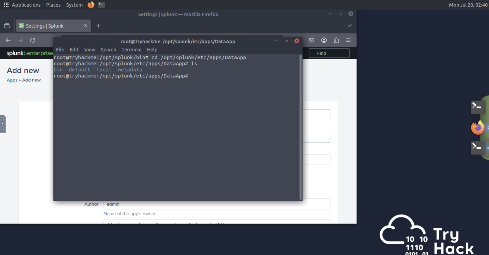

## Screenshot 4 – Building and Testing a Custom Script

Inside the `bin` directory, I created a simple Python script, `samplelogs.py`, to generate sample log output. I then executed the script directly to confirm it produced valid output before configuring Splunk to ingest it.

```bash
echo 'print("This is a sample log...")' > samplelogs.py
python3 samplelogs.py
```

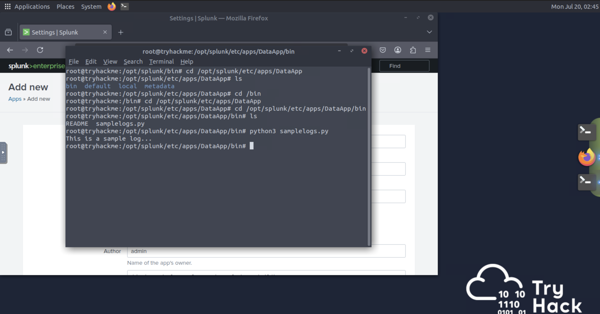

## Screenshot 5 – Configuring the Scripted Input

I created an `inputs.conf` file in the app's `local` directory to tell Splunk to run the script on a five-second interval and route its output to the `main` index using a custom sourcetype and host value.

```ini
[script:///opt/splunk/etc/apps/DataApp/bin/samplelogs.py]
INDEX = main
SOURCETYPE = testing
HOST = test
INTERVAL = 5
```

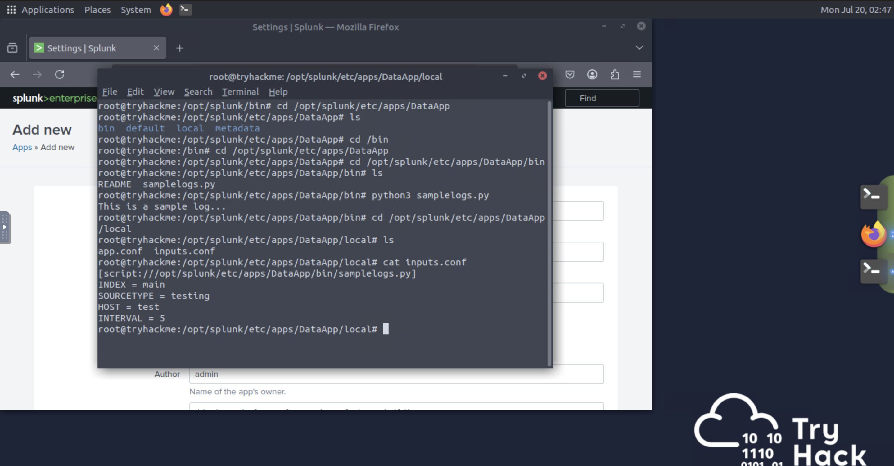

## Screenshot 6 – Restarting Splunk

After saving the configuration, I restarted Splunk for the new scripted input to take effect.

```bash
/opt/splunk/bin/splunk restart
```

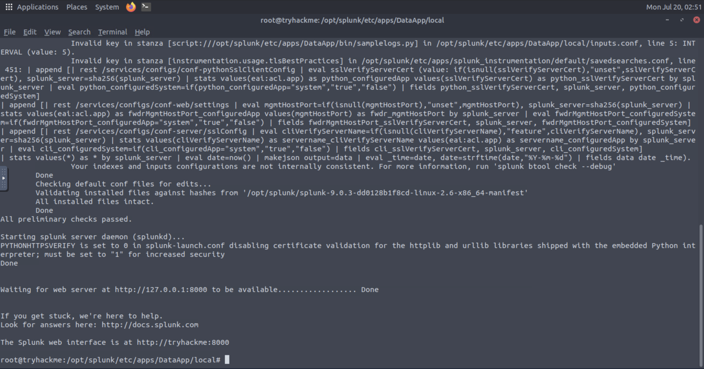

## Screenshot 7 – Verifying Log Ingestion

Finally, I switched to the DataApp context in Splunk Web and searched `index=main` with the time range set to **All time**, confirming that the scripted input was successfully generating and ingesting log events on schedule.

```spl
index=main
```

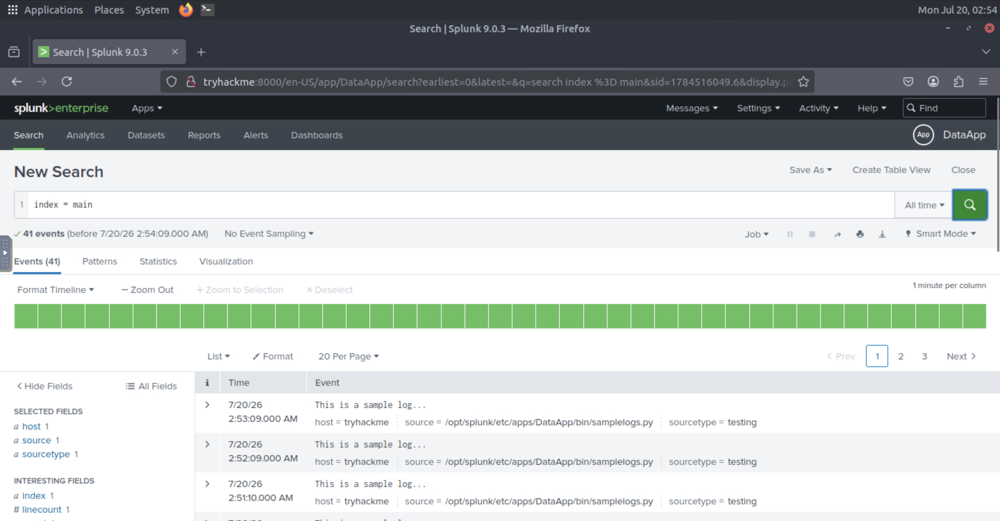

# Configuring Event Boundaries

## Screenshot 8 – Testing the VPN Log Script

I copied the `vpnlogs` executable into the app's `bin` directory and ran it directly to understand the log format before ingesting it into Splunk. Each output line contains three key fields: the connecting **User**, the **Server**, and the **Action** (CONNECT or DISCONNECT).

```bash
cp /home/ubuntu/Downloads/scripts/vpnlogs /opt/splunk/etc/apps/DataApp/bin/
cd /opt/splunk/etc/apps/DataApp/bin
./vpnlogs
```

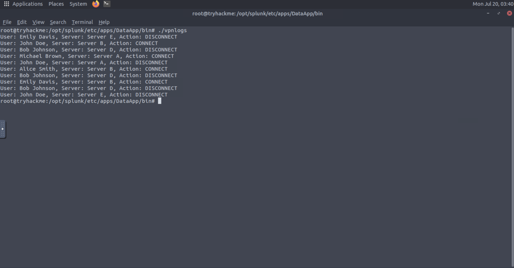

## Screenshot 9 – Configuring the VPN Log Input

I added a second stanza to `inputs.conf` in the app's `local` directory, instructing Splunk to run the `vpnlogs` script every five seconds and ingest its output into the `main` index using a dedicated sourcetype and host.

```ini
[script:///opt/splunk/etc/apps/DataApp/bin/vpnlogs]
INDEX = main
SOURCETYPE = vpn_logs
HOST = vpn_server
INTERVAL = 5
```

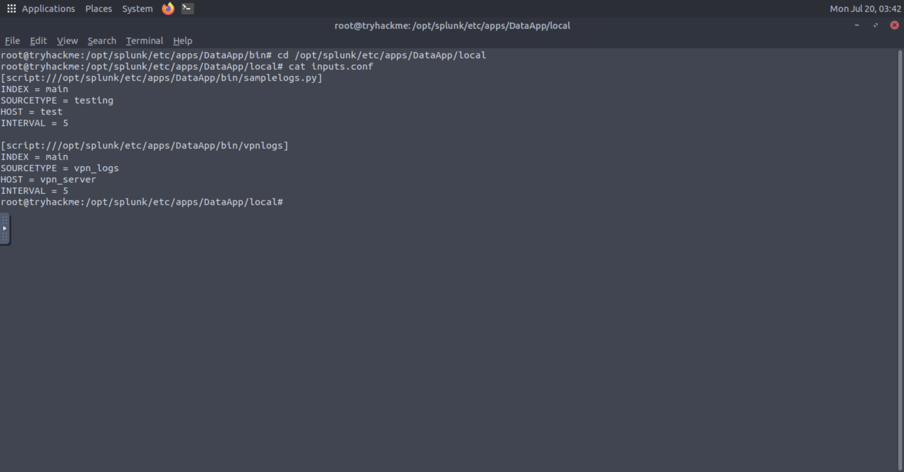

## Screenshot 10 – Identifying Broken Event Boundaries

After restarting Splunk and searching `index=main sourcetype=vpn_logs`, I found that Splunk was unable to correctly determine where one event ended and the next began. Each indexed event incorrectly contained ten lines of log data merged together instead of a single VPN connection record.

```spl
index=main sourcetype=vpn_logs
```

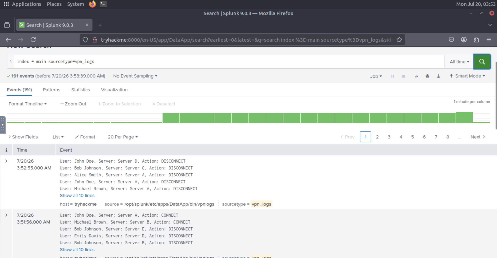

## Screenshot 11 – Testing the Event-Breaking Regex

To fix this, I needed a regular expression that reliably marks the end of each event. Since every log line ends in either `CONNECT` or `DISCONNECT`, I tested the pattern `(CONNECT|DISCONNECT)` against sample log data using regex101 to confirm it matched correctly before implementing it in Splunk.

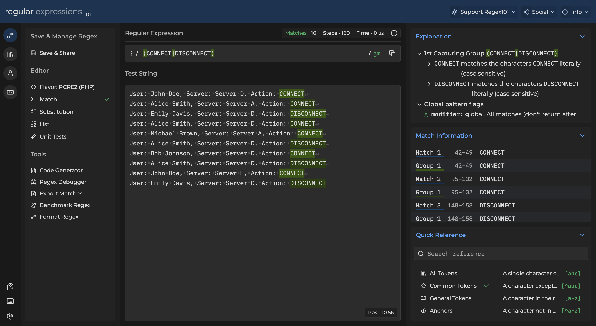

## Screenshot 12 – Creating props.conf

With the regex validated, I created a `props.conf` file in the app's `local` directory to apply the fix. This configuration disables Splunk's automatic line-merging behavior and instructs it to break a new event immediately after encountering `CONNECT` or `DISCONNECT`.

```ini
[vpn_logs]
SHOULD_LINEMERGE = false
MUST_BREAK_AFTER = (CONNECT|DISCONNECT)
```

```bash
/opt/splunk/bin/splunk restart
```

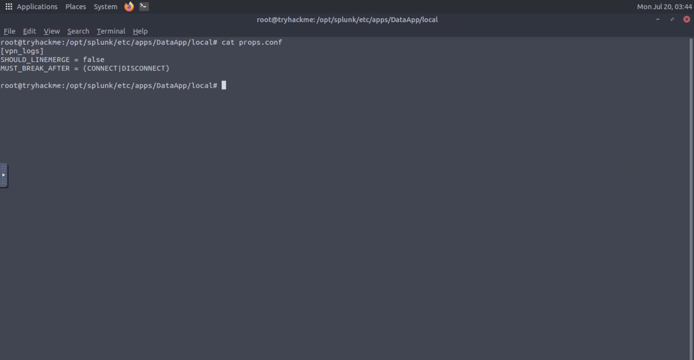

## Screenshot 13 – Verifying Correct Event Boundaries

After restarting Splunk, I re-ran the search `index=main sourcetype=vpn_logs` with the time range set to **All time (real time)**. The event boundaries are now correctly defined, with Splunk indexing 29 individual events — each representing a single VPN connection or disconnection — instead of merged multi-line blocks.

```spl
index=main sourcetype=vpn_logs
```

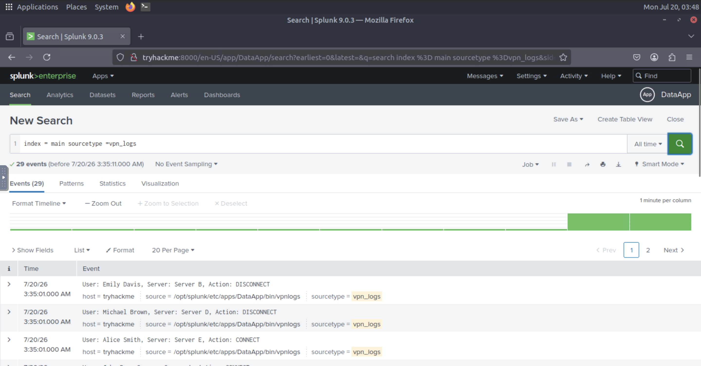

## Findings

- Splunk does not automatically know how to break raw script output into individual events — without explicit configuration, it defaults to merging multiple lines into a single event.
- Configuration file precedence matters: settings in an app's `local` directory override `default`, and a scripted input's success depends on `inputs.conf` correctly referencing the executable's path.
- Validating a regex pattern externally (regex101) before deploying it in `props.conf` is a fast way to avoid misconfigured event breaking in production.

## Lessons Learned

- Configuration files must be placed in the correct directory relative to the app (`local/` inside the app folder, not an absolute `/local` path) — an easy mistake to make when troubleshooting under time pressure.
- File naming precision matters in Splunk — a typo like `input.conf` instead of `inputs.conf` will cause the config to silently fail to load, with no obvious error.
- Restarting Splunk is required for both `inputs.conf` and `props.conf` changes to take effect.
- `SHOULD_LINEMERGE = false` combined with `MUST_BREAK_AFTER` is a reliable pattern for handling single-line, delimiter-terminated logs.

## References

1. TryHackMe. *Splunk: Data Manipulation*. https://tryhackme.com
2. Splunk Inc. *Splunk Enterprise Documentation*. https://docs.splunk.com/Documentation/Splunk
3. Splunk Inc. *Search Processing Language (SPL) Search Reference*. https://docs.splunk.com/Documentation/Splunk/latest/SearchReference/Aboutthesearchlanguage
4. regex101. *Regex Testing Tool*. https://regex101.com
