# Splunk: Setting Up a SOC Lab

## Objective

Install and configure Splunk Enterprise on Ubuntu Linux, create an administrator account, and verify access to the Splunk Web interface.

## Environment

- Platform: TryHackMe
- Operating System: Ubuntu Linux
- Splunk Enterprise 9.x

## Skills Practiced

- Linux Administration
- Splunk Installation
- Splunk Configuration
- Command Line
- SIEM Deployment

---

## 1. Starting Splunk

The Splunk Enterprise service was started from the terminal after installation. During startup, Splunk initialized its services, generated the required certificates, and launched the Splunk Web interface on the default port (8000).

### Command

```bash
cd /opt/splunk/bin
./splunk start --accept-license
```

### Screenshot

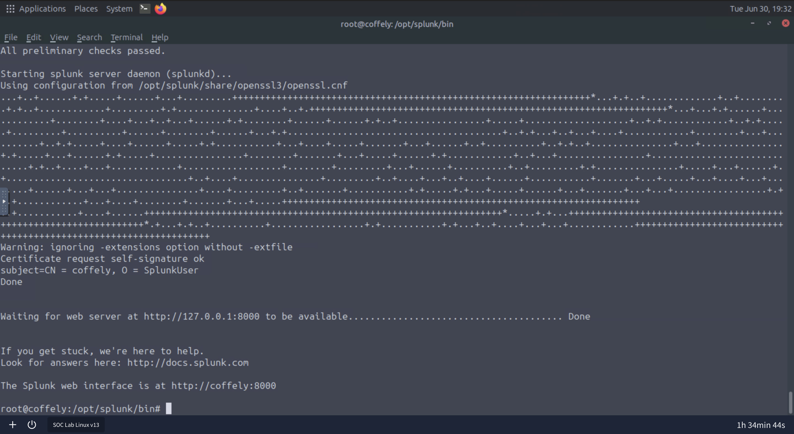

### Findings

- Successfully started the Splunk Enterprise service.
- Generated the required startup configuration and certificates.
- Confirmed the Splunk Web interface was available on port **8000**.
- Verified the installation completed successfully.
---

---

## 3. Splunk Dashboard

After logging in with the administrator account, the Splunk Enterprise dashboard was successfully loaded. This confirmed that the installation and configuration were completed correctly and that the web interface was fully operational.

### Screenshot

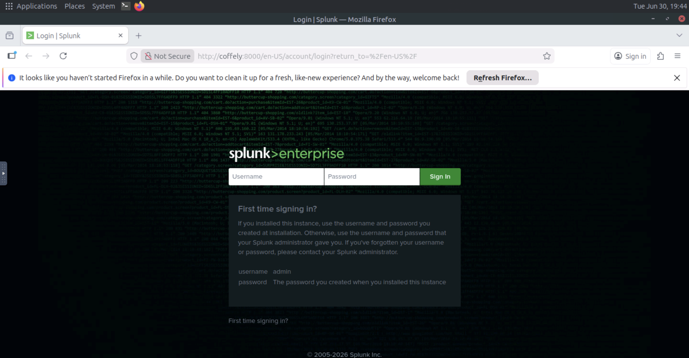

### Findings

- Successfully authenticated using the administrator account.
- Verified access to the Splunk Enterprise dashboard.
- Confirmed the installation and initial configuration were successful.
- Splunk was ready for log ingestion and analysis.

---

## Skills Demonstrated

- Linux Administration
- Splunk Enterprise Installation
- Splunk Configuration
- Command Line
- SIEM Deployment
- Web Interface Configuration
---

## 3. Splunk Home

After signing in with the administrator account, the Splunk Home page loaded successfully. This confirmed that the installation was successful and that the Splunk web interface was fully operational.

### Screenshot

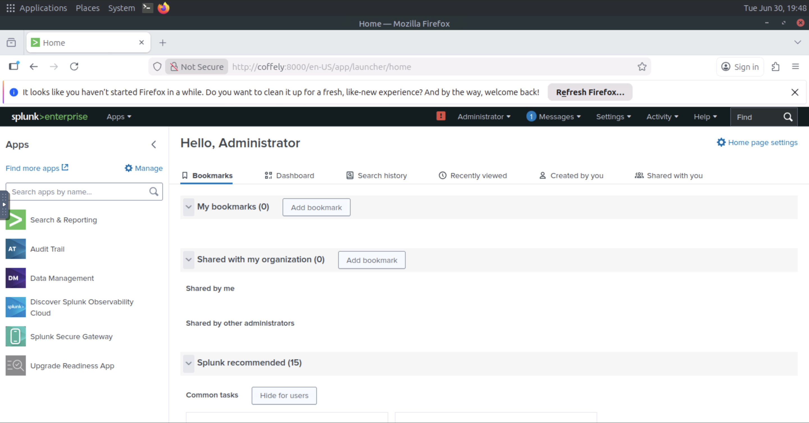

---

# 4. Verifying Splunk Status

The `splunk status` command was used to verify that the Splunk Enterprise services were running correctly after installation.

### Command

```bash
./splunk status
```

### Screenshot

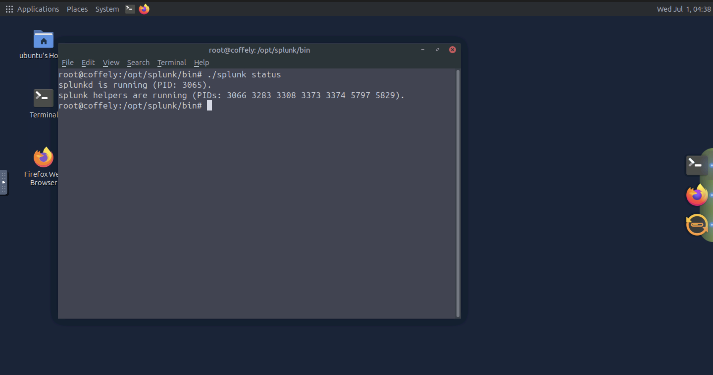

### Findings

- Verified that the `splunkd` service was running successfully.
- Confirmed that all required helper processes were active.
- Validated that the Splunk installation was operating correctly.
- Confirmed the Splunk server was ready for use.

---

# 5. Splunk CLI Help

The `splunk help` command was used to display the available command-line options for administering and managing Splunk Enterprise.

### Command

```bash
./splunk help
```

### Screenshot

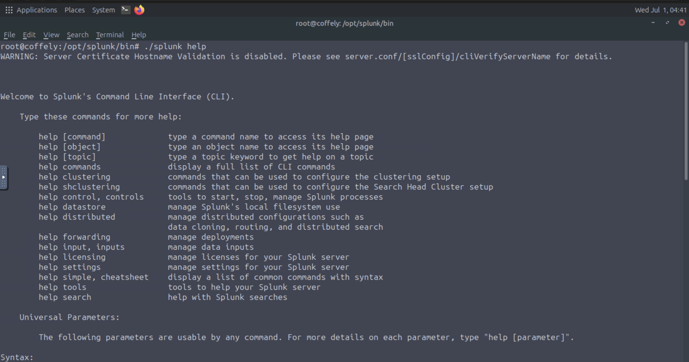

---

# 5. Splunk Universal Forwarder Installation

The Splunk Universal Forwarder was installed on the same Ubuntu system as the Splunk Enterprise instance. During startup, a management port conflict was detected because Splunk Enterprise was already using port **8089**. The forwarder was successfully configured to use **port 8090**, allowing both services to run simultaneously.

### Screenshot

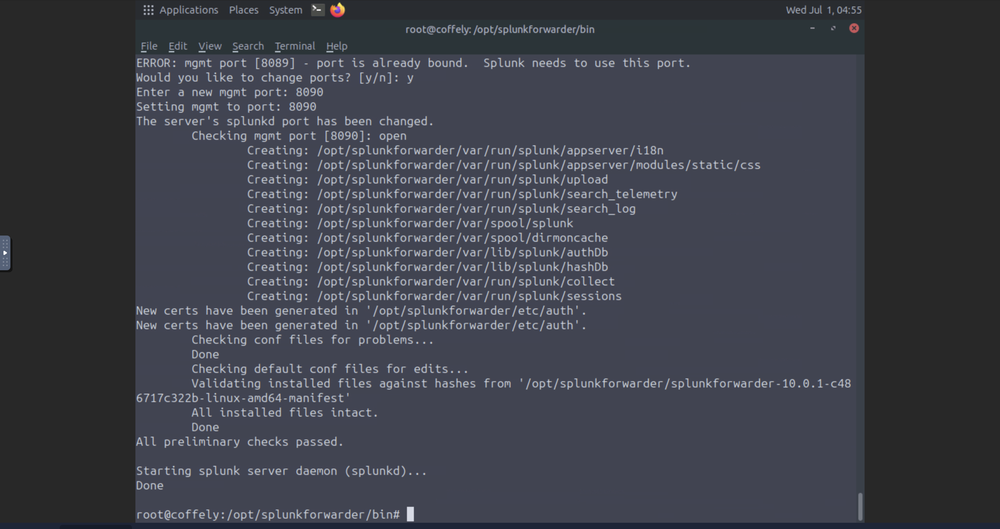

### Findings

- Installed the Splunk Universal Forwarder on Ubuntu Linux.
- Identified a management port conflict on port **8089**.
- Reconfigured the forwarder to use management port **8090**.
- Successfully started the Universal Forwarder without errors.
- Verified the installation completed successfully.

---

# 6. Splunk Universal Forwarder Status

After installation, the Universal Forwarder status was verified using the Splunk CLI. The output confirmed that the **splunkd** service and all helper processes were running correctly.

### Screenshot

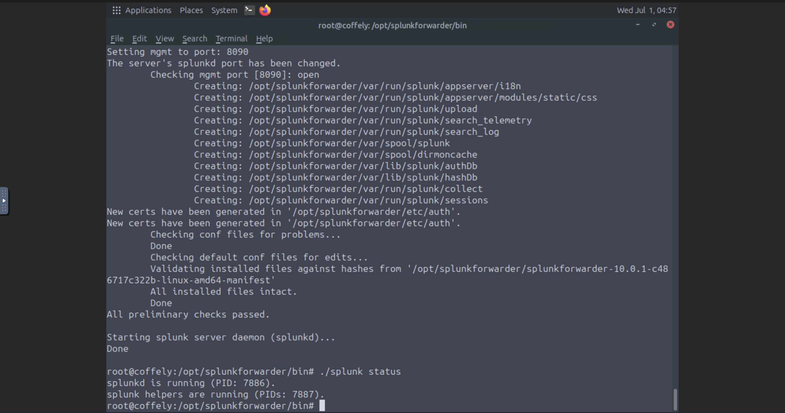

### Findings

- Verified the Universal Forwarder service was running.
- Confirmed **splunkd** was active.
- Verified all helper processes were running successfully.
- Confirmed the forwarder was ready for data forwarding and log collection.

---

---

# 7. Configuring Splunk to Receive Data

Splunk Enterprise was configured to receive data from remote forwarders. A receiving port was enabled to allow incoming log data from the Splunk Universal Forwarder.

### Screenshot

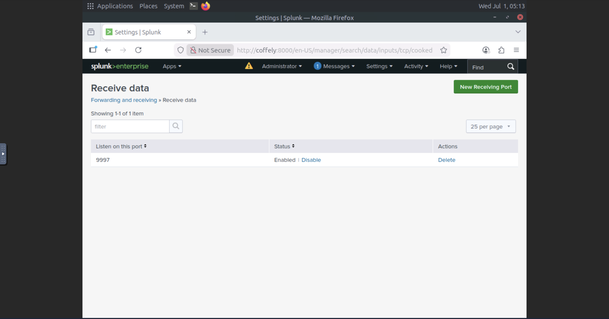

### Findings

- Enabled Splunk to receive forwarded log data.
- Configured the receiving port to listen on **TCP 9997**.
- Verified the receiving service was active and ready to accept incoming events.
- Prepared Splunk Enterprise for centralized log collection.

---

# 8. Creating the Linux Host Index

A dedicated index named **linux_host** was created to store Linux system logs separately from the default indexes. Using a dedicated index improves organization and simplifies log searching.

### Screenshot

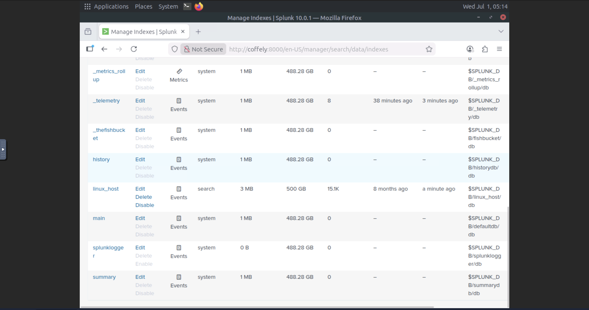

### Findings

- Created a dedicated **linux_host** index.
- Configured the index to store Linux system logs.
- Verified the index was available and actively receiving events.
- Improved log organization and search efficiency.

---

# 9. Configuring the Universal Forwarder

The Splunk Universal Forwarder was configured to send Linux system logs to the Splunk Enterprise server. The forward server was verified, and the Linux syslog file was successfully configured for monitoring.

### Screenshot

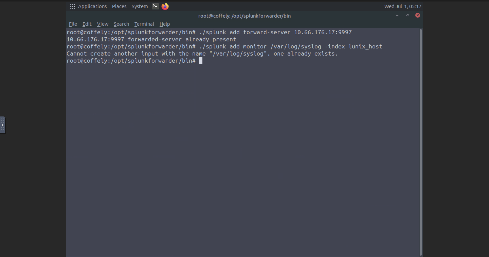

### Findings

- Configured the Universal Forwarder to communicate with Splunk Enterprise.
- Verified the forward server configuration was already present.
- Confirmed the Linux **/var/log/syslog** file was already configured for monitoring.
- Verified the forwarder configuration was successfully applied.

---

# 10. Verifying Log Ingestion

A test log was generated using the Linux **logger** utility and searched within Splunk. Successfully locating the log confirmed that the complete logging pipeline—from the Linux host, through the Universal Forwarder, to Splunk Enterprise—was functioning correctly.

### Screenshot

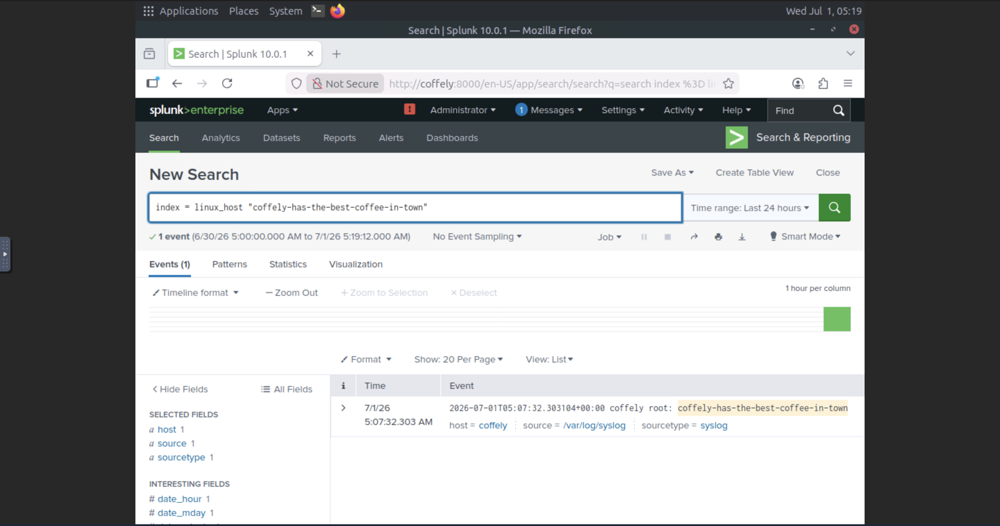

### Findings

- Successfully searched the **linux_host** index.
- Verified that the test log was received by Splunk.
- Confirmed end-to-end log forwarding and indexing.
- Demonstrated successful log ingestion and search functionality.

---

## Deployment Server Configuration

To explore Splunk's centralized management capabilities, I enabled the Deployment Server using the Splunk command-line interface. This feature allows administrators to centrally manage multiple Universal Forwarders and distribute configurations across enterprise environments from a single Splunk instance.

### Screenshot

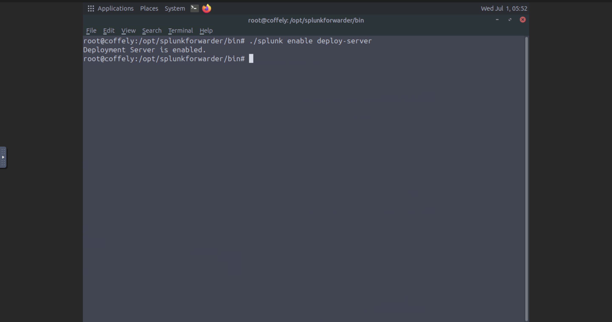

### Findings

- Successfully enabled the Splunk Deployment Server using the CLI.
- Verified that the deployment server was activated successfully.
- Prepared the Splunk instance for centralized forwarder management.

---

## Deployment Server Management Interface

After enabling the Deployment Server, I accessed the Deployment Server management interface in the Splunk web application.

Although this lab environment only provides a Linux virtual machine, Splunk also supports managing Windows systems through the Deployment Server. In a real-world Windows environment, this is where Windows Universal Forwarders would be assigned to server classes and configured to forward Windows Event Logs to the Splunk server. Because the TryHackMe lab only includes a Linux VM, the Windows configuration steps were provided as a demonstration rather than a hands-on exercise.

### Screenshot

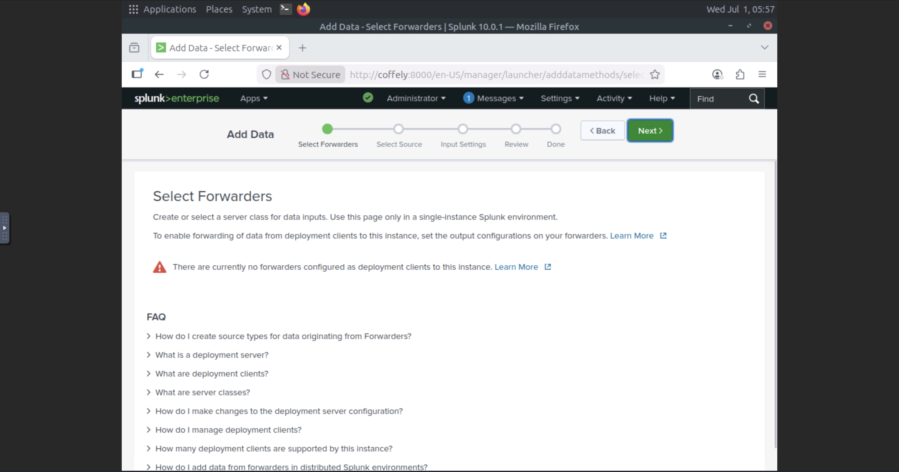

### Findings

- Verified access to the Deployment Server management interface.
- Confirmed the Splunk instance was ready to manage deployment clients.
- Learned where Windows Universal Forwarders would be assigned to server classes.
- Understood how centralized deployment simplifies management of Windows and Linux endpoints.
- Recognized that the Windows configuration could not be completed because the lab environment only provides a Linux virtual machine.


### Screenshot 1 – Add Data (Monitor)

This screenshot shows the beginning of the Apache web log ingestion process in Splunk. From the **Add Data** page, I selected the **Monitor** option to continuously collect log data from a local file instead of uploading a static file. This allows Splunk to automatically ingest new log entries as they are generated.

---

### Screenshot 2 – Configuring Apache Access Log Monitoring

This screenshot shows the Apache access log file being configured for continuous monitoring. The file `/var/log/apache2/access.log` was selected and configured using the **Continuously Monitor** option. This ensures that all future web server requests are automatically collected and indexed by Splunk in real time.

---

### Screenshot 3 – Apache Web Logs Successfully Ingested

This screenshot confirms that the Apache access logs were successfully ingested into Splunk. The search query filters the results using the source (`/var/log/apache2/access.log`), host (`coffelyweb`), index (`web`), and sourcetype (`access_combined`). The returned events verify that Splunk is successfully collecting, indexing, and making the Apache web server logs searchable for analysis.
## Skills Demonstrated

- Splunk Enterprise Administration
- Splunk Universal Forwarder
- Linux Log Collection
- Data Ingestion
- Index Management
- Forwarder Configuration
- Centralized Logging
- Linux System Administration
- Splunk Search & Reporting
- SIEM Deployment

## Skills Demonstrated

- Splunk Universal Forwarder Installation
- Linux Administration
- Command Line (CLI)
- Splunk Service Management
- Port Conflict Resolution
- Log Collection Preparation

### Findings

- Displayed the available Splunk CLI commands.
- Reviewed command syntax and administrative options.
- Demonstrated the use of the Splunk command-line interface.
- Verified access to built-in command documentation.

### Findings

- Successfully authenticated using the administrator account.
- Verified access to the Splunk Home interface.
- Confirmed the installation and configuration were successful.
- Splunk was ready for log ingestion and analysis.

## Resources

- **TryHackMe:** Splunk – Setting up a SOC Lab
- https://tryhackme.com/room/splunksettingupasoclab

- **Splunk Enterprise Documentation**
- https://docs.splunk.com/Documentation/Splunk
