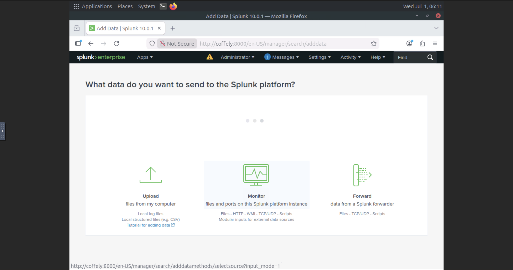
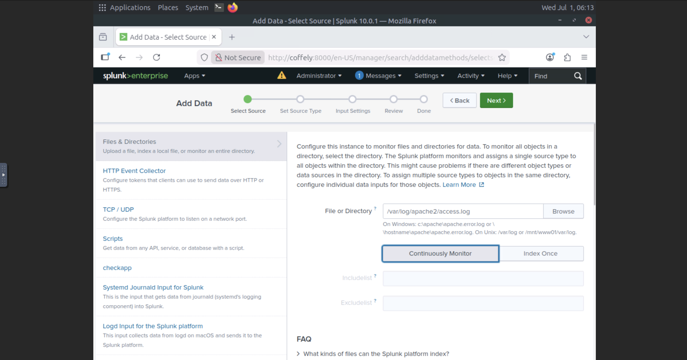
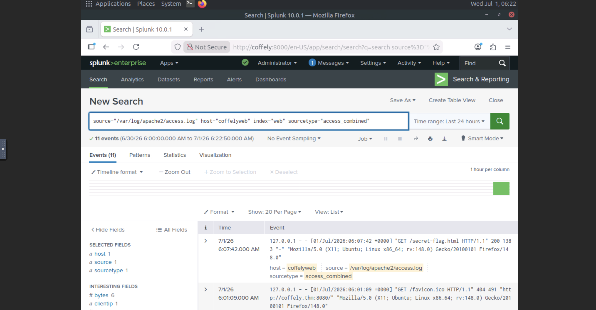

# Splunk: Setting Up a SOC Lab

## Objective

Install and configure Splunk Enterprise on Ubuntu Linux, configure the
Splunk Universal Forwarder, ingest Linux and Apache web logs, and verify
successful log collection and searching.

## Environment

-   **Platform:** TryHackMe
-   **Operating System:** Ubuntu Linux
-   **Splunk Version:** Splunk Enterprise 9.x

## Skills Practiced

-   Linux Administration
-   Splunk Enterprise Administration
-   Splunk Universal Forwarder
-   SIEM Deployment
-   Log Collection & Ingestion
-   Index Management
-   Splunk Search & Reporting

------------------------------------------------------------------------

## 1. Starting Splunk

``` bash
cd /opt/splunk/bin
./splunk start --accept-license
```


**Findings** -
Started Splunk Enterprise successfully.
Generated startup certificates and configuration.
Verified Splunk Web on port 8000.

------------------------------------------------------------------------

## 2. Splunk Dashboard


**Findings** - 
Logged in with the administrator account.
Verified the Splunk Web interface was operational.

------------------------------------------------------------------------

## 3. Splunk Home


**Findings** - 
Confirmed access to the Splunk Home page.

------------------------------------------------------------------------

## 4. Verifying Splunk Status

``` bash
./splunk status
```


**Findings** - 
Verified `splunkd` and helper processes were running.

------------------------------------------------------------------------

## 5. Splunk CLI Help

``` bash
./splunk help
```


**Findings** - 
Reviewed available administrative CLI commands.

------------------------------------------------------------------------

## 6. Splunk Universal Forwarder

### Installation


### Status


**Findings** - 
Installed and verified the Universal Forwarder. 
Resolved the management port conflict by using port **8090**.

------------------------------------------------------------------------

## 7. Configuring Linux Log Forwarding

### Receive Data


### Linux Host Index


### Forwarder Configuration


### Log Verification


**Findings** - 
Enabled receiving on TCP 9997. - Created the
**linux_host** index.
Configured the Universal Forwarder to monitor
`/var/log/syslog`. - Verified successful log ingestion.

------------------------------------------------------------------------

## 8. Deployment Server

### Deployment Server Enabled


### Deployment Server Interface


**Note:** 
This TryHackMe lab only provides a Linux VM. The Windows Event
Log configuration shown in the lab documentation is informational only.

------------------------------------------------------------------------

## 9. Apache Web Log Ingestion

### Add Data



### Configure Apache Access Log



### Search Apache Logs



**Findings**
Configured Splunk to monitor
`/var/log/apache2/access.log`. - Used the `access_combined`
sourcetype.
Verified successful ingestion and searching of Apache web
logs.

------------------------------------------------------------------------

## Skills Demonstrated

-   Splunk Enterprise Administration
-   Linux Administration
-   Splunk Universal Forwarder
-   Apache Log Collection
-   Index Management
-   Splunk Search & Reporting
-   SIEM Deployment
  
## Conclusion

This lab demonstrated the end-to-end deployment of Splunk Enterprise in a Linux environment. I installed and configured Splunk Enterprise, deployed and configured a Splunk Universal Forwarder, created custom indexes, configured data ingestion, verified successful log forwarding, explored Deployment Server functionality, and ingested Apache web server logs. Completing this lab strengthened my understanding of SIEM deployment, centralized logging, and Splunk administration in a SOC environment.

## Resources

-   TryHackMe -- Splunk: Setting Up a SOC Lab\
    https://tryhackme.com/room/splunksettingupasoclab

-   Splunk Enterprise Documentation\
    https://docs.splunk.com/Documentation/Splunk

